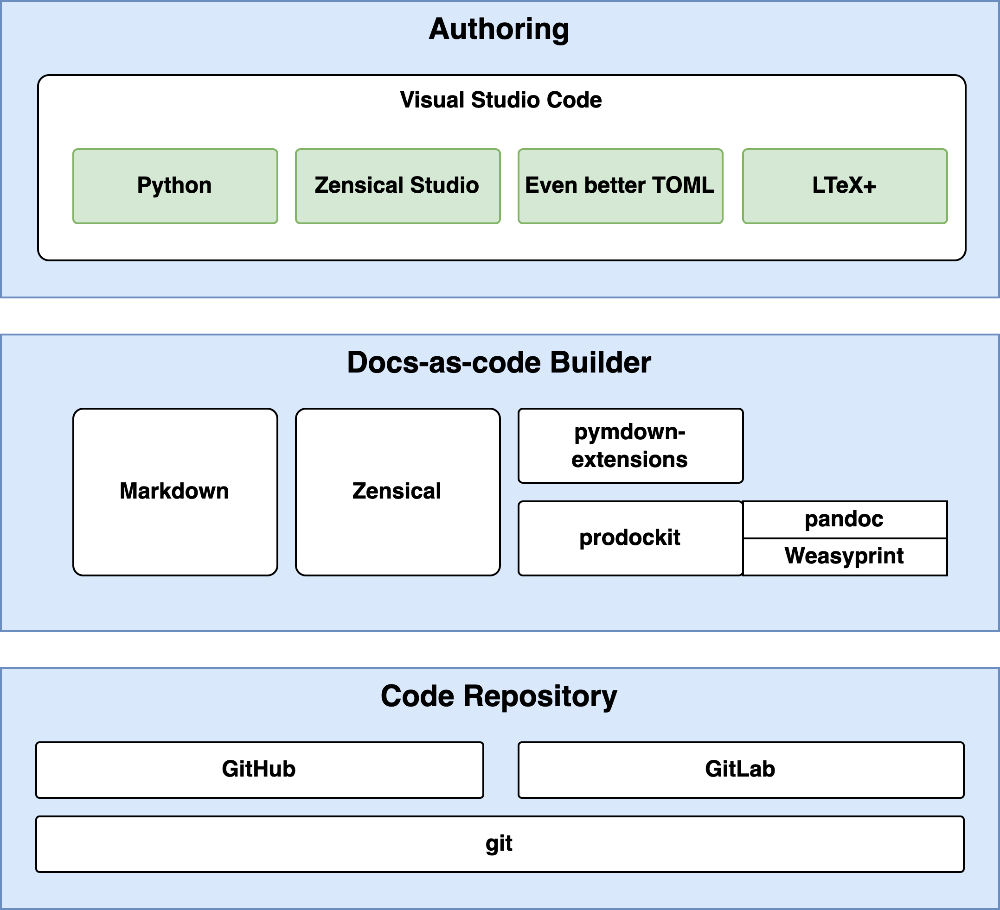

<!-- 
Copyright (c) 2025-2026 Mark Buckwell and contributors
SPDX-License-Identifier: MIT
-->

{{ heading_counter_reset(page) }}

# About this guide

A \index{docs-as-code} workflow uses plain-text Markdown, version control, and
automated builds to create documentation. This guide helps you add prodockit
to an existing Zensical or MkDocs site, or use
[prodockit-template](https://github.com/buckwem/prodockit-template){target="_blank"}
as a head start for a new professional website and PDF.

By following the guide, you will be able to:

- write and organise a document in Markdown;
- preview the website and build the PDF on your computer;
- save a recoverable history of the work in GitLab or GitHub;
- collaborate through pull requests or merge requests; and
- publish the website and PDF through an automated pipeline.

This guide is hosted separately from the projects it describes. It can
therefore remain current while each project keeps control of its own template,
content, and release schedule.

## Choose how to install

The three routes start from different situations. Choose the one matching the
project you already have; you do not need to complete the others.

-   :material-clock-fast:{ .lg .middle } **Adoption install**

    Use [`prodockit adopt`](adoptioninstall.md) when you already have a working
    Zensical or MkDocs document and want to add prodockit's components without
    replacing your own template, editor, Git setup, or publishing workflow.

    [:octicons-arrow-right-24: Use Adoption install](adoptioninstall.md)

-   :material-rocket-launch:{ .lg .middle } **Bootstrap Install**

    Use [`pdkboot`](bootstrapinstall.md) when you do not have a template of your
    own and want a formal-looking document as a head start. It installs the
    supported tools and sets up prodockit-template in recoverable stages.

    [:octicons-arrow-right-24: Use Bootstrap Install](bootstrapinstall.md)

-   :material-tools:{ .lg .middle } **Manual install**

    Follow the [manual instructions](installtooling.md) when you want the same
    prodockit-template head start but need or prefer to install and configure
    every tool yourself. Commands are explained for macOS, Windows 11, and
    Ubuntu Linux.

    [:octicons-arrow-right-24: Use Manual install](installtooling.md)

## How docs-as-code works

The workflow treats documentation with the same care as software while keeping
the writing itself in readable Markdown files.

/// steps

//// step | Write

Write the content in [Markdown](https://www.markdownguide.org/){target="_blank"}
using Visual Studio Code. Editor extensions help check spelling, grammar, and
configuration while you work.

////

//// step | Preview

Zensical turns the Markdown into a local website. prodockit adds the PDF,
heading and caption numbering, references, citations, an index, and other
features used by professional and academic documents.

////

//// step | Save and review

Git records each saved change as a commit, providing a history that can be
examined or restored. GitLab and GitHub support pull requests or merge requests
when work needs discussion and review before it is accepted.

////

//// step | Publish

Pushing an accepted change starts a pipeline. The pipeline repeats the build
in a controlled environment and publishes the website and downloadable PDF.

////

///

## How the tools fit together

{width="80%"}
/// figure-caption
The tools in the docs-as-code stack
///

| Layer | Tools used here | Purpose |
| --- | --- | --- |
| Authoring | Visual Studio Code, Zensical Studio, Even Better TOML, LTeX+, and the Python extension | Write, preview, and check the source files. |
| Building | Zensical and prodockit | Turn Markdown into the website and PDF. |
| Repository and publishing | Git with GitLab or GitHub | Store the history, support review, run the build, and publish its outputs. |

[Zensical](https://zensical.org/){target="_blank"} is the website builder.
The [prodockit](https://github.com/buckwem/prodockit-extensions){target="_blank"}
package extends it with the document features and commands used throughout
this guide. You can adopt those components into your own project, or use
prodockit-template for a ready-to-use formal document structure and publishing
configuration. In either case, your repository remains an independent project
containing your own work.

## Docs-as-code in production

An assessed report or small documentation project uses the same core cycle as
a large technical-writing team: plan, write, review, build, and publish. The
scale and number of reviewers change, but the underlying skills remain useful.

The optional GitLab video below shows that workflow in a production
documentation team. It covers planning, writing and reviewing, and deploying
and publishing. You can also
[watch the video directly on YouTube](https://www.youtube.com/watch?v=ZlabtdA-gZE){target="_blank"}.

    <iframe src="https://www.youtube-nocookie.com/embed/ZlabtdA-gZE" title="Introduction to using GitLab as a technical writing team" loading="lazy" style="width: 100%; max-width: 800px; aspect-ratio: 16 / 9; border: 0;" allow="accelerometer; autoplay; clipboard-write; encrypted-media; gyroscope; picture-in-picture; web-share" referrerpolicy="strict-origin-when-cross-origin" allowfullscreen></iframe>

!!! tip

    This User Guide is itself built from Markdown using Zensical and prodockit.
    You can [view its source repository](https://github.com/buckwem/prodockit-userguide){target="_blank"}
    to see the files behind the published site.

## Follow the guide

After choosing an installation route, work through the guide in this order.

/// steps

//// step | Set up the computer and project

Choose [Adoption install](adoptioninstall.md) to add prodockit to an existing
Zensical or MkDocs document. Choose
[Bootstrap Install](bootstrapinstall.md) for an automated formal-document head
start when you do not have a template, or [Manual install](installtooling.md)
to set up prodockit-template yourself.

////

//// step | Learn the writing workflow

[Start editing](startediting.md) introduces the everyday edit, preview, commit,
and push cycle. [Markdown basics](markdown.md) explains the source format, and
[Zensical basics](zensicalbasics.md) covers the general website features.

////

//// step | Adapt the template

Use [Customisation](customise.md) for the overall project configuration,
[Customise document content](customisecontent.md) for references, tables,
figures, and other document features, and [Customise build](customisebuild.md)
for website, PDF, pipeline, and dependency settings.

////

//// step | Extend, verify, and find help

[Additional tooling](additionaltooling.md) introduces optional authoring tools.
[Shell commands](shcommands.md) explains commands used by the guide, and
[Testing](testing.md) shows how the website and PDF are checked. The
[acronyms](acronyms.md), [glossary](glossary.md), and
[references](references.md) pages provide supporting reference information.

////

///

-   :material-clock-fast:{ .lg .middle } **Already have a documentation site?**

    Keep its template and continue to [Adoption install](adoptioninstall.md).

-   :material-rocket-launch:{ .lg .middle } **Need a formal-looking head start?**

    Continue to [Bootstrap Install](bootstrapinstall.md).

-   :material-tools:{ .lg .middle } **Need the individual setup commands?**

    Continue to [Manual install](installtooling.md).

