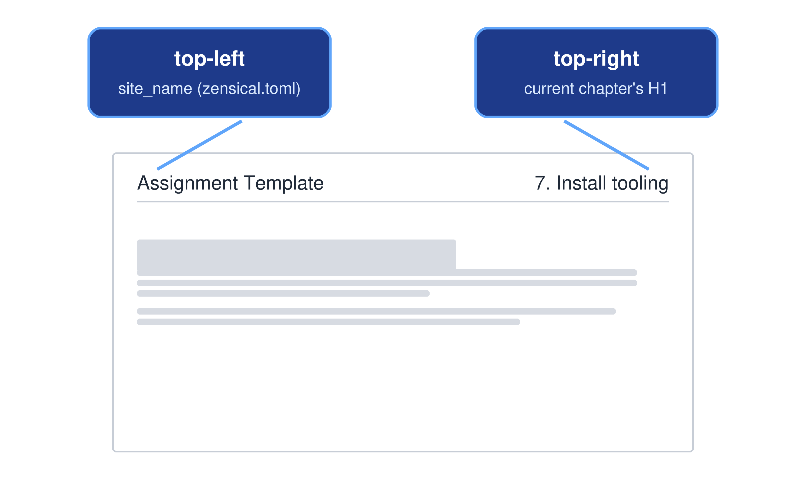
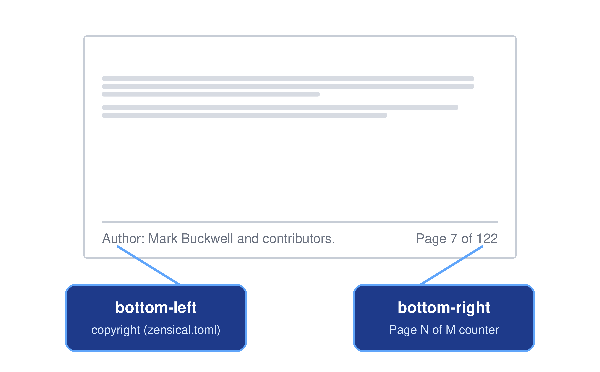

<!-- 
# Copyright (c) 2025-2026 Mark Buckwell and contributors
# SPDX-License-Identifier: MIT
-->

{{ heading_counter_reset(page) }}

# Customisation

A small number of files control almost every visible part of this template - the website, the cover page, and the generated PDF: `zensical.toml` for configuration, `macros.py` for build-time logic, and `docs/stylesheets/extra.css`/`print.css` for appearance. This section walks through each of these in turn: customising the website's branding and behaviour, changing your document's page structure, customising the cover page, and adjusting the PDF's page layout. It ends with a full map of the template's directory structure, so you know where everything lives.

!!! info "prodockit-specific features"
    Where [Zensical basics](zensicalbasics.md) is a quick reference for Zensical's own general-purpose Markdown extensions (the same ones you'd find on any Zensical site), everything on this page is specific to this template: features `macros.py` and the prodockit package add on top of Zensical (Surrey/generic branding, PDF-only/web-only content, and so on) that only exist here, not in a stock Zensical project. For the prodockit extensions that number, cross-reference, cite, and index your document's actual *content*, see [Customise document content](customisecontent.md) instead.

## Customise the web site

Most website-wide settings live in `zensical.toml`, in the `[project]` and `[project.theme]` sections. The sections below describe the most commonly customised ones; see the [Zensical setup documentation](https://zensical.org/docs/setup/) for the full reference.

### Site logo

If the documentation website is part of the university's GitLab service, or the website's location falls under the University of Surrey domain, the build automatically changes the \index{site logo} to the University of Surrey logo. Otherwise, the site logo uses the default logos in the `docs/assets/` directory. You can change the default logo by replacing the existing default logo files with your own logo files named `logo_default_black.png` and `logo_default_white.png`.

Every build, and `zensical serve`, copies either the Surrey pair or your default pair over `docs/assets/logo_black.png`/`logo_white.png` - the two files `extra.css` actually references for the light/dark logo swap. Don't edit `logo_black.png`/`logo_white.png` directly, since the next build overwrites them.

### Site metadata

`site_name`, `site_description`, `site_author`, and `site_url` (all in `[project]` in `zensical.toml`) set the browser tab title, the HTML description used by search engines, the HTML author metadata, and the canonical site URL. `site_name` is also shown on the [cover page](#site-name).

### Copyright

`copyright` in `[project]` sets the text shown in the website's footer. It can contain an HTML fragment, for example an `&copy;` entity:

```toml
copyright = """
Copyright &copy; 2026 Your Name
"""
```

The PDF build reuses this same setting for its own running footer - see [Page footer](#page-footer).

Set `pdf_copyright` in `[project.extra]` to override this text for the PDF's own footer only, leaving the website's footer untouched:

```toml
[project.extra]
pdf_copyright = "Copyright &copy; 2026 Your Name.<br>Made with real, clickable links here too."
```

Unlike `copyright`, this accepts a real HTML fragment in the PDF - a literal `<br>` forces a line break, and `<a>` links render as actual clickable links rather than flattened plain text. Leave it unset and the PDF simply reuses `copyright` as normal.

### Repository link

`repo_url` and `repo_name` in `[project]` show a link to your repository, with an icon and short name, near the top of the sidebar. For example, on GitHub:

```toml
repo_url = "https://github.com/buckwem/prodockit-template"
repo_name = "prodockit-template"
```

Or on the University of Surrey GitLab:

```toml
repo_url = "https://gitlab.surrey.ac.uk/mb0105/prodockit-template"
repo_name = "prodockit-template"
```

You set the icon shown next to it separately - see `theme.icon.repo` under [Icons](#icons).

!!! note
    This is unrelated to the `{{ repo_url }}` macro variable used on the cover page (see [Word count and repository link](#word-count-and-repository-link)). The build computes that value independently from your local Git remote, rather than reading it from this `repo_url` setting, though in practice they'll usually point to the same place.

### Favicon

Set `favicon` in `[project.theme]` to a path (relative to `docs_dir`) for your own browser-tab icon:

```toml
[project.theme]
favicon = "images/favicon.png"
```

Left unset, Zensical uses its default \index{favicon}.

### Colour Scheme

The two `[[project.theme.palette]]` blocks in `zensical.toml` configure the light and dark themes and the toggle button between them:

```toml
[[project.theme.palette]]
media = "(prefers-color-scheme: light)"
scheme = "default"
toggle.icon = "lucide/sun"
toggle.name = "Switch to dark mode"

[[project.theme.palette]]
media = "(prefers-color-scheme: dark)"
scheme = "slate"
toggle.icon = "lucide/moon"
toggle.name = "Switch to light mode"
```

`scheme` selects Zensical's built-in `default` (light) or `slate` (dark) palette; `toggle.icon`/`toggle.name` set the icon and tooltip for the button used to switch between them.

### Page Heading

The website's header background image swaps between light and dark mode too, in `docs/stylesheets/extra.css`:

```css
[data-md-color-scheme="default"] .md-header {
  background: ... url("../assets/header-background.jpg");
}
[data-md-color-scheme="slate"] .md-header {
  background: ... url("../assets/header-background-dark.jpg");
}
```

Replace `header-background.jpg`/`header-background-dark.jpg` in `docs/assets/` with your own images, or switch to a plain colour gradient instead - `extra.css` has a commented-out example of this directly below.

### Fonts

`[project.theme.font]` in `zensical.toml` sets the fonts loaded from Google Fonts, used across the website:

```toml
[project.theme.font]
text = "Inter"
code = "Jetbrains Mono"
```

Use `text` for body copy and headings, and `code` for code blocks and inline code. Both default to Inter and JetBrains Mono if you leave this section unset. The PDF build reuses this same setting - see [Customise PDF generation](#customise-pdf-generation).

### Icons

`[project.theme.icon]` sets the icons used for the edit/view/repository buttons in the header, and `[project.theme.icon.admonition]` sets the icon shown for each admonition type (`note`, `warning`, `tip`, and so on):

```toml
[project.theme.icon]
edit = "lucide/pencil"
view = "lucide/eye"
repo = "fontawesome/brands/gitlab"

[project.theme.icon.admonition]
note = "fontawesome/solid/note-sticky"
warning = "fontawesome/solid/triangle-exclamation"
```

You can use any [Lucide or FontAwesome icon name](https://zensical.org/docs/authoring/icons-emojis/#search).

### Navigation and feature toggles

The `features` list in `[project.theme]` turns individual website behaviours on or off - instant navigation, sticky tabs, search highlighting, the back-to-top button, and around twenty others. `zensical.toml` lists each one with a link to its own documentation in a comment directly above it; comment a line out to disable that feature, or uncomment one of the already-listed-but-disabled options to enable it.

### Extra CSS and JavaScript

`extra_css` and `extra_javascript` in `[project]` list additional stylesheets and scripts to load, with paths relative to `docs_dir`:

```toml
extra_css = ["stylesheets/extra.css"]
extra_javascript = [
  "javascripts/mathjax.js",                      # config - must load first
  "javascripts/vendor/mathjax/tex-svg-full.js",   # the library itself
  "javascripts/extra.js"
]
```

The config has to come before the library it configures: MathJax reads `window.MathJax` once, at startup, so a config file listed after it is ignored - see [Maths](zensicalbasics.md#maths) for what happens without one.

!!! tip "Prefer an installed copy over a CDN link"
    An entry can be a full URL as well as a local path, which makes loading a
    library from a public CDN a one-line change. It costs more than it looks:
    the version usually floats, so the library can change under you with
    nothing recorded in your repository; the page depends on someone else's
    uptime; it won't work offline; and every reader's browser makes a request
    to a third party. This project installs its own copy of MathJax for
    exactly those reasons - see [Maths](zensicalbasics.md#maths) - but doesn't
    *commit* it: the bundle is third-party code, and a repository is
    redistribution. `prodockit bootstrap` installs it on a developer's
    machine; CI installs it the same way for a published build.

[`docs/stylesheets/extra.css`](https://github.com/buckwem/prodockit-template/blob/main/docs/stylesheets/extra.css){target="_blank"} is where most of this template's own customisations live (the logo swap, header image, cover page title styles, and the `.pdf-only`/`.web-only` markers).

Set `pdf_extra_css` in `[project.extra]` to load additional stylesheets for the PDF only, in the same shape as `extra_css` above:

```toml
[project.extra]
pdf_extra_css = ["stylesheets/print.css"]
```

Use it for a rule that would look wrong on the live website, or one that needs to override something `extra_css` itself sets - `pdf_extra_css` stylesheets load after `extra_css`, so they win the cascade.

### Social links

Add icons linking to your social profiles or other sites in the footer, by uncommenting and repeating this block in `[project.extra]` in `zensical.toml`:

```toml
[[project.extra.social]]
icon = "fontawesome/brands/github"
link = "https://github.com/user/repo"
```

## Navigation structure

The `nav` list in `zensical.toml` controls how your document is broken into pages, and the order they appear in. It applies identically to the website's sidebar and the generated PDF.

`nav` (under `[project]` in `zensical.toml`) lists, in order, every page in your document and how they're grouped. Here's the template's own `nav` as delivered, for reference:

```toml
nav = [
  {"Cover" = [
    "index.md",
  ]},
  {"Originality" = [
    {"1. Originality & AI Use" = "originality.md"}
  ]},
  {"Assignment" = [
    {"2. Section" = "section1.md"},
    {"3. Section" = "section2.md"},
    {"4. Section" = "section3.md"},
    {"5. Section" = "section4.md"}
  ]},
  # Comment out the START HERE section before releasing your report, as it contains instructions for the author and is not meant for the reader of the report.
  {"START HERE" = [
    {"6. Start Here" = "starthere.md"}
  ]},
  {"Appendixes" = [
    {"Appendix A. Acronyms" = "acronyms.md"},
    {"Appendix B. Glossary" = "glossary.md"},
    {"Appendix C. References" = "references.md"}
  ]}
]
```

Each entry is either a plain path to a markdown file, or a `{"Group name" = [...]}` block nesting further entries - top-level groups become tabs, and nested groups become collapsible sections in the sidebar. This same `nav` list, walked in this same order, is also what `prodockit pdf` uses to decide which files go into the PDF and in what order - so reordering, adding, or removing an entry here changes both outputs at once.

To add a new page: create the markdown file under `docs/`, then add its path to `nav` wherever you want it to appear.

!!! warning
    Each markdown file can contain only one heading 1 (`#`). Zensical numbers headings sequentially across the whole document in `nav` order, starting a new top-level number at each heading 1 - a second heading 1 in the same file breaks that numbering and confuses the table of contents. If you need another top-level heading, create a new markdown file for it and add it to `nav` instead. See [Changing heading numbering](customisecontent.md#changing-heading-numbering) in [Customise document content](customisecontent.md) for how that numbering itself works.

## Customise front page

The \index{cover page} (`docs/index.md`) consists of a few independently customisable pieces, described below.

### Institution branding

A Jinja conditional block wraps the cover page's logo, colours, and introductory text:

```markdown


... Surrey-branded logo and text ...

... your own branding and text ...


```

`is_surrey` is a boolean computed once per build in `macros.py`, set to `true` if *any* of the following match:

* The build is running in GitLab CI/CD with `CI_SERVER_HOST` set to `surrey.ac.uk`.
* Your local Git repository's `origin` remote contains `surrey.ac.uk`.
* Zensical's own config (e.g. the site URL) contains `surrey.ac.uk`.

If you're not from the University of Surrey, the `` branch is where you customise your own institution or company \index{branding}: replace `Crested Eagle Labs`, `University of the World`, and `Research programmes in Cyber Security` with your own text, and point the two `` image lines at your own logo files (see [Site logo](#site-logo) above for the light/dark logo swap).

!!! tip
    `is_surrey` isn't only used on the cover page - `repo_url`/`repo_name` in [Repository link](#repository-link) above switch the same way. [Manual install](installtooling.md) and the other guide pages show both the GitLab and GitHub paths side by side instead, since a centrally-hosted guide can't detect which one applies to any given reader.

### PDF-only and web-only content

`.pdf-only` and `.web-only` are two general-purpose CSS marker classes. Add either to any element on any page, not just the cover page, to show it in only one output:

* `.pdf-only` - shown in the generated PDF, hidden on the live website.
* `.web-only` - shown on the live website, hidden in the generated PDF.

For static content, just add the relevant class - it looks identical either way, so hiding it from the other output is all that's needed. Computed values are different: the PDF and the website fill them in using two separate mechanisms - a `{MARKER}` placeholder substituted only during the PDF build, and a `{{ macro_variable }}` Jinja variable evaluated only by the live website - so each only works paired with its own class. The word count and repository link below are examples of this.

### Site name

The cover page also shows your project's `site_name` (from `zensical.toml`), using `{{ site_name }}`. Unlike the marker-restricted values below, this one doesn't need a `.pdf-only`/`.web-only` pair: `prodockit pdf` substitutes that exact same text directly during the PDF build (rather than a separate `{MARKER}`), so a single line works correctly in both outputs. It appears twice in `docs/index.md`, once in each half of the `is_surrey` block, styled the same way as `module_id - module_name`:

```markdown
<p class="title-ctr-b4">{{ site_name }}</p>
```

Delete both lines if you don't want the site name shown on the cover page.

### Word count and repository link

Four elements on the cover page use marker classes out of the box: the automated \index{word count}, the repository link, the latest release number, and the "Download PDF" button.

**Word count**: `.pdf-only`, shows an automated word count of your document's content (excluding the cover page itself and the Table of Contents). To remove it from the PDF, open `docs/index.md` and delete the following line:

```markdown
<p class="pdf-only">Word count: {WORDCOUNT}</p>
```

The PDF build replaces the `{WORDCOUNT}` marker with the actual count. If you delete the line, the PDF simply builds without a word count - you don't need to change anything else.

The count also skips any page whose front matter sets `exclude_from_word_count: true` - already set on `references.md`, `acronyms.md`, `glossary.md`, and `originality.md`, matching the common academic convention that a bibliography, acronym list, glossary, and originality/AI-use declaration don't count toward a submission's word limit. Add the same line to a page's own front matter (alongside `icon:`) to exclude any other page the same way:

```markdown
---
icon: lucide/book-open
exclude_from_word_count: true
---
```

**Repository link**: `.pdf-only`, shows the fully qualified URL of your project's Git repository. To remove it from the PDF, open `docs/index.md` and delete the following line:

```markdown
<p class="pdf-only">Repo: {REPOURL}</p>
```

The PDF build replaces the `{REPOURL}` marker with your repository's `origin` remote URL. If you delete the line, the PDF simply builds without a repository link - you don't need to change anything else.

**Release number**: `.pdf-only`, shows the tag of your repository's latest published GitHub or GitLab release (e.g. `v0.0.11`), so a distributed PDF can be traced back to the exact version of the source it was built from. To remove it from the PDF, open `docs/index.md` and delete the following line:

```markdown
<p class="pdf-only">Release: {RELEASE}</p>
```

The PDF build fetches the latest release from your repository host's API and replaces the `{RELEASE}` marker with its tag. This only happens if a release has actually been published - most forks of this template never publish one, so by default the whole line is dropped rather than showing an empty "Release:" label.

**To add the word count, repository link, or release tag to the website**, add a line like one of the following to any page, for example next to the lines you just deleted on the cover page:

```markdown
Word count: {{ word_count }}
Repo: {{ repo_url }}
Release: {{ release }}
```

`{{ word_count }}`, `{{ repo_url }}`, and `{{ release }}` are macro variables that Zensical makes available on every page, so you can drop any of them into any markdown file, not just the cover page. This template's own `docs/index.md` already uses `{{ release }}` for the cover page's own "Release:" line.

!!! note
    The PDF and the website calculate the word count slightly differently, so it may not always match exactly. The PDF count reflects the final, built PDF content. The website count is a rough estimate across the pages that `nav` lists in `zensical.toml` (excluding the cover page).

    The website and the PDF also resolve the release tag differently, and can genuinely disagree: `{{ release }}` reads the latest tag reachable from your local Git history at build time, while `{RELEASE}` queries your repository host's API for the latest *published* release - a tag pushed but not yet turned into a GitHub/GitLab release shows up on the website but not in the PDF.

### Download PDF button

`.web-only`, links to the generated PDF so website visitors can download it. It isn't shown inside the PDF itself, since that would be circular. To remove it from the website, open `docs/index.md` and delete the following line:

```markdown
[:material-file-pdf-box: PDF](site_documentation.pdf){ .md-button target="_blank" style="float: right; margin-left: 15px;" .web-only}
```


## Customise PDF generation

Zensical only builds the website, so the PDF comes from a separate command, `prodockit pdf`, that turns the same `docs/` content into a single-file PDF via [Pandoc](https://pandoc.org/) and [WeasyPrint](https://weasyprint.org/). This used to be a `build_pdf.py` script owned by the template; it now lives in the [prodockit](https://github.com/buckwem/prodockit-extensions) package, so there is no per-project build code to maintain. It renders every page through the same Zensical/prodockit pipeline the website uses, then hands \index{Pandoc} the resulting HTML directly - so `\citeref{}`/`\gls{}`/`\ref{}`, admonitions, tabs, and captions all resolve exactly the same way in both outputs, with no separate PDF-side translation for any of them. It reads the same `zensical.toml` your website does, so most website customisations (site name, copyright, fonts, and so on) apply to the PDF automatically - the sections below cover the handful of things that are PDF-specific.

For how to actually run it as part of your day-to-day writing - installing its dependencies, the `prodockit pdf` command itself, and troubleshooting a failed build - see [Build the PDF](startediting.md#build-the-pdf) in *Start editing* and [Customise build](customisebuild.md); this section is about customising its output once it's already working.

`prodockit pdf` controls most of the generated PDF's page layout - the running header, the footer, the page size, and the fonts - either from `zensical.toml` settings you already use for the website, or (for page size and margins) their own PDF-only `zensical.toml` settings.

The shared PDF typography defaults are **11pt body text** and **10pt inline or fenced code**. Keeping code one point smaller prevents the monospace face from appearing optically larger than the surrounding proportional text. `prodockit-template` uses the same pair, so a generated project, this guide, and prodockit's own documentation begin from one consistent baseline.

### Page header

Every page except the cover shows a \index{running header}: your project's `site_name` (from `zensical.toml` - see [Site name](#site-name)), left-aligned, with a divider line underneath. There's no separate PDF setting for it - editing `site_name` in `zensical.toml` updates the header everywhere, including the website.

The header also shows the current chapter title, right-aligned - starting from the first numbered heading 1, so it's blank on the cover page and the Table of Contents. It is computed automatically from each page's heading 1 (including its chapter number), so there's nothing to configure here either.

{ width="100%" }
/// figure-caption
PDF page header layout
///

### Page footer

Every page except the cover also shows a \index{running footer}: your `copyright` text (left-aligned - see [Copyright](#copyright)) and a "Page X of Y" counter (right-aligned).

{ width="100%" }
/// figure-caption
PDF page footer layout
///

The cover page (`docs/index.md`) never shows this header or footer at all - see the note at the end of [Page size and margins](#page-size-and-margins) below.

Set `project.extra.pdf_header_footer_font_size`, `pdf_header_footer_color`, and `pdf_header_footer_divider_color` in `zensical.toml` to change the header/footer text's font size, its colour, and the divider line's colour:

```toml
[project.extra]
pdf_header_footer_font_size = "10pt"
pdf_header_footer_color = "#555555"
pdf_header_footer_divider_color = "#e2e8f0"
```

Each accepts any valid CSS value (e.g. `9pt`, `rgb(85, 85, 85)`). One setting each applies to the header and the footer together - there's no separate setting per corner, since nothing else about their appearance differs. All three default to the values shown above if left unset. `pdf_header_footer_divider_color` is independent of `pdf_header_footer_color` - changing the text colour doesn't automatically lighten or darken the divider line, so set both if you want them to match.

### Page size and margins

Set `project.extra.pdf_page_size` and `project.extra.pdf_margin_top`/`pdf_margin_right`/`pdf_margin_bottom`/`pdf_margin_left` in `zensical.toml`:

```toml
[project.extra]
pdf_page_size = "A4"
pdf_margin_top = "2cm"
pdf_margin_right = "2cm"
pdf_margin_bottom = "2cm"
pdf_margin_left = "2cm"
```

`pdf_page_size` accepts any standard CSS page size (e.g. `letter`, `legal`, `A3`) or explicit dimensions (e.g. `21cm 29.7cm`), optionally followed by `landscape`. Each `pdf_margin_*` setting accepts any valid CSS length (e.g. `2cm`, `0.75in`) and can differ from the others - useful for, say, extra left margin for binding, or matching an institution's own asymmetric submission template. The header and footer live inside this margin, so shrinking a side also narrows the space available to them there. All five default to the values shown above if left unset, and none of them affect the live website.

The PDF also reuses your website's theme fonts (body copy, headings, and the header/footer) - see [Fonts](#fonts) above for the `zensical.toml` setting.

!!! note
    The cover page (`docs/index.md`) never shows the running header or footer, and heading numbering (e.g. "11.4") is a separate setting - see [Changing heading numbering](customisecontent.md#changing-heading-numbering) in Customise document content.

### Double-sided (duplex) printing

Set `pdf_double_sided = true` in `[project.extra]` to mirror the header, footer, and margins between recto (right-hand) and verso (left-hand) pages, and start every chapter on its own recto page - matching the convention of a professionally bound, printed document:

```toml
[project.extra]
pdf_double_sided = true
pdf_margin_inner = "2.5cm"
pdf_margin_outer = "1.5cm"
```

`pdf_margin_inner`/`pdf_margin_outer` replace the plain `pdf_margin_left`/`pdf_margin_right` above once duplex printing is on - "inner" is the spine-side margin (left on a recto page, right on a verso page), "outer" is the fore-edge on the opposite side - so one pair of settings covers both without you needing to track which physical side is which for any given page. Every numbered chapter also starts its own recto page automatically, inserting a blank page where needed, just like a printed book. Add `recto_title: "Short Title"` to a page's own front matter to shorten its running-header title from the *next* page onward, for a chapter title too long to comfortably fit.

### Source-code bundling

Run `prodockit source-bundle` alongside `prodockit pdf` to also produce a `source_bundle.pdf` - a separate document containing your Markdown content and `zensical.toml`, one file per page:

```bash
prodockit source-bundle
```

Useful for a submission that requires the underlying source alongside the report itself. A separate command rather than a `zensical.toml` setting, so a project that wants only the rendered document doesn't build the source bundle on every run too.

Written into `docs_dir`, alongside `site_documentation.pdf`, so the website's own **Source** download button finds it with no extra step.

!!! note "Only your Markdown and config, not your whole repository"
    Earlier versions of this feature bundled every one of your repository's own tracked (and not-ignored) files - Python, CSS, tests, everything. `prodockit source-bundle` now bundles the root `README.md`, Markdown beneath the configured documentation directory, and the active Zensical configuration. It excludes generated root files such as `CHANGELOG.md`, `CONTRIBUTING.md`, and `LICENSE.md`, along with the template's build tooling. For most coursework this is what you actually want - your own written content and configuration.

    If your submission needs the *whole* repository bundled - for example, an originality declaration covering custom code you wrote yourself, not just prose - that's still possible, just not from this command. See [`prodockit.pdf.source_bundle`](https://prodockit.org/pdf/#prodockitpdfsource_bundle) in the prodockit-extensions docs for calling `build_source_bundle()` directly.

### Screenshots

Every \index{screenshot} of an application or website - as opposed to a logo, icon, or diagram - must have both `figure-caption` *and* the `.screenshot` class, which frames it with a subtle border, rounded corners, and a light shadow so it reads as "a picture of your screen" rather than blending into the body text. Add `.screenshot` as an extra attribute alongside `width`:

``` markdown
{ width="40%" .screenshot }
/// figure-caption
Initial commit
///
```

`.screenshot` works the same way in both outputs - the underlying CSS rule lives in `docs/stylesheets/extra.css` for the website and the equivalent compiled block generated by `prodockit.pdf` for the PDF, matching every other class this template applies to both.


## Directory structure

Now that you've customised the website, the \index{document structure}, the cover page, and the PDF layout, it's worth knowing where everything you've just changed actually lives. The listing below is the template as delivered. Use it as a reference when you're looking for a file mentioned earlier in this section, or deciding where to add a new page.

/// tree
docs/ - Your report's Markdown source
  index.md - The cover page
  originality.md - Your declaration of originality and AI use, for you to complete
  section1.md - The first section, with worked citation, acronym and glossary examples
  section2.md - The second section, with a worked cross-reference example
  section3.md - The third section, with a worked figure-caption example
  section4.md - The fourth section, with a worked table-caption example
  acronyms.md - Your acronym list, for you to complete
  glossary.md - Your glossary of key terms, for you to complete
  references.md - Your bibliography, for you to complete
  bibliography.md - The bibliography page
  assets/ - Images, logos and header backgrounds
  javascripts/ - Site JavaScript, including the MathJax bundle CI installs
  stylesheets/ - CSS for both outputs
    extra.css - Website customisations
    print.css - PDF-only styles, loaded by the `pdf_extra_css` setting
overrides/ - Theme partials this template replaces
tools/ - Node tooling used only by the PDF build
  mermaid/ - `mermaid-cli`, for rendering diagrams to images
  mathjax/ - `mathjax-full`, for rendering maths to images
test/ - The test suite that checks the built website and PDF
.github/ - GitHub configuration
  workflows/ - The pipelines that publish the site and PDF
    docs.yml - Builds and publishes to GitHub Pages
    drift.yml - Reports when a pinned build input falls behind
    release-redeploy.yml - Rebuilds the site after a release is published
  ISSUE_TEMPLATE/ - Issue forms for this repository
.vscode/ - Editor settings and the LTeX dictionary
zensical.toml - Site configuration and navigation
macros.py - This template's own build-time logic
references.bib - Your bibliography source
bibliography.bib - A second bibliography source, if you keep them apart
requirements.txt - The Python dependencies
testrequirements.txt - The test suite's own dependencies
.python-version - The Python version CI and your shell both read
.vale.ini - Configuration for Vale, a prose style checker
.gitlab-ci.yml - Builds and publishes to GitLab Pages
.gitignore - Files and directories Git should ignore
README.md - The repository's front page, for you to rewrite before submitting
CONTRIBUTING.md - How to contribute to the template itself
CHANGELOG.md - What has changed in the template
LICENSE - The MIT licence this template is published under
///

Some of these are covered in more detail elsewhere: [References and bibliography](customisecontent.md#references-and-bibliography), [Acronyms and abbreviations](customisecontent.md#acronyms-and-abbreviations) and [Glossary](customisecontent.md#glossary-page-setup) in Customise document content; [Extra CSS and JavaScript](#extra-css-and-javascript) above for `print.css`; [Diagrams and maths](customisebuild.md#customisebuild-diagrams-and-maths) for `tools/`; and [Testing](testing.md) for `test/`.

`harvard-cite-them-right.csl` is not in the list because it is not committed - every build fetches it, and `prodockit bootstrap` does it for you.

## Where to go next {: #customise-where-to-go-next }

Continue to [Customise document content](customisecontent.md) for the prodockit extensions that number, cross-reference, cite, and index your document's actual content - or skip ahead to [Customise build](customisebuild.md) for how your document is built and published.
