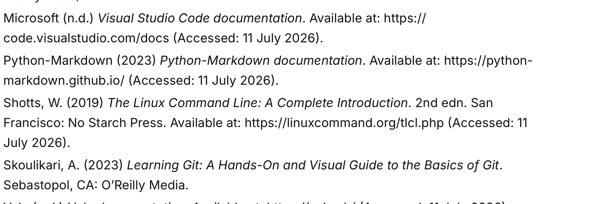
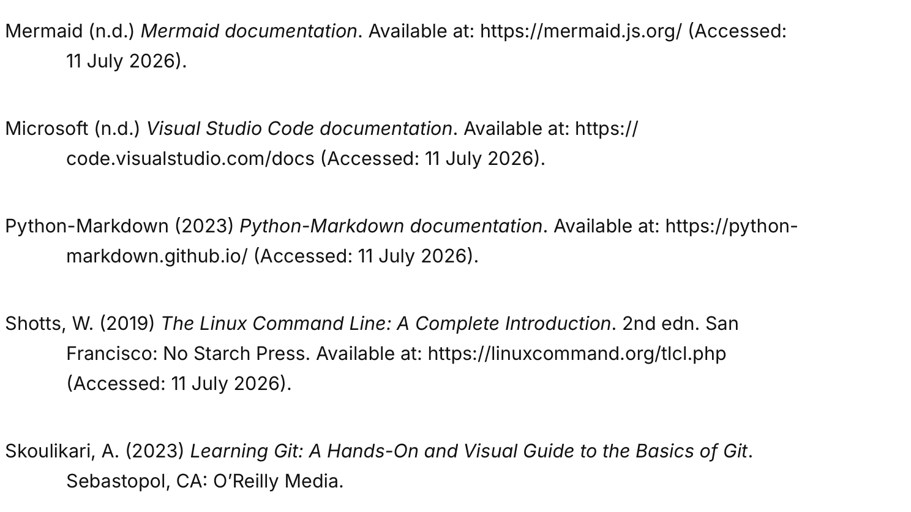
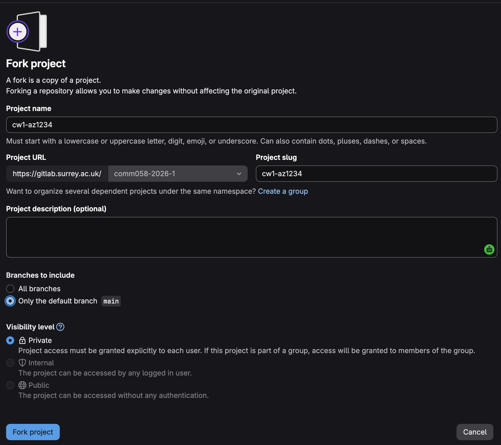

<!--
# Copyright (c) 2025-2026 Mark Buckwell and contributors
# SPDX-License-Identifier: MIT
-->

{{ heading_counter_reset(page) }}

# Customise document content

[Customisation](customise.md) covers your website's branding, layout, and cover page. This page covers the [prodockit](https://github.com/buckwem/prodockit-extensions) extensions that number, cross-reference, cite, define, and index your document's actual *content* - the things you reach for while writing, not while setting the project up. Every one of them works identically on the website and in the PDF, with no separate PDF-side translation needed.

## Changing heading numbering

By default, this documentation template enables heading numbering. If you want to disable heading numbering, you can do so by adding the following line to the `[project.extra]` section of the `zensical.toml` file:

```toml
heading_numbering = false
```

This will also disable heading numbering in the generated PDF output. If you want to enable heading numbering again, simply set the value to `true`:

```toml
heading_numbering = true
```

The top level heading numbering shown in the sidebar isn't generated automatically - it's typed directly into each entry's title in `nav`, matching the pattern of the ones already there, for example:

```toml
{"6. Case Study" = "casestudy.md"}
```

Keep the numbers in each title sequential as you add, remove, or reorder chapters - inserting a new entry partway through (as above, right after "5. Section") means renumbering every entry after it, since (unlike the in-page heading numbers) `nav` doesn't renumber these for you.

!!! note
    Appendix pages are the one exception - see [Appendixes](#appendixes) below - since they're lettered rather than numbered, and don't take a number from this sequence at all. The front matter flag that marks a page as an appendix is `is_appendix` by default, but its name itself is configurable (`appendix_attr` in `prodockit.headings`) if you'd rather use a different key.

## Section cross-references

This template uses [`prodockit.refs`](https://buckwem.github.io/prodockit-extensions/extensions/refs/){target="_blank"} (from the same [prodockit](https://github.com/buckwem/prodockit-extensions) package as citations/glossary below) for \index{cross-references}: give a heading an id, then reference it from anywhere with `\ref{id}` - it resolves to that heading's current section number, similar in spirit to LaTeX's `\ref`.

!!! info "How the PDF handles this"
    Same as citations/glossary below - `prodockit pdf` renders this page through the real Zensical/prodockit pipeline, so `\ref{id}` resolves the same way in both outputs with no separate PDF-side translation.

1. Every heading already has an id, the same slugified-from-its-text id `toc`'s permalinks use (this page's own "## Changing heading numbering" heading above got `changing-heading-numbering` automatically, with no extra markup needed). Give it an explicit id instead with [attr_list](https://zensical.org/docs/authoring/formatting/#attribute-lists) syntax when you want a short, stable id that won't change if you reword the heading later, or to avoid a collision with another heading elsewhere in the document that slugifies to the same text:

    ``` markdown
    ## SubSection {: #citations-example }
    ```

2. Reference it from anywhere in the document with `\ref{id}`:

    ``` markdown
    As covered in \ref{changing-heading-numbering}, ...
    ```

    Which renders as: As covered in \ref{changing-heading-numbering}, ...

    No need to track down the section's current number, or update it by hand if the target moves - `\ref{id}` re-resolves on every build. This template's own `docs/section1.md`-`docs/section4.md` cross-reference each other's citation/acronym/glossary/caption examples this way, each using an explicit attr_list id since "SubSection" repeats several times per page.

!!! note
    A reference to a heading that doesn't exist (a typo in the id, or a heading in a page not yet processed) falls back to `??`, the same way an undefined LaTeX `\ref` shows `??` until a later compilation pass - a quick visual signal something needs fixing. It renders with a `prodockit-ref-unresolved` CSS class, so you can style it more prominently (e.g. a warning colour) in `extra.css` if `??` alone isn't visible enough while drafting.

## References and bibliography

This template uses [`prodockit.citations`](https://buckwem.github.io/prodockit-extensions/extensions/citations/) (from the [prodockit](https://github.com/buckwem/prodockit-extensions) package, already installed and enabled in `zensical.toml` - see [prodockit-template#25](https://github.com/buckwem/prodockit-template/issues/25)) for \index{citations}: define a source once, cite it by key anywhere with `\citeref{id}`.

!!! info "How the PDF handles this"
    `prodockit pdf` renders every page through the same Zensical/prodockit pipeline the website uses, so `\citeref{id}` resolves to the same linked citation in both outputs automatically - no separate PDF-side translation needed, and no manual HTML or per-output link either.

1. Create a page for your sources (this template includes one at [`docs/references.md`](https://buckwem.github.io/prodockit-template/references/){target="_blank"}). List each source as a paragraph, and give it a short, unique id plus a short display text using [attr_list](https://zensical.org/docs/authoring/formatting/#attribute-lists) syntax on the line directly below it (no heading needed - attr_list works on plain paragraphs too):

    ``` markdown
    Skoulikari, A. (2023) *Learning Git: A Hands-On and Visual Guide to the Basics of Git*. Sebastopol, CA: O'Reilly Media.
    {: #skou2023 .reference data-cite-text="Skoulikari, 2023" }
    ```

    Each entry needs a blank line before and after it - attr_list only recognises `{: ... }` as an id (rather than literal visible text) when it's the last line of its own paragraph. Removing the blank lines to save space merges entries into one paragraph and breaks both outputs.

2. Add the page to `nav` in `zensical.toml` so it appears in the sidebar - as a regular numbered chapter, or as a lettered appendix (see [Appendixes](#appendixes) below). This template ships it as an appendix by default.
3. Cite the source in-text with `\citeref{id}`:

    ``` markdown
    Git is a tool used to manage version control.\citeref{skou2023}
    ```

    Which renders as: Git is a tool used to manage version control.\citeref{skou2023}

    No relative path to work out, regardless of which page cites it - unlike a hand-typed Markdown link, `\citeref{id}` resolves the same way from any page, and the `data-cite-text` you set once is reused everywhere the source is cited. Cite more than one source in the same place with a comma: `\citeref{skou2023,chacon2014}` renders `\citeref{skou2023,chacon2014}`.

    This in-text citation resolves correctly in both outputs - on the website, and as an internal cross-page link jumping straight to the cited entry within the built PDF.

4. Consecutive entries get the browser's normal spacing between paragraphs by default - noticeably looser than a typical bibliography. Give each entry's attr_list line a `.reference` class alongside its id and `data-cite-text` (as shown in the code block above) so the template's layout rules - described next - can target them.

5. Set `project.extra.reference_style` in `zensical.toml` to control how `.reference` entries are laid out, on both the website and the PDF build:

    ``` toml
    [project.extra]
    reference_style = "european" # or "global"
    ```

    `"european"` (the default) - single line spacing, no indent, entries close together:

    { width="100%" .screenshot }
    /// figure-caption
    European reference style
    ///

    `"global"` - double spacing between entries, with a 0.5in/1.27cm hanging indent on wrapped lines (the common APA/MLA/Chicago style):

    { width="100%" .screenshot }
    /// figure-caption
    Global reference style
    ///

    Set `project.extra.reference_spacing_european`, `reference_indent_global`, and `reference_spacing_global` in `zensical.toml` to change the spacing/indent values themselves, on both the website and the PDF build:

    ```toml
    [project.extra]
    reference_spacing_european = "-0.8em"  # gap between entries, "european" style
    reference_indent_global = "1.27cm"     # hanging indent on wrapped lines, "global" style
    reference_spacing_global = "2em"       # gap between entries, "global" style
    ```

    Each accepts any valid CSS length and defaults to the value shown above if left unset. `reference_spacing_european` also controls the [Acronyms](#acronyms-and-abbreviations) and [Glossary](#glossary-page-setup) pages' own list spacing, which share the same tight "european" look but have no "global"-style alternative to switch to.

!!! tip
    Keep ids short and stable (e.g. `skou2023`, author surname plus year) so citations keep working even if you reorder entries on the references page later. Unlike a hand-typed link, `\citeref{id}` needs no adjustment when citing from a page nested in a subdirectory.

!!! note
    An unresolved `\citeref{id}` (a typo in the key, or a source not yet added) renders `?` instead of a linked citation, with a `prodockit-cite-unresolved` CSS class for styling it distinctly.

### An alternative: prodockit.bibliography

This template also enables [`prodockit.bibliography`](https://buckwem.github.io/prodockit-extensions/extensions/bibliography/){target="_blank"} in `zensical.toml`, a different way to manage sources - not currently used in this guide's own content, but available if you'd rather work this way instead of (or alongside) `prodockit.citations` above.

Where `prodockit.citations` is a hand-typed reference list you write and format yourself, `prodockit.bibliography` generates one automatically from a BibTeX/BibLaTeX `.bib` file, in any Citation Style Language (CSL) style - APA, IEEE, Harvard, and hundreds more:

```toml
[project.markdown_extensions."prodockit.bibliography"]
bib_file = "references.bib"
csl_style = "harvard-cite-them-right.csl"
```

The template enables this by default, pointing at `harvard-cite-them-right.csl` - but that file isn't part of the clone, so it's fetched rather than committed. If you followed [Install tooling](installtooling.md#install-python-and-zensical) when setting up, you already did this; if not, or if you'd rather use a different CSL style, fetch one from the [Zotero Style Repository](https://www.zotero.org/styles){target="_blank"} into your project root and point `csl_style` at its filename:

``` bash
curl -fsSL -o harvard-cite-them-right.csl "https://www.zotero.org/styles/harvard-cite-them-right"
```

Cite a source with `\cite{id}` (note the different marker, distinct from `\citeref{id}` above), and put a bare `\bibliography` marker on its own paragraph wherever you want the formatted reference list to appear:

``` markdown
Git is a distributed version control system \cite{chacon2014}.
```

It's a longer-term trade for a shorter one: `prodockit.bibliography` needs [Pandoc](https://pandoc.org/) installed even for a website-only build with no PDF, but in return gives you an automatically generated, correctly styled reference list you never hand-format yourself. See [prodockit.bibliography's own docs](https://buckwem.github.io/prodockit-extensions/extensions/bibliography/#comparing-the-two-approaches) for the full comparison between the two.

## Acronyms and abbreviations

This template uses [`prodockit.glossary`](https://buckwem.github.io/prodockit-extensions/extensions/glossary/) (from the same [prodockit](https://github.com/buckwem/prodockit-extensions) package as citations above - see [prodockit-template#87](https://github.com/buckwem/prodockit-template/issues/87)) for \index{acronyms}: define a term once, insert it by id with `\gls{id}` - it expands to the term's own text, linked to its definition.

!!! info "How the PDF handles this"
    Same as citations above - `prodockit pdf` renders this page through the real Zensical/prodockit pipeline, so `\gls{id}` resolves the same way in both outputs with no separate PDF-side translation.

1. Create a page for your acronyms (this template includes one at [`docs/acronyms.md`](https://buckwem.github.io/prodockit-template/acronyms/){target="_blank"}). List each acronym as a short paragraph, and give it an id plus a `data-term` attribute (the acronym's own text) using attr_list syntax on the line directly below it:

    ``` markdown
    **CSS** - Cascading Style Sheets
    {: #css .acronym data-term="CSS" }
    ```

    Each entry needs a blank line before and after it, and the `.acronym` class is what keeps consecutive entries close together rather than using the browser's normal, looser paragraph spacing.

2. Add the page to `nav` in `zensical.toml` so it appears in the sidebar - as a regular numbered chapter, or as a lettered appendix (see [Appendixes](#appendixes) below). This template ships it as an appendix by default.
3. Insert the acronym the first time you use it in a page with `\gls{id}`:

    ``` markdown
    This template uses \gls{css} to control the website's appearance.
    ```

    Which renders as: This template uses \gls{css} to control the website's appearance.

!!! tip
    Keep ids short and lowercase (e.g. `css`, `pdf`) so `\gls{id}` keeps working even if you reorder entries on the acronyms page later.

!!! note
    An unresolved `\gls{id}` renders `?` instead of the term's expansion, with a `prodockit-gls-unresolved` CSS class for styling it distinctly.

## Glossary {: #glossary-page-setup }

You can build a \index{glossary} of key terms the same way, in its own page - this template includes one at `docs/glossary.md`, right after the acronyms page in `nav`. Acronym entries and glossary entries share the same `prodockit.glossary` registry - they're the same kind of thing, an id with a short display text - so a `\gls{id}` works identically whichever page defines it.

!!! info "How the PDF handles this"
    Same as acronyms above - resolved automatically, no separate PDF-side translation.

1. Create a page for your glossary (this template includes one at [`docs/glossary.md`](https://buckwem.github.io/prodockit-template/glossary/){target="_blank"}). List each term as a short paragraph, and give it an id plus a `data-term` attribute using attr_list syntax, the same as an acronym entry:

    ``` markdown
    **Markdown** - A lightweight markup language for formatting plain text...
    {: #markdown-def .glossary data-term="Markdown" }
    ```

    Give glossary entries their own ids, distinct from any acronym ids for the same concept (for example `css-def` rather than `css`) - `prodockit.glossary` shares one id namespace across every page, so two entries sharing an id anywhere in the site would collide.

2. Add the page to `nav` in `zensical.toml` so it appears in the sidebar - as a regular numbered chapter, or as a lettered appendix (see [Appendixes](#appendixes) below). This template ships it as an appendix by default.
3. Insert the term the first time you use it in a page with `\gls{id}`, the same way as an acronym:

    ``` markdown
    This document is written in \gls{markdown-def}.
    ```

    Which renders as: This document is written in \gls{markdown-def}.

4. Cross-link an acronym to its own glossary entry (and vice versa) with a plain Markdown link, **not** `\gls{id}`. A "see also" reference needs to say something like "see the glossary", not repeat the term itself - `\gls{id}` always inserts the term's own registered text instead, so `\gls{css-def}` would read "See Cascading Style Sheets for the expansion" rather than "See the glossary...":

    ``` markdown
    **CSS** - Cascading Style Sheets. See the [glossary](glossary.md#css-def) for what this means in practice.
    {: #css .acronym data-term="CSS" }
    ```

    This template's own `docs/acronyms.md`/`docs/glossary.md` cross-link every entry that has a counterpart on the other page this way - see [prodockit.glossary's own docs](https://buckwem.github.io/prodockit-extensions/extensions/glossary/#cross-links-between-entries-use-a-plain-link-not-glsid) for the full rule of thumb: `\gls{id}` when the term's own name belongs in the sentence, a plain link when the link text needs to say something else entirely.

!!! tip
    If a term is also one of your acronyms, cross-link the two entries as shown above rather than duplicating the explanation on both pages.

## Appendixes

Set `is_appendix: true` in a page's \index{front matter} to give its heading letter-based numbering - "Appendix A", "Appendix B", ... - instead of continuing the document's normal numbered sequence, matching the usual academic convention for \index{appendixes}. Sub-headings within an appendix page number the same way numbered sections do, just using the letter instead of a chapter number - "A.1", "A.1.1", and so on.

```markdown
---
icon: lucide/book-open
is_appendix: true
---
```

Appendix pages are lettered in `nav` order - the first `is_appendix: true` page becomes Appendix A, the second becomes Appendix B, and so on - regardless of how many numbered chapters come before them, and without taking a number away from that sequence (see the note in [Changing heading numbering](#changing-heading-numbering) above). This template ships `docs/acronyms.md`, `docs/glossary.md`, and `docs/references.md` as appendixes by default, grouped under their own "Appendixes" tab in `nav`.

!!! note
    Like the numbered chapter titles in `nav` (see [Changing heading numbering](#changing-heading-numbering)), the "Appendix A"/"Appendix B" prefix shown in the sidebar isn't generated automatically - type it directly into each entry's title in `nav`, matching the pattern already there:

    ```toml
    {"Appendix A. Acronyms" = "acronyms.md"}
    ```

!!! tip
    Appendixes conventionally don't count toward a submission's word limit either - pair `is_appendix: true` with `exclude_from_word_count: true` (see [Word count and repository link](customise.md#word-count-and-repository-link) in Customisation), as this template's own appendix pages already do.

## Back-of-book index

This template also enables [`prodockit.index`](https://buckwem.github.io/prodockit-extensions/extensions/index-terms/){target="_blank"} for a \index{back-of-book index}: a traditional, alphabetised, PDF-only index at the end of your document, listing every term you've marked and the page(s) it appears on - the same kind of index/back matter every printed technical book has.

!!! info "PDF-only"
    There's no website equivalent - a reader of the live site uses [Zensical's own search](https://zensical.org/docs/setup/search/) instead. Marking a term has no visible effect on the website at all; it only ever becomes an index entry once the PDF is built.

Mark a term wherever you actually discuss it with `\index{Term}` - it displays inline exactly as written, and is marked for the index in one go, no separate definition step needed:

``` markdown
A \index{merge conflict} happens when Git can't automatically combine two changes.
```

Which renders as: A \index{merge conflict} happens when Git can't automatically combine two changes.

Marking the same term more than once across the document merges into a single index entry, with every page it appears on listed together.

Nest a term under another with `Parent!Child` - only the last segment displays inline, the earlier segments only ever shape how the generated index groups related entries:

``` markdown
Now generate the \index{Git!ssh keys} to use for authentication.
```

Which renders as: Now generate the \index{Git!ssh keys} to use for authentication.

Wrap the last segment in backticks to mark a command or other code term, both inline and in the generated index entry:

``` markdown
Run \index{`git commit`} to save your changes.
```

Which renders as: Run \index{`git commit`} to save your changes.

Set `pdf_include_index` in `[project.extra]` to actually generate the index page, appended at the very end of the PDF:

```toml
[project.extra]
pdf_include_index = true
pdf_index_title = "Index"   # optional - the page's own heading text
```

!!! tip
    Generating page numbers for the index needs a second pass over the whole PDF, so it's a little slower than a build without one - not something to worry about unless you actually have `pdf_include_index` switched on.

## Captions

The [attribute list](https://zensical.org/docs/authoring/formatting/#attribute-lists)-based `<figure>`/`<figcaption>` pattern in [Zensical basics](zensicalbasics.md#images) works for images, but this template also enables `pymdownx.blocks.caption`, a `/// caption ... ///` block that captions *either* an image *or* a table, auto-numbers itself, and - unlike the `<figure>` approach - works correctly in the PDF too.

!!! info "How the PDF handles this"
    `prodockit pdf` renders this page through the real Zensical/pymdownx pipeline, so `pymdownx.blocks.caption`'s own per-page auto-number is already correct by the time Pandoc sees it - a Lua filter (`Figure()`, generated by `prodockit.pdf.lua`) just prepends the current chapter number/appendix letter in front of it (e.g. "1." → "8.1."), matching the same `<chapter>.<n>` numbers the website shows via CSS.

This template configures three caption types under `[project.markdown_extensions.pymdownx.blocks.caption]` in `zensical.toml`:

1. **`caption`** - plain and unnumbered, for an image that doesn't need a "Figure N" label - a decorative image or an institution logo, rather than a screenshot or diagram that's part of the document's actual content:

    ``` markdown
    
    /// caption
    Institution logo
    ///
    ```

2. **`figure-caption`** - auto-numbered "Figure `<chapter>.<n>`" (e.g. "Figure 9.1"), attached to the image immediately before it. `<chapter>` is wherever this page ends up in `nav`; `<n>` auto-increments per page - reordering chapters, or adding another figure to the page, never needs a manual renumber:

    ``` markdown
    { width=70% .screenshot }
    /// figure-caption
    GitLab fork project
    ///
    ```

3. **`table-caption`** - the same auto-numbering, but for a table, shown *below* it by default - just like a figure. Add `| <` after the type name to show it *above* the table instead, genuinely repositioned in both outputs rather than just a CSS visual trick:

    ``` markdown
    | Feature | Fork | Clone |
    |----|----|---|
    | ... |
    /// table-caption | <
    Fork and Clone Comparison at a Glance
    ///
    ```

    !!! warning "Always add `| <` to `table-caption`"
        `table-caption` has no setting that makes it default to top-positioned - `| <` isn't optional here, it's part of the syntax every single `table-caption` block needs. This template shows every table caption of its own above its table (see [Fork and cloning the prodockit-template](installtooling.md#cloning-the-prodockit-template) for a real example); a `table-caption` block missing `| <` silently falls back to *below* the table instead, breaking that consistency without any warning. There's no `zensical.toml` setting to make this the default and skip typing `| <` each time - see [issue #68](https://github.com/buckwem/prodockit-template/issues/68) if you want to help change that.

The caption block always comes *after* the image or table it captions, regardless of where it's actually shown - `pymdownx.blocks.caption` attaches to whichever element immediately precedes it.

!!! tip
    Force a specific number instead of the auto-incrementing one with `| 5` (later auto-numbers on the same page continue counting up from there, never going backwards); give a caption a stable custom id instead of the auto-generated one with `| #my-id`; add an extra CSS class with `| #my-id.my-class`. Combine modifiers with spaces, e.g. `/// table-caption | < 5 #my-id`.

!!! note "Caption every image, diagram, and table"
    Every screenshot, diagram, or other image that's actually part of the document's content gets `figure-caption`, and every table gets `table-caption` - so a reader can cite "Figure 7.2" or "Table 3.1" and mean something specific. Reserve the plain `caption` type for decorative images that aren't part of the content itself, like an institution logo (see the `caption` example above).

### Table column widths

Give any table's header cell a `width` attribute with attr_list syntax to control how much horizontal space that column takes, in either output:

``` markdown
| Name {: width="25%" } | Description {: width="50%" } | Due {: width="25%" } |
|---|---|---|
| Headings | Heading ids and section numbers | Q1 |
| Refs | Cross-references, resolved by number | Q2 |
```

Which renders as:

| Name {: width="25%" } | Description {: width="50%" } | Due {: width="25%" } |
|---|---|---|
| Headings | Heading ids and section numbers | Q1 |
| Refs | Cross-references, resolved by number | Q2 |

Use a CSS length (e.g. `120px`) instead of a percentage for a column that should stay a fixed size regardless of the table's own width. Leave a column unannotated and it takes whatever space is left over, shared evenly with any other unannotated column - only a table with at least one `width` gets this treatment at all.

### Dense tables

A table with many short columns comes out wider than it needs to be. The theme
gives every header cell a minimum width of `5rem` and pads each cell generously,
so a column holding `H` takes as much room as one holding a sentence - and a wide
table overflows whatever it actually contains.

Mark any header cell `{: .compact }` to turn both off:

``` markdown
| Threat {: .compact } | Likelihood | Impact | Risk |
|---|---|---|---|
| Credential theft | H | H | H |
```

Which renders as:

| Threat {: .compact } | Likelihood | Impact | Risk |
|---|---|---|---|
| Credential theft | H | H | H |

The marker describes the whole table, not the column it's written on - it can go
on any header cell. It applies to the website and the PDF alike, and combines
with `width`, which answers a different question: how wide one column is, rather
than how tightly every cell is set.

It's deliberately opt-in. A table that reads well at its default keeps it.

### A header of more than one row

A Markdown table has exactly one header row. A heading that needs two lines has
to be written as a second body row - and that row then stops repeating when the
table breaks across pages, because only the real header repeats.

Mark it `{: .header }` and it becomes part of the header:

``` markdown
| Target {: rowspan=2 } | Measured {: colspan=2 } | | Note {: rowspan=2 } |
|---|---|---|---|
| | Before {: .header } | After | |
| Widget | 1 | 2 | ok |
```

Which renders as:

| Target {: rowspan=2 } | Measured {: colspan=2 } | | Note {: rowspan=2 } |
|---|---|---|---|
| | Before {: .header } | After | |
| Widget | 1 | 2 | ok |

Both lines now repeat on every page the table reaches.

`colspan` and `rowspan` merge cells in the usual way. Because a pipe table has to
keep its columns to parse at all, a merged cell is written with empty cells after
it - those are removed, so the row isn't left wider than its header.

!!! note "Put the marker on a cell that has text"
    `attr_list` needs something to attach to, so `{: .header }` won't work in an
    empty cell. In the example above the first cell of the second row is blank -
    covered by the `rowspan` above it - so the marker goes on `Before` instead.
    Any cell in the row will do.

    Only rows at the top are promoted. A `{: .header }` further down the table
    stays where it is, rather than the table being quietly re-ordered around it.

    An empty placeholder cell is removed; one with text in it is kept, on the
    assumption that it's your content.

### Rotated headings

A wide table is often wide because of its headings, not its data. Turn them on
their side:

``` markdown
| Item | Availability {: rotate=270 width="2em" height="90pt" } | Confidentiality {: rotate=270 width="2em" height="90pt" } |
|---|---|---|
| Investment data | H | H |
```

Which renders as:

| Item | Availability {: rotate=270 width="2em" height="90pt" } | Confidentiality {: rotate=270 width="2em" height="90pt" } |
|---|---|---|
| Investment data | H | H |

`270` reads bottom-to-top and `90` top-to-bottom; no other angle is accepted,
because it would give a heading nobody can read and a row height nobody can
predict.

All three parts are needed together, and a `rotate` without a `width` is refused
rather than rendered:

!!! warning "The width is what saves the space"
    Rotating text doesn't make a column narrower - a rotated heading still
    occupies the room it would have taken lying flat. **The `width` is what
    narrows the column; the rotation is what keeps the heading readable once it
    is narrow.** That's why the two have to be given together: a rotated heading
    in a full-width column looks exactly like the feature working.

    `height` sets how tall the header row is, and is what a long heading wraps
    against - the rotated text reserves no height of its own.

### Landscape Table or Diagram

A table or diagram too wide for a portrait page can have its own landscape page instead - wrap it (and its own caption) in a `<div class="landscape-page" markdown="1">` block, using [`md_in_html`](https://python-markdown.github.io/extensions/md_in_html/){target="_blank"} (the `markdown="1"` is required):

``` markdown
<div class="landscape-page" markdown="1">

| ID {: width="15%" } | Description {: width="70%" } | Due {: width="15%" } |
|---|---|---|
| 1 | ... | Q1 |
/// table-caption | <
A wide reference table
///

</div>
```

The caption block goes **after** the table it describes - that is what attaches the two together. Put it before and the caption becomes a standalone item with the table left loose beneath it.

A diagram works the same way:

``` markdown
<div class="landscape-page" markdown="1">


/// figure-caption
Architecture overview
///

</div>
```

A table longer than one page carries on across further landscape pages, repeating its header on each one exactly as it would on a portrait page - including a two-row header marked with `{: .header }`.

This is PDF-only - the same table or diagram renders completely normally on the live website. A page break is always forced immediately before and after the block, so it never shares a page with anything else. A document mixing portrait and landscape pages prints without any special handling.

## Finalising your document

Before you release your document, work through the following step.

### Remove the Originality warning

Delete the first Warning admonition box in `originality.md` - it's a note for you as the author, explaining what to do on that page, and isn't part of your declaration itself.

!!! note
    Earlier versions of this template shipped a "START HERE" nav entry and stub page (`docs/starthere.md`) that had to be removed before submitting. The template no longer ships one at all - this User Guide is the only copy of this guidance, so there's nothing left in your own fork to comment out of `nav` or delete.

## Where to go next {: #customisecontent-where-to-go-next }

Continue to [Customise build](customisebuild.md) for how your document is built and published - the two build commands, the tooling that diagrams and maths need in the PDF, and the settings that make publishing behave.
