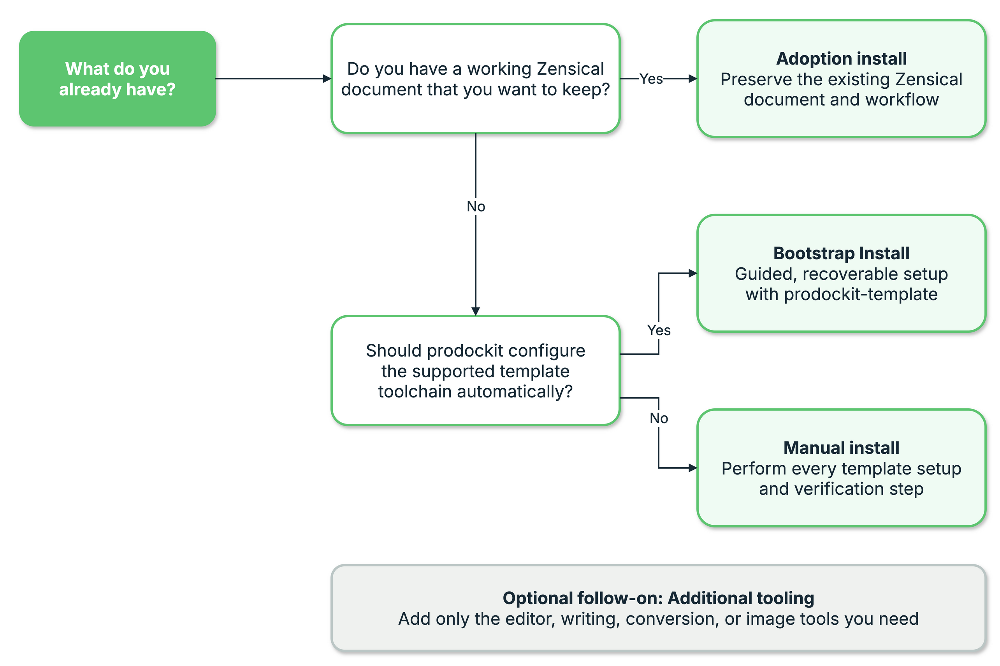

<!--
Copyright (c) 2025-2026 Mark Buckwell and contributors
SPDX-License-Identifier: MIT
-->

{{ heading_counter_reset(page) }}

# Installing prodockit

Prodockit supports three installation approaches. Choose one approach for the
document you are working on; the routes are alternatives rather than stages
that must all be completed.

The decision starts with what you already have. An existing, working Zensical
document normally needs Adoption because that route preserves its structure
and publishing workflow. A new document based on
`prodockit-template` can use Bootstrap for guided automation or Manual install
when every setup action must be performed directly.

{ .documentation-diagram }
/// figure-caption
    attrs: {id: figure-installing-prodockit-decision-tree-components}

Choose the prodockit installation approach
///

## Choose an installation approach

Use the table to compare the starting point and level of automation for each
approach. Follow the link for the approach that matches the current document;
each linked page provides the complete installation procedure.

| Approach | Choose it when | What happens |
| --- | --- | --- |
| [Adoption install](adoptioninstall.md) | You already have a working Zensical document and want to keep its structure, appearance, Git history, and publishing workflow. | `prodockit adopt` adds the shared authoring components while preserving the project's existing choices. |
| [Bootstrap Install](bootstrapinstall.md) | You want to start from `prodockit-template` and allow a guided installer to configure the supported tools and project. | `prodockit bootstrap` checks the computer, previews its changes, and completes the setup in recoverable stages. |
| [Manual install](installtooling.md) | You want to start from `prodockit-template`, but need or prefer to install and configure every tool yourself. | You follow the equivalent platform-specific setup and verification commands directly. |
/// table-caption | <
Prodockit installation approaches
///

### Adopt an existing document

Choose Adoption when the document already builds successfully and its own
template, navigation, styles, repository, and publishing workflow should
remain in place. Adoption does not replace the project with
`prodockit-template`, and it does not commit or push changes.

[:octicons-arrow-right-24: Use Adoption install](adoptioninstall.md){ .md-button }

### Bootstrap a template project

Choose Bootstrap when you want the structure supplied by
`prodockit-template` and can allow prodockit to install and configure the
supported toolchain. The command reports its proposed actions before applying
them and can resume safely after an interruption.

[:octicons-arrow-right-24: Use Bootstrap Install](bootstrapinstall.md){ .md-button }

### Install a template project manually

Choose Manual install when you want the same template-based result but cannot
use the automated installer, or when you need to understand and perform each
configuration step yourself. This is the longest route and includes separate
instructions for macOS, Windows, and Ubuntu Linux.

[:octicons-arrow-right-24: Use Manual install](installtooling.md){ .md-button }

## Environment used by each approach

Every route uses Python 3.14 and an isolated project build environment.
Bootstrap and Manual install first create `GitHub/.venv` as a setup
environment, then create a separate `.venv` inside the project for building
the website and PDF. Adoption begins with an existing project and uses or
creates that project's own `.venv`.

The commands in this guide assume these `.venv` locations. Conda, Poetry, uv,
and other environment managers can be used, but their creation, activation,
and package commands must be adapted while preserving the separation between
setup and project packages.

## Add optional tooling afterwards

After the chosen installation route is complete, the project already has
everything required to write, build, and publish the document. The
[Additional tooling](additionaltooling.md) page is an optional follow-on for
specific needs such as repository-service integration in Visual Studio Code,
extra Git history views, spelling and writing checks, document conversion, or
image optimisation. It is not a fourth installation route, and none of its
tools is required before you start editing.
