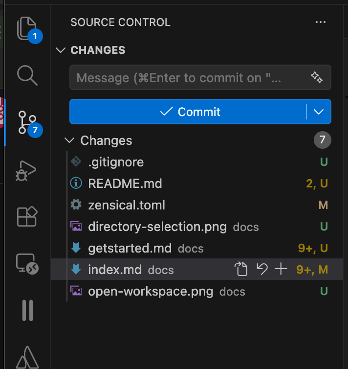
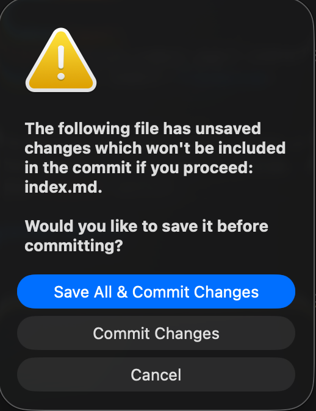
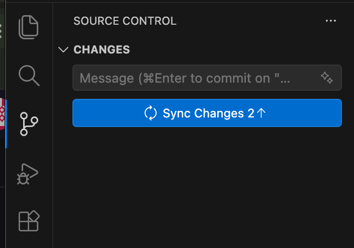
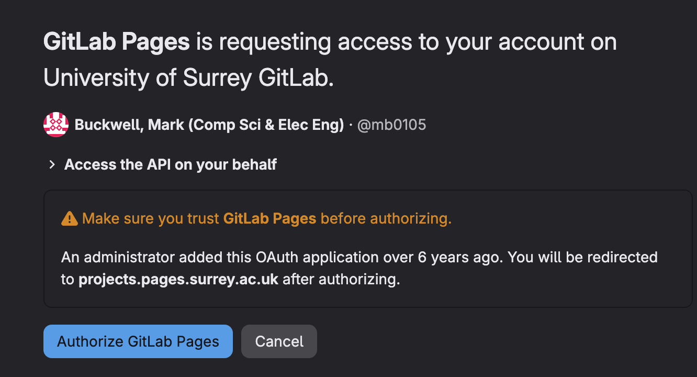

<!--
# Copyright (c) 2025-2026 Mark Buckwell and contributors
# SPDX-License-Identifier: MIT
-->

{{ heading_counter_reset(page) }}

# Start editing

This page introduces the everyday authoring cycle after installation. It shows
how to preview and check the document before saving a recoverable version in
GitLab or GitHub, and how to confirm that the published result is current.
Commands are explained for authors who are new to Git or the terminal.

## Follow the everyday cycle

/// steps

//// step | Preview the website

Open the project environment and use `zensical serve` while editing Markdown.

////

//// step | Build and check the documents

Generate the PDF and any source bundle locally. Check them before publishing.

////

//// step | Save and push the change

Commit a labelled snapshot with Git, then push it through SSH to GitLab or
GitHub.

////

//// step | Confirm publication

Wait for the automated build to pass, then open the published website and PDF.

////

///

Branches and issues are optional tools for larger or shared changes. The final
sections explain those tools and provide help with common problems.

## Preview the website locally

\index{Tasks!Preview a website} locally with Zensical while you write, without
needing to push anything. This lets you check headings, links, images,
diagrams, and PDF-only/web-only content before anyone else sees them.

### Open a terminal

A terminal (also called a command line, console, or shell) is a text-based way to give your computer instructions by typing commands, instead of clicking buttons. It can look intimidating at first, but this whole workflow only needs a handful of commands, and they're all given below.

The easiest way to open one is Visual Studio Code's own integrated terminal:

1. Open your project folder in Visual Studio Code, if it isn't already open (**File** > **Open Folder...**).
2. Open the integrated terminal, whichever way is quickest for you:
    * Menu: **View** > **Terminal**.
    * Keyboard shortcut: `` Ctrl+` `` on Windows/Linux, `` Cmd+` `` on macOS.
    * Command Palette (`Ctrl+Shift+P`/`Cmd+Shift+P`) > **View: Toggle Terminal**.
3. A panel opens at the bottom of the window, already sitting in your project folder - defaulting to PowerShell on Windows, or your shell of choice (bash/zsh) on macOS and Linux.

This integrated terminal also activates your Python virtual environment automatically (a self-contained folder holding just this project's Python packages, kept separate from everything else on your computer), as long as you've selected the `.venv` interpreter once - see [Install Python and Zensical](installtooling.md#install-python-and-zensical). That's the recommended path, since it needs no further steps below.

If you'd rather use your system's own terminal application instead of Visual Studio Code's, you need to navigate to your project folder and activate the virtual environment yourself:

=== ":material-apple: macOS"

    1. Open a terminal application: press `Cmd+Space` to open Spotlight, type `Terminal`, and press `Enter`.
    2. Navigate to your project folder using the `cd` (change directory) command - replace the path below with wherever you cloned your project:

        ```bash
        cd path/to/your/project
        ```

    3. Activate the virtual environment:

        ```bash
        source .venv/bin/activate
        ```

        Your prompt now starts with `(.venv)`, confirming it's active.

=== ":fontawesome-brands-windows: Windows"

    1. Open PowerShell: press the `Windows` key, type `PowerShell`, and press `Enter`.
    2. Navigate to your project folder using the `cd` command:

        ```powershell
        cd path\to\your\project
        ```

    3. Activate the virtual environment:

        ```powershell
        .\.venv\Scripts\Activate.ps1
        ```

        Your prompt now starts with `(.venv)`, confirming it's active.

=== ":material-linux: Linux (Ubuntu)"

    1. Open a terminal application: look for **Terminal** in your applications menu.
    2. Navigate to your project folder using the `cd` (change directory) command - replace the path below with wherever you cloned your project:

        ```bash
        cd path/to/your/project
        ```

    3. Activate the virtual environment:

        ```bash
        source .venv/bin/activate
        ```

        Your prompt now starts with `(.venv)`, confirming it's active.


### Start the preview server

1. In your terminal (with the virtual environment active), start the local preview server:

    ```bash
    zensical serve
    ```

2. Wait for it to finish starting - you'll see some log messages ending with a local web address.
3. Open that address (typically [http://127.0.0.1:8000](http://127.0.0.1:8000)) in your browser to view your documentation.

Leave `zensical serve` running in its terminal while you write - it watches your files and automatically rebuilds and refreshes the browser whenever you save a change, so you don't need to restart it after every edit. To stop it, click back into its terminal and press `Ctrl+C`.

!!! tip
    `zensical serve` only builds the website - it does not update
    `docs/site_documentation.pdf`. Build and check the downloadable documents
    separately before publishing.

## Build and check the downloadable documents {: #build-the-pdf }

Build downloadable documents separately because `zensical serve`
updates the website preview but does not regenerate the PDF or
source bundle. Build these documents before committing a change that should
appear in them.

1. Confirm that the terminal is in the project directory and its virtual
    environment is active.
2. Build the report:

    ``` bash
    prodockit pdf
    ```

3. If the project provides a **Source** download, build that document too:

    ``` bash
    prodockit source-bundle
    ```

4. Open `docs/site_documentation.pdf` and, when created,
    `docs/source_bundle.pdf`. Check page breaks, figures, tables, references,
    diagrams, mathematics, and the index rather than relying only on the
    website preview.

### Use the author checklist

Before saving and pushing a substantial change, check what a reader will
actually receive rather than checking only the Markdown source:

- Open every page you changed in the local website preview. Check its heading
    appears in the navigation, and follow any links you added.
- Look for `?` or `??` where a citation, glossary term, section, figure, or
    table reference should appear. These markers normally mean that an id is
    missing or mistyped.
- Check that images have useful alternative text and that figures and tables
    have the expected captions and numbers.
- Open the PDF and check the same changed content again. Pay particular
    attention to page breaks, wide tables, landscape pages, fonts, diagrams,
    mathematics, and references to page numbers.
- If the change affects the cover page or appendixes, check the displayed word
    count and the generated index as well.
- Follow the PDF and Source download buttons in the local website when those
    files are part of the published project.

The website and PDF use the same source but different layout engines. A correct
website preview therefore does not prove that the PDF is correct, and the
reverse is also true.

!!! warning "Recheck after maintenance"
    After updating prodockit, another dependency, or files from
    `prodockit-template`, rebuild both outputs and repeat this checklist. A
    maintenance update can change generated output even when none of the
    document's Markdown files changed.

The front-page download buttons already point to these files. They are generated
locally and excluded from Git, so a fresh clone does not contain them and a
normal commit does not upload them. Refresh the local website after building to
test its download buttons.

!!! note "What the source bundle contains"

    `prodockit source-bundle` includes the root `README.md`, the Markdown files
    under the configured documentation directory, and the active Zensical
    configuration. It does not include the whole repository or generated root files
    such as `CHANGELOG.md`, `CONTRIBUTING.md`, and `LICENSE.md`. See
    [Source-code bundling](customise.md#source-code-bundling) if the submission
    requires something different.

Run these commands again whenever the downloadable documents need to reflect
new edits. The automated build repeats them after a change reaches the default
branch.

## Save and push your updates {: #synchronise-your-updates }

\index{Tasks!Save and push changes} you want to keep. Save the file, \index{Git!commit}
it (record a labelled snapshot in the project's history), and **push** it
(upload that snapshot with \index{Git!push} to GitLab or GitHub). You can use Visual Studio Code's
Source Control view or type Git commands directly.

=== "Visual Studio Code"

    1. Make sure you've saved your changed files (a filled circle next to a file name in the Explorer tab means it has unsaved changes - select the file and press `Ctrl+S` / `Cmd+S`).
    2. Click the :gitlab-branch: **Source Control** icon in the left-hand sidebar. You'll see a list of every changed and new file.

        { width="40%" .screenshot }
        /// figure-caption
            attrs: {id: figure-initial-commit}

        Initial commit
        ///

    3. Type a short, descriptive message in the message box (for example, "Add section 2 draft") - this is the label future-you (or a marker) will see when looking back through the history.
    4. Press the **Commit**{: .bg-blue} button and select **Save All and Commit Changes**{: .bg-blue}. This records the snapshot on your computer only - you haven't sent anything anywhere yet.

        { width="40%" .screenshot }
        /// figure-caption
            attrs: {id: figure-commit-changes}

        Commit changes
        ///

    5. Press **Sync Changes**{: .bg-blue} to push your commit to GitLab or GitHub (and pull down anyone else's changes too).

        { width="40%" .screenshot }
        /// figure-caption
            attrs: {id: figure-sync-changes}

        Sync changes
        ///

=== "Command line"

    1. Check what's changed - this lists every file you've added, edited, or deleted since your last commit:

        ```bash
        git status
        ```

    2. Stage the files you want to commit - "staging" means marking them so Git includes them in the next commit (use `git add .` to stage everything shown by `git status` in one go):

        ```bash
        git add docs/section1.md
        ```

    3. Commit the staged changes with a short, descriptive message:

        ```bash
        git commit -m "Add section 2 draft"
        ```

        This records the snapshot on your computer only - you haven't sent anything anywhere yet.

    4. Push your commit to your GitLab or GitHub remote, uploading it so it's backed up and visible online:

        ```bash
        git push
        ```


!!! note
    Commit little and often. Small, clearly described commits are easier to review, easier to revert if something goes wrong, and give you a much more useful history to look back on than one huge commit at the deadline.

## Confirm the published website and documents

\index{Tasks!Check published outputs} after the commit reaches the default
branch and the \index{continuous integration!pipeline} rebuilds the website and PDF.

!!! warning "The first build takes longer than you'd expect"
    Every build installs the whole toolchain from scratch - Node.js, Chrome, Pandoc, the Python environment - so even a routine rebuild takes several minutes, and the very first one on a fresh project can easily run into the mid-teens. A blank page or a 404 on your first visit almost always means the build simply hasn't finished yet, not that something is broken.

    Check first, rather than refreshing a page that hasn't been built yet: **Build > Pipelines** in the sidebar on GitLab, or the **Actions** tab on GitHub. A running pipeline or workflow shows a spinner or a yellow dot; wait for it to turn green.

=== "GitLab"

    The simplest way to find your site is from the project itself, rather than working out the URL by hand: open your project on the GitLab website and look for the **GitLab Pages** link, shown on the project overview page once Pages has deployed at least once (also always available under **Deploy > Pages** in the sidebar). Click it.


    1. The first time you visit, GitLab prompts you to authorise GitLab Pages access to your project:

        { width="40%" .screenshot }
        /// figure-caption
            attrs: {id: figure-authorise-gitlab-pages}

        Authorise GitLab Pages
        ///

    2. Your browser redirects to a URL with an extra, unique key added, such as [https://prodockit-template-4f75ad.pages.surrey.ac.uk/](https://prodockit-template-4f75ad.pages.surrey.ac.uk/){target="_blank"}. This confirms that you (specifically, someone with access to the underlying GitLab project) can view the page - GitLab Pages sites aren't public by default.

    This confirms that someone with access to the underlying GitLab project can
    view its private Pages site.

    The Pages address opens after the deployment finishes. A private GitLab
    service may ask you to sign in or authorise Pages before it displays the
    site; complete that request with the account that can access the project.



    !!! note "Working out the address yourself"
        If you'd rather not click through, University of Surrey Pages addresses
        follow the form `https://`*namespace*`.pages.surrey.ac.uk/`*repository-name*.

    !!! note "Working out the address yourself"
        If you'd rather not click through, most GitLab Pages addresses follow the form `https://`*namespace*`.gitlab.io/`*repository-name*, though a self-hosted instance may use its own domain - check **Settings > Pages** on your project for the exact one.


=== "GitHub"

    1. Go to your GitHub Pages address, in the form `https://`*username*`.github.io/`*repository-name*. This template's own site is at [https://template.prodockit.org](https://template.prodockit.org/){target="_blank"}.
    2. Unlike GitLab Pages, GitHub Pages sites are publicly accessible by default, even when the source repository is private - so no separate authorisation step is normally needed to view a GitHub Pages site once it's built.
    3. If your organisation has restricted Pages visibility (available on GitHub Enterprise), GitHub will ask you to sign in with an account that has access to the repository before the site loads.


### What the automated build does {: #automated-builds }

Both `.gitlab-ci.yml` and `.github/workflows/docs.yml` run this exact sequence automatically on every push to your default branch:

```bash
prodockit pdf
zensical build --clean --strict
```

`prodockit pdf` runs first so `docs/site_documentation.pdf` exists before
Zensical builds the site. That makes the cover page's **Download PDF** button
work in the published website. `zensical build --clean --strict` then builds
the site into the configured output directory for GitLab Pages or GitHub Pages.
`--strict` turns validation warnings such as broken internal links or missing
anchors into build failures. See
[A clean website build is needed](#a-clean-website-build-is-needed) if the
local output appears stale.

## Organise larger changes with branches and issues

Organise work with branches and issues after you are comfortable
with the basic commit-and-push cycle. A branch isolates a change until it is
ready, while an issue records what needs doing.

### Working with branches

A \index{Git!branch} is a parallel, isolated copy of your files where you can work without affecting the "real", published version until you're ready. For anything more than a small tweak - a new section, a bigger restructure - it's worth developing it on its own branch rather than directly on your default branch (usually `main`). That keeps `main` (and therefore the published website and PDF) stable while you're mid-change, and makes an unfinished idea easy to abandon without cleaning up half-done edits.

=== "Visual Studio Code"

    1. Click the branch name in the bottom-left of the status bar (it normally reads `main`).
    2. Select **Create new branch...** and give it a short, descriptive name (for example, `add-section-3`).
    3. Visual Studio Code switches you onto the new branch. Edit, save, and commit as usual (see [Save and push your updates](#synchronise-your-updates)) - your commits go onto this branch, not `main`.
    4. The first time you press **Sync Changes**{: .bg-blue}, Visual Studio Code offers to **Publish Branch**{: .bg-blue} instead - accept this to push the new branch to GitLab or GitHub.

=== "Command line"

    1. Create and switch to a new branch in one step:

        ```bash
        git switch -c add-section-3
        ```

    2. Commit as usual (see [Save and push your updates](#synchronise-your-updates)) - your commits go onto this branch, not `main`.
    3. Push it, telling Git to track this new branch on the remote the first time:

        ```bash
        git push -u origin add-section-3
        ```

        After that first push, a plain `git push` is enough.


### Merging your branch back

Once you're happy with the branch, bring it into your default branch so it's published.

=== "Merge or pull request"

    1. Open your project on GitLab or GitHub in a browser.
    2. Open a merge request (GitLab) or pull request (GitHub) from your branch into `main` - both platforms show a prompt for this as soon as you push a new branch, or you can start one from the **Merge requests**/**Pull requests** section of the sidebar.
    3. This gives you, or a collaborator, a chance to review the diff before it goes live.
    4. Once you're happy, click the **Merge**{: .bg-blue} button on the merge/pull request page - GitLab or GitHub does the rest.

=== "Merge locally"

    If you're working alone and don't need a review step first:

    1. Switch to your default branch:

        ```bash
        git switch main
        ```

    2. Pull down the latest version, in case anything's changed since you branched:

        ```bash
        git pull
        ```

    3. Merge your branch into it:

        ```bash
        git merge add-section-3
        ```

    4. Push the result:

        ```bash
        git push
        ```


Either way, once the merge reaches `main`, the [CI/CD pipeline](#automated-builds) rebuilds and republishes the website and PDF automatically, the same as any other push to `main`.

!!! tip
    Delete the branch once you've merged it - neither GitLab nor GitHub need it anymore, and it keeps your branch list tidy. Both offer a **Delete branch** button right after you merge a merge request or pull request.

### Recording issues and linking them to a branch

Issues are GitLab's and GitHub's built-in way to track things to do - a missing section, a diagram to add, a typo to fix - separately from the writing itself. They're especially useful once more than one person is working on the same report, or if you just want a running to-do list attached to the project instead of a separate document.

1. Open the **Issues** section in the left-hand sidebar of your project on the website, and select **New issue**.
2. Give it a short title (for example, "Add diagram to section 2") and, optionally, a longer description of what's needed.

Both platforms let you \index{Git!branch!create a branch} directly from an issue, which links the two together from the start:

* On GitLab, open the issue and use the **Create merge request**{: .bg-blue} button (or the dropdown next to it, for **Create branch** only). This creates a branch named after the issue (for example `12-add-diagram-to-section-2`) and links it back to the issue automatically.
* On GitHub, open the issue and, in the right-hand sidebar under **Development**, select **Create a branch**. This creates a branch linked to the issue, and offers to check it out for you.

If you've already created your branch by hand instead (see [Working with branches](#working-with-branches)), you can still link it to an issue by mentioning the issue number in a commit message:

```bash
git commit -m "Add diagram to section 2 (#12)"
```

Using `Closes #12`, `Fixes #12`, or `Resolves #12` instead of just `#12` - in the commit message, or in the merge/pull request description - automatically closes that issue as soon as the commit reaches your default branch.

## Help with common problems {: #startediting-help-with-common-problems }

Use this section to troubleshoot authoring problems encountered
while working on the document.

### `prodockit` or `zensical` is not recognised

``` text
prodockit : The term 'prodockit' is not recognized as the name of a cmdlet,
function, script file, or operable program.
```

Both commands are installed *inside* the virtual environment, not system-wide, so they only exist in a terminal where it is active. A new terminal window never has it - activation lasts for that window only.

=== ":material-apple: macOS"

    ``` bash
    cd path/to/your-project
    source .venv/bin/activate
    ```

=== ":fontawesome-brands-windows: Windows"

    ``` powershell
    cd C:\path\to\your-project
    .\.venv\Scripts\Activate.ps1
    ```

=== ":material-linux: Linux (Ubuntu)"

    ``` bash
    cd path/to/your-project
    source .venv/bin/activate
    ```


The prompt gains a `(.venv)` prefix when it works. This bites most often after a step that told you to close and reopen your terminal to pick up a `PATH` change - the new window has lost the virtual environment as well.

If activating makes no difference, the virtual environment itself may be in the wrong place: `.venv` created somewhere other than your project folder still activates perfectly happily. `pwd` tells you where you are.

### Local preview isn't updating

If you save a change and the browser doesn't refresh, or the page looks stuck:

1. Do a hard refresh in the browser first (`Ctrl+Shift+R` on Windows/Linux, `Cmd+Shift+R` on macOS) - this bypasses the browser's own cache, which is a more common culprit than Zensical itself.
2. If that doesn't help, stop the server (`Ctrl+C` in its terminal) and start it again:

    ```bash
    zensical serve
    ```

3. Still stuck? Check the terminal `zensical serve` is running in - a build error there (for example, invalid TOML in `zensical.toml`, or a broken link) stops it rebuilding, and it'll usually tell you exactly which file and line to look at.

### A cross-page reference looks stale in the live preview

`zensical serve` rebuilds only what it needs after a saved change. A value that
depends on a different page, such as a section or caption number, can therefore
briefly show the value from the preceding build.

Stop the preview with `Ctrl+C`, then make a clean build:

``` bash
prodockit pdf
zensical build --clean --strict
```

Open the rebuilt page again before changing a correct reference by hand. The
clean whole-site build, and the equivalent automated build after a push, are
the authoritative results.

### A reference opens the wrong repeated heading

Zensical normally creates an id from the heading text. Two pages can therefore
both contain a heading such as `## Results`, giving a cross-page reference an
ambiguous generated id.

Give each target a short, unique, explicit id and use that id in the reference:

``` markdown
## Test results {: #integration-test-results }

See \ref{integration-test-results}.
```

An explicit id also keeps the reference stable if you later rename the
heading. See [Section cross-references](customisecontent.md#section-cross-references)
for the complete syntax.

### A clean website build is needed

The `--clean` flag on `zensical build --clean --strict` deletes the previous contents of `public/` before rebuilding, so pages you've since renamed or removed don't linger in the published site. `--strict` also makes validation warnings fail the build. Both CI pipelines use both flags.

To do the same locally when the website output looks stale, run:

```bash
prodockit pdf
zensical build --clean --strict
```

### Numbered lists reset to "1."

If a numbered list in your Markdown restarts at "1." partway through instead of continuing (for example after a code block, admonition, or tab), it's almost always an indentation problem - Zensical (and Pandoc, for the PDF) only treat content as *continuing* the list item if it's indented to match. See [Lists within lists](zensicalbasics.md#lists-within-lists) for the exact rule to follow.

### Mermaid or mathematics appears as source text

If a diagram appears as its Mermaid definition, or a formula appears as TeX
with its backslashes and braces visible, the optional renderer has not run.
The website and PDF have separate rendering paths, so one can be correct while
the other is not.

1. Confirm the project was installed with the Mermaid or mathematics option it
    actually uses.
2. Run `prodockit pdf` and read any renderer warning printed in the terminal.
3. Run `zensical build --clean --strict` and check the website again.

Return to [Adoption install](adoptioninstall.md),
[Bootstrap Install](bootstrapinstall.md), or
[Manual install](installtooling.md#install-the-two-toolchains) if the required
renderer was skipped during setup.

### The website and PDF do not have exactly the same layout

Some variation is normal. A browser uses a responsive screen layout, while the
PDF has fixed pages, margins, headers, footers, and page breaks. Do not try to
make line and page breaks identical between the two outputs.

Treat it as a problem when content is missing, overlaps, is unreadably narrow,
uses the wrong font, or appears in the wrong output. Use a landscape page or
adjust the content when a wide table or diagram does not fit the PDF, then
check that the website remains readable too.

### The word count leaves out unexpected content

The displayed word count follows the project's configured rules. It can omit
pages marked `exclude_from_word_count: true`, PDF-only or web-only material,
generated labels, and content produced by an extension rather than written as
ordinary Markdown text.

Check the page front matter and the
[word-count settings](customise.md#word-count-and-repository-link) before
relying on the total for a submission. When a formal limit matters, compare the
reported value with the institution's own counting rules.

### PDF build fails

If `prodockit pdf` errors out or produces a PDF missing content:

1. Check the error message in the terminal - it usually names the file and the problem directly, and anything the underlying tool printed appears beneath it.
2. Make sure the dependencies from `requirements.txt` are installed in the
    active virtual environment.
3. If the document uses \index{Zensical!Mermaid} diagrams or mathematics,
    confirm that those options were enabled during
    [Adoption install](adoptioninstall.md), or that their toolchains were
    installed by [Bootstrap Install](bootstrapinstall.md) or
    [Manual install](installtooling.md#install-the-two-toolchains).
4. If the error says WeasyPrint cannot load a library, return to the common
    problems for the installation route. Reinstalling the Python package alone
    does not install its operating-system graphics libraries.

### Published site shows old content or a 404

1. Check the pipeline (GitLab **CI/CD > Pipelines**) or workflow (GitHub **Actions** tab) actually ran, and succeeded, for your latest commit - if it's still running, or failed, the old version stays published.
2. Confirm your change actually reached the default branch (`main`) - a commit sitting on a feature branch, or a merge/pull request you haven't merged yet, never triggers a rebuild. See [Organise larger changes with branches and issues](#organise-larger-changes-with-branches-and-issues).
3. Hard refresh the published page (`Ctrl+Shift+R`/`Cmd+Shift+R`) - your browser can cache the old version just as easily as it caches the local preview.
4. On GitHub specifically, if the workflow fails with `Get Pages site failed... Not Found`, GitHub Pages hasn't been switched on for the repository yet. Go to **Settings > Pages** and change **Build and deployment > Source** from **Deploy from a branch** to **GitHub Actions**, then re-run the failed workflow. This is a one-off step after creating a repository in a new GitHub account - see [Choose how to get the project](installtooling.md#cloning-the-prodockit-template) in Manual install.
5. On GitLab specifically, if the pipeline succeeds but no Pages site ever appears, check that the **Pages** feature itself hasn't been disabled for the project: **Settings > General > Visibility, project features, permissions**, and make sure **Pages** is toggled on. Unlike GitHub, GitLab doesn't need a separate "source" setting - Pages deploys automatically from the `pages` job in `.gitlab-ci.yml` once the feature is enabled, which it is by default.

## Prepare the final report

\index{Tasks!Prepare a final report} before submission by removing the "Start
Here" stub page. See [Start here](https://template.prodockit.org/starthere/starthere/){target="_blank"}
in your own copy of the template for what to comment out in `zensical.toml`
and what to delete.

!!! Info
    Once you've removed the stub from your own report, you can still come back to this guidance any time on the independent [prodockit User Guide](https://docs.prodockit.org/){target="_blank"} site.

## Where to go next {: #startediting-where-to-go-next }

Continue to [Markdown basics](markdown.md) and [Zensical basics](zensicalbasics.md) to learn the syntax you'll actually use to write your document. Once you're comfortable writing content, come back to these later chapters when you need them:

* [Document appearance and structure](customise.md) - branding, the cover page, PDF layout, and the document's directory structure.
* [Shell commands](shcommands.md) - a reference for commands used throughout the guide.
