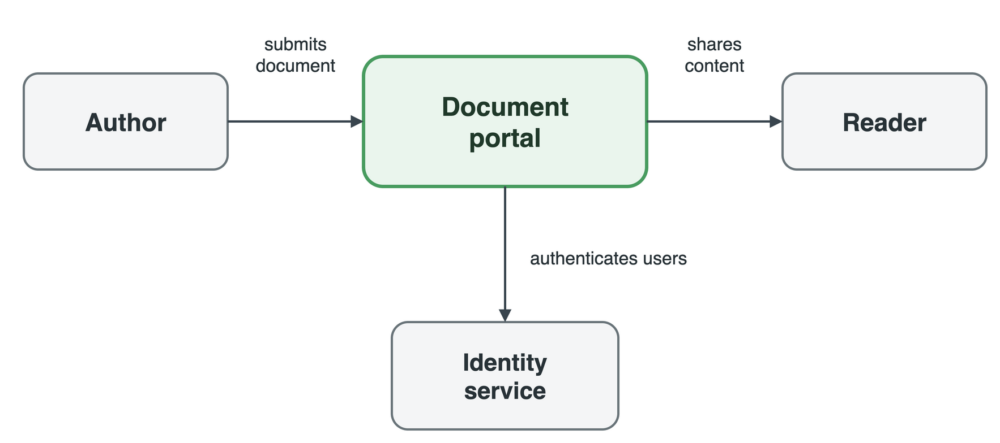

<!--
# Copyright (c) 2025-2026 Mark Buckwell and contributors
# SPDX-License-Identifier: MIT
-->

{{ pdk_heading_counter_reset(page) }}

# Start editing

This page introduces the everyday authoring cycle after installation. It shows
how to record a proposed change in an issue, edit and check the document,
and bring the change into GitLab or GitHub through a review. It also shows how
to confirm that the published result is current and the issue is closed.
Commands are explained for authors who are new to Git or the terminal.


!!! info "Practices measured by your module dashboard"
    The <span class="measurement-badge measurement-badge--example" role="img" aria-label="Example measurement badge">M</span>
    badges identify practices measured by the academic development
    dashboard for your module. They do not mean you have passed a check or earned
    marks. Use the **Measurements** page in your module's dashboard for the full
    definitions and your current results; its address depends on the module.


## Follow the everyday cycle

/// steps

//// step | Record the task

Raise an issue describing the change and what a finished result must include.
Create a branch for that issue before editing.

////

//// step | Edit the source

Update the Markdown file in Visual Studio Code and review the changed lines.

////

//// step | Preview the website

Open the project environment and use `zensical serve` while editing Markdown.

////

//// step | Build and check the documents

Generate the PDF and any source bundle locally. Check them before publishing.

////

//// step | Review, save, and propose the change

Use the pre-commit checklist, then commit a labelled snapshot on your issue
branch and push it through SSH to
GitLab or GitHub. Open a merge or pull request into the protected `main`
branch, linking it to the issue.

////

//// step | Confirm closure and publication

After the merge, check that the issue closed, wait for the automated build to
pass, then open the published website and PDF.

////

///

The example below follows one issue from the first description through its
Markdown edit, diagram, review, and merge.


For individual work, use this table to find the action behind each badge.
These are working practices, not a live scorecard; check your module dashboard
for the measurement definitions and your own results.

| Measurement | Section | Specific task |
| --- | --- | --- |
| <span class="measurement-badge" role="img" aria-label="Measurement M2.1: protected pull or merge request route" title="M2.1 — protected PR/MR route">M2.1</span> — PR/MR route | [4.7 Review and merge](#merging-your-branch-back) | Bring changes into `main` through a merge or pull request. |
| <span class="measurement-badge" role="img" aria-label="Measurement M2.2: protected by midpoint" title="M2.2 — protected by midpoint">M2.2</span> — Protected by midpoint | [4.2.1 Protect `main`](#check-that-main-is-protected) | Check that `main` is protected by the module midpoint. |
| <span class="measurement-badge" role="img" aria-label="Measurement M2.3: protection sustained" title="M2.3 — protection sustained">M2.3</span> — Protection sustained | [4.2.1 Protect `main`](#check-that-main-is-protected) | Keep protection enabled through the deadline; recheck after settings change. |
| <span class="measurement-badge" role="img" aria-label="Measurement M2.4: no direct push to main" title="M2.4 — no direct push">M2.4</span> — No direct push | [4.6 Save and push](#synchronise-your-updates) | Push the issue branch, not directly to `main`. |
| <span class="measurement-badge" role="img" aria-label="Measurement M3.1: CI configured by midpoint" title="M3.1 — CI configured by midpoint">M3.1</span> — CI by midpoint | [4.2.1 Protect `main`](#check-that-main-is-protected) | Have a CI configuration on `main` by the midpoint. |
| <span class="measurement-badge" role="img" aria-label="Measurement M3.2: CI sustained through midpoint" title="M3.2 — CI sustained through midpoint">M3.2</span> — CI sustained | [4.8.1 Automated build](#automated-builds) | Check that the latest recorded pipeline succeeds during the setup-to-midpoint weeks. |
| <span class="measurement-badge" role="img" aria-label="Measurement M3.3: passing checks required before merge" title="M3.3 — passing checks required before merge">M3.3</span> — Checks required | [4.2.1 Protect `main`](#check-that-main-is-protected) | Require passing checks or a pipeline before a request can merge. |
| <span class="measurement-badge" role="img" aria-label="Measurement M3.4: latest validation passes through deadline" title="M3.4 — latest validation passes through deadline">M3.4</span> — Validation passes | [4.8.1 Automated build](#automated-builds) | Check that the latest recorded pipeline succeeds during the midpoint-to-deadline weeks. |
| <span class="measurement-badge" role="img" aria-label="Measurement M4.1: work item linkage" title="M4.1 — work item linkage">M4.1</span> — Work-item link | [4.7 Review and merge](#merging-your-branch-back) | Link the issue in the request description, for example with `Closes #12`. |
| <span class="measurement-badge" role="img" aria-label="Measurement M4.2: work item precedes change" title="M4.2 — work item precedes change">M4.2</span> — Work precedes change | [4.2.2 Raise the issue](#raise-the-issue-and-create-a-branch) | Create the issue before opening the request; server creation times are compared. |
| <span class="measurement-badge" role="img" aria-label="Measurement M4.3: individual work uses the merge or pull request route" title="M4.3 — individual PR/MR route">M4.3</span> — Individual PR/MR route | [4.7 Review and merge](#merging-your-branch-back) | Use the request route for changes to `main`; individual work is not scored on a second-person approval. |
| <span class="measurement-badge" role="img" aria-label="Measurement M4.4: feedback resolved" title="M4.4 — feedback resolved">M4.4</span> — Feedback resolved | [4.7 Review and merge](#merging-your-branch-back) | Resolve review discussions before merging the request. |

The M1.1–M1.4 delivery checkpoints and M5.1–M5.4 clean-environment
validation checks are not covered by these editing steps. Follow your module's
scheduled checkpoint and validator instructions; a local preview or build does
not by itself provide that evidence.


## Start with an issue and edit the source

An issue records the work before the first edit, so the branch and review have
a clear purpose. For example, suppose you need to write a **System context**
section and draw a system context diagram.

### Check that `main` is protected

The project maintainer may already have set this up during installation.
Before using the issue-and-branch workflow, check the existing rules; do not
create a second rule or change project settings just because you cannot see
them. A branch named `main` is not necessarily protected.

=== ":fontawesome-brands-github: GitHub"

    1. In the repository, open **Settings** > **Rules** > **Rulesets**. Look for
        an active rule targeting `main`. Some repositories use the older
        **Settings** > **Branches** > **Branch protection rules** instead.
    2. Check that changes must arrive through a pull request, the expected
        build/status checks must pass before merge, and force pushes are not
        allowed. If your course requires approval, check that the rule requires
        it rather than relying on a reviewer being invited.

=== ":fontawesome-brands-gitlab: GitLab"

    1. Open **Settings** > **Repository** > **Branch rules** and inspect the
        rule for `main`. Confirm that direct **push and merge** access is
        restricted, force push is off, and the right people can merge requests.
    2. Open **Settings** > **Merge requests**. Check whether **Pipelines must
        succeed** is enabled under merge checks and whether your project has
        any required approvals. A required-pipeline rule also needs a pipeline
        configured to run for merge requests; otherwise a request may be
        blocked because it has no pipeline at all.

Check that the project has a CI configuration (`.github/workflows/` or
`.gitlab-ci.yml`) **and** that a recent run passed; the presence of a file alone
does not show that checks are working. If you cannot see the settings, ask a
maintainer to confirm them. If a required guardrail is missing, ask the
maintainer to put it in place before you rely on the workflow. Recheck after
repository-setting changes and before later merges; protection and passing CI
need to persist, not just exist on the day the project was created.


For your module's measured workflow, have protection in place by the midpoint
<span class="measurement-badge" role="img" aria-label="Measurement M2.2: protected by midpoint" title="M2.2 — protected by midpoint">M2.2</span>
and keep it enabled through the deadline
<span class="measurement-badge" role="img" aria-label="Measurement M2.3: protection sustained" title="M2.3 — protection sustained">M2.3</span>.
Have CI configured on `main` by the midpoint
<span class="measurement-badge" role="img" aria-label="Measurement M3.1: CI configured by midpoint" title="M3.1 — CI configured by midpoint">M3.1</span>
and require its checks to pass before merge
<span class="measurement-badge" role="img" aria-label="Measurement M3.3: passing checks required before merge" title="M3.3 — passing checks required before merge">M3.3</span>.
Keep checking that the latest pipeline actually succeeds during the first half
<span class="measurement-badge" role="img" aria-label="Measurement M3.2: CI sustained through midpoint" title="M3.2 — CI sustained through midpoint">M3.2</span>
and second half
<span class="measurement-badge" role="img" aria-label="Measurement M3.4: latest validation passes through deadline" title="M3.4 — latest validation passes through deadline">M3.4</span>
of the assessment period; a CI file alone does not meet those checks.


### Raise the issue and create a branch

1. Open your project in a browser. On GitHub, select **Issues** > **New issue**.
    On GitLab, select **Plan** > **Work items** > **New item**, choose **Issue**,
    and create it. If your GitLab version shows **Issues** directly, use its
    **New issue** button instead.
2. Give it a specific title, such as **Write the system context section and
    diagram**. In the description, record what a reviewer should be able to
    check:

    - Explain the system boundary, its users, and the external systems it
        interacts with in the relevant Markdown chapter.
    - Draw a system context diagram whose labels agree with the text. Keep
        the editable drawing source as well as the exported image.
    - Add the diagram to the chapter with useful alternative text and a
        caption; check it in both the website and PDF.

3. Note the issue number. This example uses `#12`; use the number your project
    gives you. Before editing, create a branch from `main` named after the
    issue, such as `12-system-context`. In Visual Studio Code, click the active
    branch name in the bottom-left status bar and select
    **:material-plus: Create new branch...**{: .bg-blue}. If the branch name
    is missing, follow the [branch-name recovery note](#synchronise-your-updates)
    under **Save and push your updates**.
    The [command-line route](#synchronise-your-updates) is available too.

Keep the issue open while you work. The merge request or pull request will
close it when the finished change reaches `main`.

Create the issue before the merge/pull request, not just before merging it:
the dashboard compares their server-recorded creation times
<span class="measurement-badge" role="img" aria-label="Measurement M4.2: work item precedes change" title="M4.2 — work item precedes change">M4.2</span>.


### Edit and review the Markdown file in Visual Studio Code

1. Open the project's folder with **File** > **Open Folder...**. In the
    **Explorer** sidebar, expand `docs/` and select the `.md` file containing
    the chapter. If the section needs its own new page, create the Markdown
    file under `docs/` and add it to the project's navigation in
    `zensical.toml`.
2. In the editor, add a **System context** heading at the right level and
    write a short explanation of what is inside the system boundary, who uses
    the system, and which outside systems connect to it. Draw the diagram in
    your project's chosen tool. Save its editable source in the project, export
    an image under `docs/`, and insert it in the Markdown with descriptive
    alternative text and a caption as shown in the next section.
3. Save the Markdown with `Ctrl+S` on Windows/Linux or `Cmd+S` on macOS. To
    see the file as ordinary Markdown beside its source, press `Ctrl+K V` on
    Windows/Linux or `Cmd+K V` on macOS. This built-in preview is useful for
    prose and basic formatting, but it does not reproduce all of Zensical's
    captions, numbering, or site styling; check those in the browser preview
    in the next section.
4. Click the :gitlab-branch: **Source Control** icon and select the Markdown
    file under **Changes**. The side-by-side diff shows the earlier version
    beside your edits. Review the diagram source and exported image there as
    well, and make sure unrelated files are not part of the change.

### Insert an image with a caption

Keep the drawing you can edit and the image you publish as separate files. For
this example, save `system-context-example.pptx` **or**
`system-context-example.drawio` under `tools/documentation-diagrams/`, then
export `docs/images/system-context-example.png`. The example below uses the
editable `tools/documentation-diagrams/system-context-example.drawio` source
in this guide. The `.png` is what the website and PDF display; the source file
lets you revise it later. If your project uses different folders, adjust the
paths consistently.

=== "PowerPoint"

    1. Save the editable presentation as
        `tools/documentation-diagrams/system-context-example.pptx`. Put the
        whole diagram on one slide using shapes, text, and connectors.
    2. Select only the diagram objects (`Ctrl`-click on Windows or
        `Command`-click on macOS). On **Shape Format**, choose **Group** >
        **Group**, so the exported image includes all the labels and arrows
        but not the empty slide around them.
    3. Right-click the group (Control-click on macOS), choose **Save as
        Picture**, select **PNG**, and save it as
        `docs/images/system-context-example.png`.
    4. Open the exported PNG. Check that nothing is cut off, there is little
        empty space, and the smallest labels are readable at the size you
        intend to use in the document. If it looks blurry, enlarge the
        drawing before exporting again; do not stretch a small PNG in Markdown.

=== "draw.io"

    1. In the downloadable draw.io application, save the editable diagram as
        `tools/documentation-diagrams/system-context-example.drawio`.
    2. Choose **File** > **Export As** > **PNG**. Set **Zoom** to `200%` for
        readable text. Set **Size** to the diagram bounds, rather than a whole
        mostly empty page, and use a small **Border Width** such as `20`.
        Leave **Grid** off; use a light background so text remains legible in
        both website colour schemes and the PDF.
    3. Click **Export** and save the PNG as
        `docs/images/system-context-example.png`. Open it and check the crop,
        labels, arrows, and text size before inserting it.

In a Markdown file such as `docs/system-context.md`, the path to that PNG is
`images/system-context-example.png`, relative to the Markdown file. Add a
sentence that refers to the figure, then put the `figure-caption` block
immediately after the image:

``` markdown
The portal's external interactions are shown in \ref{figure-system-context-example}.

{ width="90%" }
/// figure-caption
    attrs: {id: figure-system-context-example}

System context of the document portal
///
```

The alternative text explains the image to a reader who cannot see it. The
stable `id` makes the `\ref{...}` work even if earlier figures are added or
removed. The `width` limits the displayed size; it cannot restore detail to
an undersized export. Here is the example as it should render:

The portal's external interactions are shown in \ref{figure-system-context-example}.

{ width="90%" }
/// figure-caption
    attrs: {id: figure-system-context-example}

System context of the document portal
///

Open this page with `zensical serve` and check the image, numbered caption,
and reference in the website. Then build the PDF as described under
[Build and check the downloadable documents](#build-the-pdf) and check that
the same image fits, its smallest labels remain readable, and the caption and
reference have the expected number. Visual Studio Code's built-in Markdown
preview does not verify the final caption rendering. For more options, see
[Add a caption](zensicalbasics.md#images),
[Caption a figure](customisecontent.md#caption-a-figure), and the
[drawing-tool guidance](zensicalbasics.md#diagrams).

Before committing, open :gitlab-branch: **Source Control** in Visual Studio
Code. Make sure the changed Markdown file, the exported PNG, and its editable
`.pptx` or `.drawio` source are all included on your issue branch; do not
commit only the image and leave the drawing behind.

## Preview the website locally

\index{Tasks!Preview a website} locally with Zensical while you write, without
needing to push anything. This lets you check headings, links, images,
diagrams, and PDF-only/web-only content before anyone else sees them.

### Open a terminal

A terminal (also called a command line, console, or shell) is a text-based way to give your computer instructions by typing commands, instead of clicking buttons. It can look intimidating at first, but this whole workflow only needs a handful of commands, and they're all given below.

The easiest way to open one is Visual Studio Code's own integrated terminal:

1. Open your project folder in Visual Studio Code, if it isn't already open (**File** > **Open Folder...**).
2. Open the integrated terminal, whichever way is quickest for you:
    * Menu: **View** > **Terminal**.
    * Keyboard shortcut: `` Ctrl+` `` on Windows/Linux, `` Cmd+` `` on macOS.
    * Command Palette (`Ctrl+Shift+P`/`Cmd+Shift+P`) > **View: Toggle Terminal**.
3. A panel opens at the bottom of the window, already sitting in your project folder - defaulting to PowerShell on Windows, or your shell of choice (bash/zsh) on macOS and Linux.

This integrated terminal also activates your project virtual environment
automatically (a self-contained folder holding this project's Python packages),
as long as you selected its `.venv` interpreter once. Follow the
[Getting started](gettingstarted.md)
to create the environment, and check that every new terminal prompt begins
with `(.venv)` before running a Python, Zensical, or prodockit command.

If you'd rather use your system's own terminal application instead of Visual Studio Code's, you need to navigate to your project folder and activate the virtual environment yourself:

=== ":material-apple: macOS"

    1. Open a terminal application: press `Cmd+Space` to open Spotlight, type `Terminal`, and press `Enter`.
    2. Navigate to your project folder using the `cd` (change directory) command - replace the path below with wherever you cloned your project:

        ```bash
        cd path/to/your/project
        ```

    3. Activate the virtual environment:

        ```bash
        source .venv/bin/activate
        ```

        Your prompt now starts with `(.venv)`, confirming it's active.

=== ":fontawesome-brands-windows: Windows"

    1. Open PowerShell: press the `Windows` key, type `PowerShell`, and press `Enter`.
    2. Navigate to your project folder using the `cd` command:

        ```powershell
        cd path\to\your\project
        ```

    3. Activate the virtual environment:

        ```powershell
        .\.venv\Scripts\Activate.ps1
        ```

        Your prompt now starts with `(.venv)`, confirming it's active.

=== ":material-linux: Linux (Ubuntu)"

    1. Open a terminal application: look for **Terminal** in your applications menu.
    2. Navigate to your project folder using the `cd` (change directory) command - replace the path below with wherever you cloned your project:

        ```bash
        cd path/to/your/project
        ```

    3. Activate the virtual environment:

        ```bash
        source .venv/bin/activate
        ```

        Your prompt now starts with `(.venv)`, confirming it's active.


=== ":stag-stag_icon_32: Surrey RemoteLabs"

    1. Open **Terminal** from the applications menu.
    2. Navigate to your project folder with `cd`:

        ```bash
        cd path/to/your/project
        ```

    3. Activate the virtual environment:

        ```bash
        source .venv/bin/activate
        ```

        Your prompt now starts with `(.venv)`, confirming it's active.



After activation, `python --version` must report `Python 3.14`. If you use
Conda, Poetry, uv, or a differently named environment, substitute its
activation and package commands throughout the guide and verify it selects
Python 3.14 before continuing.


### Start the preview server

1. In your terminal (with the virtual environment active), start the local preview server:

    ```bash
    zensical serve
    ```

2. Wait for it to finish starting - you'll see some log messages ending with a local web address.
3. Open that address (typically [http://127.0.0.1:8000](http://127.0.0.1:8000)) in your browser to view your documentation.

Leave `zensical serve` running in its terminal while you write - it watches your files and automatically rebuilds and refreshes the browser whenever you save a change, so you don't need to restart it after every edit. To stop it, click back into its terminal and press `Ctrl+C`.

!!! tip
    `zensical serve` only builds the website - it does not update
    `docs/site_documentation.pdf`. Build and check the downloadable documents
    separately before publishing.

## Build and check the downloadable documents {: #build-the-pdf }

Build downloadable documents separately because `zensical serve`
updates the website preview but does not regenerate the PDF or
source bundle. If your local environment can build them, do so before
committing a change that should appear in them. Otherwise, follow the
[pre-commit checklist](#review-before-committing) and check the PDF after the
merge.

1. Confirm that the terminal is in the project directory and its virtual
    environment is active.
2. Make a clean website build, then build the report from it:

    ``` bash
    zensical build --clean --strict
    pdk pdf
    ```

3. If the project provides a **Source** download, build that document too:

    ``` bash
    pdk source-bundle
    ```

4. Open `docs/site_documentation.pdf` and, when created,
    `docs/source_bundle.pdf`. Check page breaks, figures, tables, references,
    diagrams, mathematics, and the index rather than relying only on the
    website preview.

The front-page download buttons already point to these files. They are generated
locally and excluded from Git, so a fresh clone does not contain them and a
normal commit does not upload them. Refresh the local website after building to
test its download buttons.

!!! note "What the source bundle contains"

    `prodockit source-bundle` includes the root `README.md`, the Markdown files
    under the configured documentation directory, and the active Zensical
    configuration. It does not include the whole repository or generated root files
    such as `CHANGELOG.md`, `CONTRIBUTING.md`, and `LICENSE.md`. See
    [Source-code bundling](customise.md#source-code-bundling) if the submission
    requires something different.

Run these commands again whenever the downloadable documents need to reflect
new edits. The automated build repeats them after a change reaches the default
branch.

## Review your work before committing {: #review-before-committing }

Use this checklist after editing and building, but before you stage and commit
the change. Check the result against the issue's description and acceptance
criteria, not just the files you intended to edit.

- [ ] The issue describes this work, and your active branch is the issue branch,
    not `main`.
- [ ] All edited files are saved. Review each changed file and its diff; remove
    accidental edits, generated files, temporary files, and credentials.
- [ ] Every changed page looks right in the local website preview. Check its
    navigation entry, new links, captions, figure and table numbers, useful
    image alternative text, and references. A `?` or `??` in place of a
    reference usually means an id is missing or mistyped.
- [ ] For diagrams, compare labels and connections with the surrounding text.
    Include both the exported image and its editable drawing source.
- [ ] The clean website build passed. If your project provides a Source
    download, rebuild and test it after the final edit.
- [ ] If a local PDF build is available, rebuild and open the PDF. Check the
    changed content, page breaks, wide tables, fonts, diagrams, mathematics,
    and page references; if affected, also check the word count and index.
    Test the PDF download button locally.
- [ ] Check the list of files you are about to stage. It should contain only
    the files needed for this issue; review the staged diff before committing.

The website and PDF use different layout engines, so a correct website preview
does not prove the PDF is correct. If a check fails, fix it and repeat the
affected checks before committing. [Save and push your updates](#synchronise-your-updates)
once the checklist is complete.

!!! note "When you cannot build the PDF locally"
    Complete the other checks and continue with the commit and review. Mark
    PDF layout as a check still to do. After the branch is merged and the
    automated build succeeds, open the [published PDF](#confirm-the-published-website-and-documents)
    and inspect the changed pages. If the layout is wrong or the PDF is
    missing, raise a follow-up issue and fix it on a new branch.

Local checks are preparation, not a substitute for course checkpoints or
instructor-controlled clean-setup/build validation. Follow any scheduled
validation instructions and retain the required evidence.

!!! warning "Recheck after maintenance"
    After updating prodockit, another dependency, or files from
    `prodockit-template`, rebuild both outputs and repeat this checklist. A
    maintenance update can change generated output even when none of the
    document's Markdown files changed.

## Save and push your updates {: #synchronise-your-updates }

\index{Tasks!Save and push changes} you want to keep. Stay on the
\index{Git!branch} you created for the issue. If you have not made one yet,
create it before committing because `main` is protected. Then
\index{Git!commit} it (record a labelled snapshot in the project's history)
and **push** the branch (upload it with \index{Git!push} to GitLab or GitHub).
You can use Visual Studio Code's Source Control view or type Git commands
directly. If you've already edited files on `main`, creating a branch carries
your uncommitted edits with you.

=== ":material-microsoft-visual-studio-code: Visual Studio Code"

    1. Make sure you've saved your changed files (a filled circle next to a file name in the Explorer tab means it has unsaved changes - select the file and press `Ctrl+S` / `Cmd+S`).
    2. Check the branch name in the bottom-left of the status bar. If it says `main`, click it, select **:material-plus: Create new branch...**{: .bg-blue}, and enter a name that identifies your issue, such as `12-system-context`. Visual Studio Code switches to that branch, taking your uncommitted edits with it. If you are already on the issue branch, keep using it.

        !!! note "Restoring a missing active branch name"
            If no branch name appears, right-click the status bar and turn on
            **Source Control Checkout**.

            If it still does not appear, open the integrated terminal
            (**View** > **Terminal**) and run `git branch --show-current`.
            If the result is `main`, use the Command Palette
            (`Ctrl+Shift+P` / `Cmd+Shift+P`) to run **Git: Create Branch...**.
            If Git says this is not a repository, open the cloned project
            folder with **File** > **Open Folder...**, then try again.
    3. Click the :gitlab-branch: **Source Control** icon in the left-hand sidebar. You'll see a list of every changed and new file. Select each file to review its diff, then stage only the files for this issue with the **:material-plus: Stage Changes** control. For the example, include the Markdown chapter, exported diagram, and editable drawing source.

        { width="40%" .screenshot }
        /// figure-caption
            attrs: {id: figure-initial-commit}

        Initial commit
        ///

    4. Type a short, descriptive message in the message box (for example, "Write system context section and diagram") - this is the label future-you (or a marker) will see when looking back through the history.
    5. Press **Commit**{: .bg-blue} to record the staged files on your branch. This records the snapshot on your computer only - you haven't sent anything anywhere yet.

        { width="40%" .screenshot }
        /// figure-caption
            attrs: {id: figure-commit-changes}

        Commit changes
        ///

    6. Press **Publish Branch**{: .bg-blue} to push a new branch to GitLab or GitHub. For later commits on the same branch, use **Sync Changes**{: .bg-blue}.

        { width="40%" .screenshot }
        /// figure-caption
            attrs: {id: figure-sync-changes}

        Sync changes
        ///

=== ":material-console: Command line"

    1. Check your current branch and what's changed:

        ```bash
        git branch --show-current
        git status
        ```

    2. If you are on `main`, create and switch to a branch named for the issue before committing. Any uncommitted edits come with you:

        ```bash
        git switch -c 12-system-context
        ```

        If you are already on a change branch, stay on it.

    3. Stage the files for this issue - "staging" means marking them so Git includes them in the next commit. Use the paths shown by `git status`; for example, stage the changed Markdown file, exported image, and editable drawing source, but leave unrelated files out:

        ```bash
        git add docs/section1.md
        git add docs/images/system-context.png
        git add tools/documentation-diagrams/system-context.drawio
        git status
        ```

        Replace those example paths with the locations used by your project.

    4. Commit the staged changes with a short, descriptive message:

        ```bash
        git commit -m "Write system context section and diagram"
        ```

        This records the snapshot on your computer only - you haven't sent anything anywhere yet.

    5. Push the new branch to your GitLab or GitHub remote, telling Git to track it there:

        ```bash
        git push -u origin 12-system-context
        ```

        Substitute your branch name if it differs. For later commits on the
        same branch, a plain `git push` is enough.

Pushing a branch does not publish the website or close its issue. Open a merge
request on GitLab or a pull request on GitHub from your branch into `main`,
include `Closes #12` in its description (using your actual issue number), wait
for the checks, and merge it when approved. The protected `main` branch cannot
be pushed to directly. See [Merging your branch back](#merging-your-branch-back)
for the review steps.

!!! note
    Commit little and often. Small, clearly described commits are easier to review, easier to revert if something goes wrong, and give you a much more useful history to look back on than one huge commit at the deadline.

### If you committed and tried to push from `main`

If the push was rejected because `main` is protected, your commit is still on
your computer. You do not need to undo it or commit the files again. Create a
branch from the current commit, then push that branch instead. Do not force-push
`main`.

=== ":material-microsoft-visual-studio-code: Visual Studio Code"

    1. Check that the active branch is still `main`. Click its name in the
        status bar and select **:material-plus: Create new branch...**{: .bg-blue}. Enter a name such as
        `12-system-context`. The new branch includes the commit you already made.
    2. Open :gitlab-branch: **Source Control** and select **Publish Branch**{: .bg-blue} to push the new
        branch. Then open a merge request on GitLab or a pull request on GitHub
        to bring it into `main`.

=== ":material-console: Command line"

    1. Check that you are still on `main`, then create a branch at your current
        commit:

        ```bash
        git branch --show-current
        git switch -c 12-system-context
        ```

    2. Push the new branch and open a merge request or pull request into `main`:

        ```bash
        git push -u origin 12-system-context
        ```

Your local `main` may still point to the commit; that is expected. Continue
working on the new branch, and do not try to push `main` again.

If the push to `main` **succeeded**, the commit is already on the remote
`main` branch. Do not make a second branch just to push the same commit. Check
with your repository maintainer, because the expected branch protection may
not be enabled.

## Review and merge the issue branch

The issue created at the start describes the intended result. Keep its branch
and review connected to that issue until the change reaches protected `main`.

### Working with branches

A branch is a parallel, isolated line of work that keeps `main` (and therefore
the published website and PDF) stable while you edit. Follow
[Save and push your updates](#synchronise-your-updates) to create and publish
one if you did not create it from the issue before editing.

Creating the branch from the issue in GitLab or GitHub is another option:
GitLab offers **Create branch** on an issue, while GitHub offers it under
**Development**. Check out that branch locally before editing. Whatever
method you use, put the closing reference in the merge/pull request
description so reviewers can see the issue and its acceptance checklist.

That link also supplies the work-item evidence for
<span class="measurement-badge" role="img" aria-label="Measurement M4.1: work item linkage" title="M4.1 — work item linkage">M4.1</span>.


### Merging your branch back

Once you're happy with the branch, use the hosting service to merge it into
protected `main`:

1. Open your project on GitLab or GitHub in a browser.
2. Open a merge request (GitLab) or pull request (GitHub) from your issue branch into `main` - both platforms show a prompt for this as soon as you push a new branch, or you can start one from the **Merge requests**/**Pull requests** section of the sidebar.
3. Describe the work and include `Closes #12` in the request description, replacing `12` with your issue number. This links the request to the issue and closes it when the change is merged into the default branch. Do not close the issue just because the branch was pushed or the request was opened.
4. Compare the changed Markdown and diagram files with the issue's checklist. Check that the latest commit has a passing pipeline or required status checks. Respond to review comments, push revisions, and resolve discussions before merging. If your project requires approval, wait for an eligible reviewer to record it; an invitation alone is not an approval.
5. Recheck that `main` still has the expected protections, then click **Merge**{: .bg-blue} on the merge/pull request page when it is ready. Do not bypass a failed check or try to merge locally and push directly to protected `main`.
6. Confirm the issue is **Closed** and follow the [published-site checks](#confirm-the-published-website-and-documents). If the issue is still open, follow the recovery guidance there.


The issue branch and merge/pull request route is measured by
<span class="measurement-badge" role="img" aria-label="Measurement M2.1: protected pull or merge request route" title="M2.1 — protected PR/MR route">M2.1</span>.
Avoiding a direct push to `main` is measured separately by
<span class="measurement-badge" role="img" aria-label="Measurement M2.4: no direct push to main" title="M2.4 — no direct push">M2.4</span>.
For individual work, the dashboard uses
<span class="measurement-badge" role="img" aria-label="Measurement M4.3: individual work uses the merge or pull request route" title="M4.3 — individual PR/MR route">M4.3</span>
to measure whether changes used the merge/pull request route; it does not
require a second person's approval for this check. Resolve every review
discussion before merging
<span class="measurement-badge" role="img" aria-label="Measurement M4.4: feedback resolved" title="M4.4 — feedback resolved">M4.4</span>.


Once the merge reaches `main`, the [CI/CD pipeline](#automated-builds)
rebuilds and republishes the website and PDF automatically.

!!! tip
    Delete the branch once you've merged it - neither GitLab nor GitHub need it anymore, and it keeps your branch list tidy. Both offer a **Delete branch** button right after you merge a merge request or pull request.

## Confirm the published website and documents

\index{Tasks!Check published outputs} after the commit reaches the default
branch and the \index{continuous integration!pipeline} rebuilds the website and PDF.
On the merged request, confirm the linked issue is **Closed**. If it remains
open after the merge, check that the request targeted `main` and its description
used your issue number (for example, `Closes #12`). Close it manually only
after confirming the agreed work is on `main`; add a link to the merged request
so the issue retains its history.

Open the published PDF from the website's **Download PDF** button and check the
changed pages and layout. This check is especially important if you could not
build the PDF locally before committing. If the build failed, wait for a
successful pipeline before trusting the published file.

!!! warning "The first build takes longer than you'd expect"
    Every build installs the whole toolchain from scratch - Node.js, Chrome, Pandoc, the Python environment - so even a routine rebuild takes several minutes, and the very first one on a fresh project can easily run into the mid-teens. A blank page or a 404 on your first visit almost always means the build simply hasn't finished yet, not that something is broken.

    Check first, rather than refreshing a page that hasn't been built yet: **Build > Pipelines** in the sidebar on GitLab, or the **Actions** tab on GitHub. A running pipeline or workflow shows a spinner or a yellow dot; wait for it to turn green.

=== ":fontawesome-brands-gitlab: GitLab"

    On GitLab.com, open your project and select **Deploy > Pages** in the
    sidebar. After the pipeline succeeds, open the active deployment URL shown
    there. This is more reliable than guessing the address, especially when
    the project uses a unique Pages domain.

    If the site asks you to sign in, use an account allowed by the project's
    Pages access settings. Check those settings before sharing the URL: a
    private repository does not, by itself, tell you who can view its Pages
    site.

    !!! note "Working out the address yourself"
        With a path-based GitLab.com Pages address, a project site uses
        `https://<namespace>.gitlab.io/<project-name>/`. A project using a
        unique domain has a different address, such as
        `https://<project-name>-<unique-id>.gitlab.io/`. Use the exact URL
        shown under **Deploy > Pages**.


=== ":fontawesome-brands-gitlab: Surrey GitLab"

    The simplest way to find your site is from the project itself, rather than working out the URL by hand: open your project on Surrey GitLab and look for the **GitLab Pages** link, shown on the project overview page once Pages has deployed at least once (also available under **Deploy > Pages** in the sidebar). Click it.

    1. The first time you visit, GitLab prompts you to authorise GitLab Pages access to your project:

        { width="80%" .screenshot }
        /// figure-caption
            attrs: {id: figure-authorise-gitlab-pages}

        Authorise GitLab Pages
        ///

    2. Your browser redirects to a URL with an extra, unique key added, such as [https://prodockit-template-4f75ad.pages.surrey.ac.uk/](https://prodockit-template-4f75ad.pages.surrey.ac.uk/){target="_blank"}. This confirms that you (specifically, someone with access to the underlying GitLab project) can view the page - GitLab Pages sites aren't public by default.

    !!! note "Working out the address yourself"
        If you'd rather not click through, use the Surrey GitLab Pages address
        for the namespace that owns the project.

        For a personal project, the URL is
        `https://<user-id>.pages.surrey.ac.uk/<repo-name>`; for a project in a
        subgroup, it is
        `https://<top-level-group>.pages.surrey.ac.uk/<subgroup>/<repo-name>`.


=== ":fontawesome-brands-github: GitHub"

    1. Go to your GitHub Pages address, in the form `https://`*username*`.github.io/`*repository-name*. This template's own site is at [https://template.prodockit.org](https://template.prodockit.org/){target="_blank"}.
    2. Unlike GitLab Pages, GitHub Pages sites are publicly accessible by default, even when the source repository is private - so no separate authorisation step is normally needed to view a GitHub Pages site once it's built.
    3. If your organisation has restricted Pages visibility (available on GitHub Enterprise), GitHub will ask you to sign in with an account that has access to the repository before the site loads.


### What the automated build does {: #automated-builds }

Both `.gitlab-ci.yml` and `.github/workflows/docs.yml` run this exact sequence automatically on every push to your default branch:

```bash
zensical build --clean --strict
prodockit pdf
```

`zensical build --clean --strict` creates the complete site and turns
validation warnings such as broken internal links or missing anchors into
build failures. `prodockit pdf` then reads those generated pages and atomically
adds `site_documentation.pdf` to the site output, making the cover page's
**Download PDF** button work without another website build. See
[A clean website build is needed](#a-clean-website-build-is-needed) if the
local output appears stale.

## Help with common problems {: #startediting-help-with-common-problems }

Use this section to troubleshoot authoring problems encountered
while working on the document.

### `prodockit` or `zensical` is not recognised

``` text
prodockit : The term 'prodockit' is not recognized as the name of a cmdlet,
function, script file, or operable program.
```

Both commands are installed *inside* the virtual environment, not system-wide, so they only exist in a terminal where it is active. A new terminal window never has it - activation lasts for that window only.

=== ":material-apple: macOS"

    ``` bash
    cd path/to/your-project
    source .venv/bin/activate
    ```

=== ":fontawesome-brands-windows: Windows"

    ``` powershell
    cd C:\path\to\your-project
    .\.venv\Scripts\Activate.ps1
    ```

=== ":material-linux: Linux (Ubuntu)"

    ``` bash
    cd path/to/your-project
    source .venv/bin/activate
    ```


=== ":stag-stag_icon_32: Surrey RemoteLabs"

    ``` bash
    cd path/to/your-project
    source .venv/bin/activate
    ```



The prompt gains a `(.venv)` prefix when it works. This bites most often after a step that told you to close and reopen your terminal to pick up a `PATH` change - the new window has lost the virtual environment as well.

If activating makes no difference, the virtual environment itself may be in the wrong place: `.venv` created somewhere other than your project folder still activates perfectly happily. `pwd` tells you where you are.

### The virtual environment is broken

A virtual environment can become inconsistent after an interrupted install or
upgrade. Typical signs include `WARNING: Ignoring invalid distribution
~ensical` or `WARNING: Ignoring invalid distribution ~rodockit`, duplicate
`*.dist-info` directories, `python -m pip show prodockit` reporting an old
version after an upgrade, or `pdk --version` reporting a stale system
installation.

Do not repair individual files under `.venv` or `site-packages`. The `.venv`
directory contains installed packages, not your document or its source files,
so it is disposable and safer to rebuild as one unit. Start in the project
directory containing `requirements.txt`. If the prompt currently begins with
`(.venv)`, run `deactivate`; otherwise skip that first command. If a
`.venv-broken` backup already exists, choose a different backup name rather
than overwriting it.

=== ":material-apple: macOS"

    ``` bash
    deactivate
    mv .venv .venv-broken

    "$(brew --prefix python@3.14)/bin/python3.14" -m venv .venv
    source .venv/bin/activate

    python -m pip install --upgrade pip
    python -m pip install -r requirements.txt -r testrequirements.txt
    python -m pip install --upgrade prodockit

    rehash
    command -v pdk
    python -m pip show prodockit
    pdk --version
    ```

    `rehash` refreshes zsh's cached command locations. Without it, the shell
    can continue to run a system `pdk` found before the new environment was
    activated.

=== ":fontawesome-brands-windows: Windows"

    In PowerShell:

    ``` powershell
    deactivate
    Rename-Item .venv .venv-broken

    py -3.14 -m venv .venv
    .\.venv\Scripts\Activate.ps1

    python -m pip install --upgrade pip
    python -m pip install -r requirements.txt -r testrequirements.txt
    python -m pip install --upgrade prodockit

    Get-Command pdk
    python -m pip show prodockit
    pdk --version
    ```

=== ":material-linux: Linux (Ubuntu)"

    ``` bash
    deactivate
    mv .venv .venv-broken

    python3.14 -m venv .venv
    source .venv/bin/activate

    python -m pip install --upgrade pip
    python -m pip install -r requirements.txt -r testrequirements.txt
    python -m pip install --upgrade prodockit

    hash -r
    command -v pdk
    python -m pip show prodockit
    pdk --version
    ```

    `hash -r` is bash's equivalent of zsh's `rehash`: it discards cached
    command locations before the checks resolve `pdk` again.


=== ":stag-stag_icon_32: Surrey RemoteLabs"

    ``` bash
    deactivate
    mv .venv .venv-broken

    python3 -m venv .venv
    source .venv/bin/activate

    python -m pip install --upgrade pip
    python -m pip install -r requirements.txt -r testrequirements.txt
    python -m pip install --upgrade prodockit

    hash -r
    command -v pdk
    python -m pip show prodockit
    pdk --version
    ```


The command lookup should point inside the new `.venv`, and the two version
checks should agree. Run `zensical build --clean --strict` as a final check.
Delete the backup only after the rebuilt environment has passed these checks
and you are certain it contains no local file you still need:

=== ":material-apple: macOS / :material-linux: Linux (Ubuntu)"

    ``` bash
    rm -rf .venv-broken
    ```

=== ":fontawesome-brands-windows: Windows"

    ``` powershell
    Remove-Item -Recurse -Force .venv-broken
    ```


=== ":stag-stag_icon_32: Surrey RemoteLabs"

    ``` bash
    rm -rf .venv-broken
    ```


### Local preview isn't updating

If you save a change and the browser doesn't refresh, or the page looks stuck:

1. Do a hard refresh in the browser first (`Ctrl+Shift+R` on Windows/Linux, `Cmd+Shift+R` on macOS) - this bypasses the browser's own cache, which is a more common culprit than Zensical itself.
2. If that doesn't help, stop the server (`Ctrl+C` in its terminal) and start it again:

    ```bash
    zensical serve
    ```

3. Still stuck? Check the terminal `zensical serve` is running in - a build error there (for example, invalid TOML in `zensical.toml`, or a broken link) stops it rebuilding, and it'll usually tell you exactly which file and line to look at.

### A cross-page reference looks stale in the live preview

`zensical serve` rebuilds only what it needs after a saved change. A value that
depends on a different page, such as a section or caption number, can therefore
briefly show the value from the preceding build.

Stop the preview with `Ctrl+C`, then make a clean build:

``` bash
zensical build --clean --strict
prodockit pdf
```

Open the rebuilt page again before changing a correct reference by hand. The
clean whole-site build, and the equivalent automated build after a push, are
the authoritative results.

### A reference opens the wrong repeated heading

Zensical normally creates an id from the heading text. Two pages can therefore
both contain a heading such as `## Results`, giving a cross-page reference an
ambiguous generated id.

Give each target a short, unique, explicit id and use that id in the reference:

``` markdown
## Test results {: #integration-test-results }

See \ref{integration-test-results}.
```

An explicit id also keeps the reference stable if you later rename the
heading. See [Section cross-references](customisecontent.md#section-cross-references)
for the complete syntax.

### A clean website build is needed

The `--clean` flag on `zensical build --clean --strict` deletes the previous contents of `public/` before rebuilding, so pages you've since renamed or removed don't linger in the published site. `--strict` also makes validation warnings fail the build. Both CI pipelines use both flags.

To do the same locally when the website output looks stale, run:

```bash
zensical build --clean --strict
prodockit pdf
```

### Numbered lists reset to "1."

If a numbered list in your Markdown restarts at "1." partway through instead of continuing (for example after a code block, admonition, or tab), it's almost always an indentation problem - Zensical (and Pandoc, for the PDF) only treat content as *continuing* the list item if it's indented to match. See [Lists within lists](zensicalbasics.md#lists-within-lists) for the exact rule to follow.

### Mermaid or mathematics appears as source text

If a diagram appears as its Mermaid definition, or a formula appears as TeX
with its backslashes and braces visible, the optional renderer has not run.
The website and PDF have separate rendering paths, so one can be correct while
the other is not.

1. Confirm the project was installed with the Mermaid or mathematics option it
    actually uses.
2. Run `zensical build --clean --strict` and check the website.
3. Run `prodockit pdf` and read any renderer warning printed in the terminal.

Return to your chosen [installation path](gettingstarted.md) if the
required renderer was skipped during setup.

### The website and PDF do not have exactly the same layout

Some variation is normal. A browser uses a responsive screen layout, while the
PDF has fixed pages, margins, headers, footers, and page breaks. Do not try to
make line and page breaks identical between the two outputs.

Treat it as a problem when content is missing, overlaps, is unreadably narrow,
uses the wrong font, or appears in the wrong output. Use a landscape page or
adjust the content when a wide table or diagram does not fit the PDF, then
check that the website remains readable too.

### The word count leaves out unexpected content

The displayed word count follows the project's configured rules. It can omit
pages marked `exclude_from_word_count: true`, PDF-only or web-only material,
generated labels, and content produced by an extension rather than written as
ordinary Markdown text.

Check the page front matter and the
[word-count settings](customise.md#word-count-and-repository-link) before
relying on the total for a submission. When a formal limit matters, compare the
reported value with the institution's own counting rules.

### PDF build fails

If `prodockit pdf` errors out or produces a PDF missing content:

1. Run `zensical build --clean --strict` first. The PDF command requires a
    completed website and reports any generated page that is missing.
2. Check the error message in the terminal - it usually names the file and the problem directly, and anything the underlying tool printed appears beneath it.
3. Make sure the website dependencies from `requirements.txt` are installed
    in the active virtual environment. On first PDF use, `prodockit pdf`
    installs and validates the PDF-only packages in `pdf-requirements.txt`.
4. If the document uses \index{Zensical!Mermaid} diagrams or mathematics,
    confirm that those options and their toolchains were installed through
    your chosen [installation path](gettingstarted.md).
5. If the error says WeasyPrint cannot load a library, return to the
    [installation guidance](gettingstarted.md), including its troubleshooting
    link. Reinstalling the Python package alone does not install its
    operating-system graphics libraries.

### Published site shows old content or a 404

1. Check the pipeline (GitLab **CI/CD > Pipelines**) or workflow (GitHub **Actions** tab) actually ran, and succeeded, for your latest commit - if it's still running, or failed, the old version stays published.
2. Confirm your change actually reached the default branch (`main`) - a commit sitting on a feature branch, or a merge/pull request you haven't merged yet, never triggers a rebuild. See [Review and merge the issue branch](#review-and-merge-the-issue-branch).
3. Hard refresh the published page (`Ctrl+Shift+R`/`Cmd+Shift+R`) - your browser can cache the old version just as easily as it caches the local preview.
4. On GitHub specifically, if the workflow fails with `Get Pages site failed... Not Found`, GitHub Pages hasn't been switched on for the repository yet. Go to **Settings > Pages** and change **Build and deployment > Source** from **Deploy from a branch** to **GitHub Actions**, then re-run the failed workflow. This is a one-off step after creating a repository in a new GitHub account; see [Getting started](gettingstarted.md) for the setup route you chose.
5. On GitLab specifically, if the pipeline succeeds but no Pages site ever appears, check that the **Pages** feature itself hasn't been disabled for the project: **Settings > General > Visibility, project features, permissions**, and make sure **Pages** is toggled on. Unlike GitHub, GitLab doesn't need a separate "source" setting - Pages deploys automatically from the `pages` job in `.gitlab-ci.yml` once the feature is enabled, which it is by default.

## Where to go next {: #startediting-where-to-go-next }

Continue to [Markdown basics](markdown.md) and [Zensical basics](zensicalbasics.md) to learn the syntax you'll actually use to write your document. Once you're comfortable writing content, come back to these later chapters when you need them:

* [Document appearance and structure](customise.md) - branding, the cover page, PDF layout, and the document's directory structure.
* [Shell commands](shcommands.md) - a reference for commands used throughout the guide.
