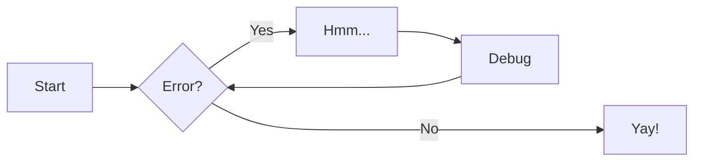

<!--
# Copyright (c) 2025-2026 Mark Buckwell, Zensical and contributors
# SPDX-License-Identifier: MIT
-->

{{ heading_counter_reset(page) }}

# Zensical basics

\index{Zensical} Zensical turns the Markdown files under `docs/` into the
website. Prodockit uses the same configured Markdown pipeline when it builds the
PDF, so the authoring features on this page are intended to work in both
outputs.

Start with [Markdown basics](markdown.md) if headings, links, images, or lists
are new to you. This page introduces the extended features configured in this
project. Each section shows either the source to copy, a live result, or both.

## Preview and build

Run commands from the project directory with its virtual environment active.
Use the Zensical Studio viewer in Visual Studio Code, or start the live website
preview with:

``` bash
zensical serve
```

Leave it running while you edit and press `Ctrl+C` when you want to stop it.
For a complete clean website build, use:

``` bash
zensical build --clean --strict
```

The preview and website build do not rebuild the PDF. After the clean build,
use `prodockit pdf`; it reads the completed website rather than running
Zensical itself. Follow the author checks in
[Start editing](startediting.md#build-the-pdf) when both outputs need reviewing.

## Follow the four-space rule {: #lists-within-lists }

Python Markdown uses four spaces to attach nested content to a list item,
admonition, tab, or other containing block:

``` markdown
1. A list item with supporting information.

    !!! note
        This admonition belongs to the list item. Its own content is indented
        by another four spaces.

2. The next list item.
```

If a list unexpectedly restarts at `1`, or block syntax appears as visible
text, inspect its indentation first. Do not substitute a tab or two spaces.

## Add an admonition

\index{Zensical!admonitions} Admonitions distinguish supporting information
from the main argument. Use them sparingly: `note` for context, `tip` for useful
advice, and `warning` or `danger` when ignoring the message has a consequence.

``` markdown
!!! note "Optional title"
    The content is indented by four spaces.

!!! warning
    A title is optional.
```

The first example renders as:

!!! note "Optional title"
    The content is indented by four spaces.

See Zensical's [admonitions reference](https://zensical.org/docs/authoring/admonitions/){target="_blank"}
for every supported type.

## Add collapsible details

Replace `!!!` with `???` to hide the content until a reader opens it. Use
`???+` when it should start open:

``` markdown
??? info "Show the explanation"
    This content starts closed.

???+ note "Shown initially"
    This content starts open but can be collapsed.
```

??? info "Show the explanation"
    This content starts closed.

Collapsible details are useful for optional explanations and answers, but not
for information every reader must see.

## Enhance code blocks {: #zensicalbasics-code-blocks }

Add options after a fenced block's language to provide a title, line numbers,
or highlighted lines:

```` markdown
``` python title="Greeting" linenums="1" hl_lines="2"
def greet(name):
    print(f"Hello, {name}!")

greet("Python")
```
````

Annotations connect a numbered marker in code with an explanation immediately
after the block:

``` python title="Code annotation"
print("Hello")  # (1)!
```

1. This explanation belongs to marker 1.

Highlight short inline code by adding a language after `#!`:
`#!python print("Hello, Python!")`.

See Zensical's [code-block reference](https://zensical.org/docs/authoring/code-blocks/){target="_blank"}
for the complete option list.

## Present alternatives in content tabs

\index{Zensical!content tabs} Tabs are useful when a reader should choose one
of several alternatives, such as an operating system. Each tab heading begins
with `===`, and all of its content is indented by four spaces:

``` markdown
=== "Python"

    ``` python
    print("Hello from Python!")
    ```

=== "Rust"

    ``` rust
    println!("Hello from Rust!");
    ```
```

The example renders as:

=== "Python"

    ``` python
    print("Hello from Python!")
    ```

=== "Rust"

    ``` rust
    println!("Hello from Rust!");
    ```

Keep tab labels short and do not hide sequential steps inside tabs.

## Add a caption {: #images }

This project enables PyMdown Blocks captions for images and tables. Put the
caption block immediately after the item it describes:

``` markdown
{ width="70%" }
/// figure-caption
    attrs: {id: figure-caption-example}

Example reference-list layout
///
```

For a table, use `table-caption` and add `| <` to display its caption above the
table:

``` markdown
| Option | Purpose |
|---|---|
| `--clean` | Start with an empty output directory |
/// table-caption | <
    attrs: {id: table-caption-example}

Build options
///
```

The figure and table caption types are numbered in both outputs. Continue to
[Caption a figure](customisecontent.md#caption-a-figure) for stable ids and
cross-references, or [Caption a table](customisecontent.md#caption-a-table) for
positioning and the table-layout features. The
[PyMdown Blocks caption reference](https://facelessuser.github.io/pymdown-extensions/extensions/blocks/plugins/caption/){target="_blank"}
contains the underlying syntax.

## Add a Mermaid diagram {: #diagrams }

Zensical renders [Mermaid](https://mermaid.js.org/){target="_blank"} definitions
as diagrams. Use a Mermaid fence rather than an ordinary code fence:



The website renders Mermaid in the browser. The PDF needs the optional Mermaid
renderer installed during Adoption, Bootstrap, or Manual install. If the PDF
shows definition text instead of a diagram, use
[the editing help](startediting.md#mermaid-or-mathematics-appears-as-source-text).

!!! note "Consider a drawing tool for architecture diagrams"
    A drawing tool such as the downloadable draw.io application is often a
    better choice for a carefully arranged architecture diagram. Export it as
    an image and keep the editable source in the project. Follow any
    organisational policy governing confidential information and cloud tools.

## Add footnotes

Place a marker in the sentence and define it elsewhere on the page:

``` markdown
This statement needs extra context.[^context]

[^context]: This is the supporting information.
```

This statement has a live footnote.[^live-footnote]

[^live-footnote]: The website can show this in a tooltip, while the PDF places
    it as a conventional footnote.

Use a meaningful label such as `context` rather than a number when the source
will be easier to maintain that way.

## Use extended formatting {: #formatting }

| Source | Result | Purpose |
|---|---|---|
| `==important==` | ==important== | Highlight text. |
| `^^inserted^^` | ^^inserted^^ | Underline or mark inserted text. |
| `~~removed~~` | ~~removed~~ | Mark deleted text. |
| `H~2~O` | H~2~O | Subscript. |
| `A^T^A` | A^T^A | Superscript. |
| `++ctrl+alt+del++` | ++ctrl+alt+del++ | Keyboard keys. |
/// table-caption | <
    attrs: {id: table-extended-formatting}

Extended text formatting
///

Avoid combining several styles merely for decoration. Headings and emphasis
communicate document structure more clearly.

## Add icons and emojis

\index{Zensical!icons and emojis} Use `:name:` for an emoji or configured icon:

- `:sparkles:` → :sparkles:
- `:rocket:` → :rocket:
- `:material-file-document:` → :material-file-document:

The available icon sets depend on `zensical.toml`. See Zensical's
[icons and emojis reference](https://zensical.org/docs/authoring/icons-emojis/){target="_blank"}
before adding a new icon family.

## Add mathematics {: #maths }

\index{Zensical!MathJax} Put inline mathematics between single dollar signs.
Put displayed mathematics between double dollar signs on separate lines. This
live example is displayed mathematics:

$$
\cos x=\sum_{k=0}^{\infty}\frac{(-1)^k}{(2k)!}x^{2k}
$$

MathJax renders the website copy and prodockit's optional maths tool renders the
PDF copy. Both must be installed for consistent output. Use
[the editing help](startediting.md#mermaid-or-mathematics-appears-as-source-text)
if the formula appears as raw TeX.

## Add task lists {: #zensicalbasics-task-lists }

Task-list syntax produces checkboxes:

``` markdown
- [x] Draft completed
- [x] References checked
- [ ] Final review outstanding
```

Use these for project work, not as a substitute for numbered procedural steps.

## Add a tooltip or abbreviation

A reference-style link with a title becomes a tooltip:

``` markdown
[Hover over this text][example]

[example]: https://example.com "Additional information"
```

[Hover over this live text][live-tooltip].

[live-tooltip]: https://example.com "Additional information"

Define an abbreviation once and Zensical explains matching text when a reader
hovers over it:

``` markdown
*[HTML]: HyperText Markup Language
```

Use the dedicated [Acronyms and abbreviations](customisecontent.md#acronyms-and-abbreviations)
feature when the term must also link to a managed acronym or glossary page.

## Avoid common mistakes {: #zensical-common-mistakes }

- Preview with Zensical Studio or `zensical serve`, not a generic Markdown
    viewer that lacks this project's extensions.
- Use four spaces for content nested inside lists, tabs, admonitions, details,
    footnotes, and other blocks.
- Leave a blank line around block syntax and close every fence or block.
- Build and inspect the PDF as well as the website; JavaScript-rendered diagrams
    and mathematics use a separate PDF toolchain.
- Use an ordinary Markdown link when link text should differ from a registered
    term, citation, or cross-reference.

## Where to go next {: #zensicalbasics-where-to-go-next }

Use [Shell commands](shcommands.md) as a beginner's reference when following
terminal instructions. Continue to [Document appearance and structure](customise.md) to change the
site, cover page, navigation, and PDF layout, or to
[Prodockit authoring features](customisecontent.md) for prodockit's authoring
extensions.
