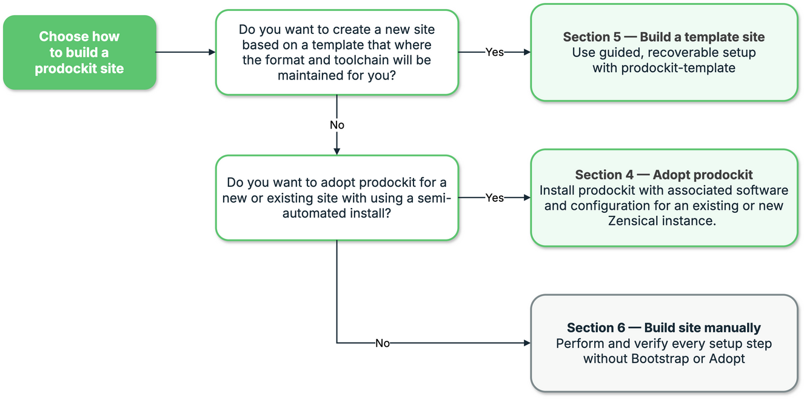

{{ heading_counter_reset(page) }}

# Choose your install

Prodockit supports three installation paths. Choose the one that matches the
document and level of automation you have; the paths are alternatives rather
than stages to complete in sequence.

## Install Prodockit

This concise path assumes that:

1. Python 3.14 is installed.
2. Zensical is installed in an activated project virtual environment and the
   site has been initialized. Complete Zensical's
   [Get started](https://zensical.org/docs/get-started/){target="_blank" rel="noopener"}
   instructions first if that environment and site do not already exist.

/// steps

//// step | Install Prodockit

With the initialized Zensical project's environment active, install Prodockit:

```bash
python -m pip install --upgrade prodockit
```

////

//// step | Enable the authoring extensions

Enable the Prodockit extensions your site uses in `zensical.toml`. Add these
tables to the existing configuration, omitting any feature you do not use.
The dotted extension names must be quoted:

```toml
[project.markdown_extensions."prodockit.headings"]
[project.markdown_extensions."prodockit.refs"]
[project.markdown_extensions."prodockit.glossary"]
[project.markdown_extensions."prodockit.tables"]
[project.markdown_extensions."prodockit.steps"]
[project.markdown_extensions."prodockit.tree"]
[project.markdown_extensions."prodockit.index"]

[project.markdown_extensions."pymdownx.blocks.caption"]
types = [
  { name = "caption" },
  { name = "figure-caption", prefix = "{}.", classes = "prodockit-figure-caption" },
  { name = "table-caption", prefix = "{}.", classes = "prodockit-table-caption" },
]
```

Add `prodockit.bibliography` only for bibliography files, or
`prodockit.citations` only for inline citation definitions; these need their
own configuration and a citation style. See [Configure Prodockit
features](publishing.md#configure-prodockit-features).

////

//// step | Add the website stylesheets

Put this key in the **existing** `[project]` table (do not add a second table):

```toml
extra_css = ["stylesheets/pdk.css", "stylesheets/extra.css"]
```

From the project root, run the following command. It:

- Creates `docs/stylesheets/` if it does not exist.
- Copies Prodockit's bundled `pdk.css` into that directory, replacing any
  existing copy with the version from the installed Prodockit release.
- Creates an empty `extra.css` only if it is missing; it leaves an existing
  `extra.css` and your custom styles untouched.

```bash
python -c "from pathlib import Path; from prodockit.shared_files import resource_bytes; p = Path('docs/stylesheets'); p.mkdir(parents=True, exist_ok=True); (p / 'pdk.css').write_bytes(resource_bytes('pdk.css')); (p / 'extra.css').touch(exist_ok=True)"
```

Put your own CSS in `extra.css`, not the release-managed `pdk.css`. The detailed
[Adopt route](getting-started.md) can instead configure the full standard
integration for you.

////

//// step | Prepare local PDF support **Optional**{: .bg-green}

For optional local PDF generation, run the block for the current platform.
Skip this on Windows ARM64 and let the GitLab pipeline generate PDFs instead.
`pdk pdf --prepare all` creates and registers the PDF stylesheets **before**
preparing the renderer; an ordinary `pdk pdf` does the same before rendering.
You do not need to add PDF stylesheets in step 3.
Do not add `[project.markdown_extensions."prodockit.pdf"]` to `zensical.toml`:
`prodockit.pdf` is the PDF command's renderer, not a Markdown extension.

=== ":material-apple: macOS"

    ```bash
    brew install pango node
    export DYLD_FALLBACK_LIBRARY_PATH="$(brew --prefix)/lib"
    pdk pdf --prepare all
    ```

=== ":fontawesome-brands-windows: Windows x64"

    ```powershell
    winget install OpenJS.NodeJS.LTS
    # Close and reopen PowerShell, then reactivate the project environment.
    pdk pdf --prepare all
    ```

=== ":material-linux: Linux (Ubuntu)"

    ```bash
    sudo apt update
    sudo apt install -y libpango-1.0-0 libpangoft2-1.0-0 libharfbuzz-subset0 nodejs
    pdk pdf --prepare all
    ```

On first use, `pdk pdf --prepare all` makes these changes:

- Creates `pdk-pdf.toml` and `pdf-requirements.txt` if missing. It also adds
  `docs/stylesheets/pdk-pdf.css` and an empty `docs/stylesheets/print.css` if
  missing, then lists both under `[document].extra_css` in `pdk-pdf.toml`.
  Existing PDF stylesheets are not overwritten; `zensical.toml` is unchanged
  for a new project.
- Installs the PDF-only Python packages in the active project environment and
  downloads the PDF tools into the project's `.prodockit/cache/pdf/` directory.
  A later run reuses the prepared files and cache when they are current.

`--prepare all` does not build a PDF or install host software such as Pango
or Node.js; the platform command above installs those prerequisites. Review
the project-file changes with `git status` before committing them.

////

//// step | Build and preview

Build and preview the site whenever its content changes:

```bash
zensical build --clean --strict
pdk pdf       # optional if PDF generation is used
zensical serve
```

////

///

This is the shortest path from a working Zensical site to a non-template
Prodockit website. It deliberately leaves out machine preparation, repository
and publishing setup, detailed PDF guidance, recovery guidance, and
maintained-template integration. Choose one of the detailed installation paths
below when you need those steps or want the setup checked as you proceed.

## Choose an installation path


!!! info "Coursework with a prepared repository"

    If you are using Prodockit for coursework, your course will give you a
    prepared repository. Follow [section 5 — Build a template site](devcons/bootstrap.md)
    to set it up; you do not need to create a separate site from scratch.


\ref{fig-installation-approaches} helps you choose between a template site,
adopting Prodockit for a new or existing Zensical site, and a manual installation.

<!-- Adapted from prodockit-userguide. The canonical editable source for this figure is tools/documentation-diagrams/2.1-installation-approaches.drawio. -->
{ .documentation-diagram }
/// figure-caption
    attrs: {id: fig-installation-approaches}

Choose the Prodockit installation approach
///

The three routes below compare their starting points and results in the same
order as the following sections.

<div class="grid cards installation-route-grid" markdown>

-   :lucide-rocket:{ .lg .middle } __Adopt prodockit__

    ---

    **Starting point:** an empty directory and no Zensical site.

    Create the Python environment, install Zensical, and prove that its local
    preview and strict build work. Then use Adoption to add Prodockit's
    authoring components and selected renderers without using the report
    template. `pdk pdf` prepares PDF support if you use it later.

    [:octicons-arrow-right-24: Open section 4](getting-started.md){ .md-button .md-button--primary .installation-route-button }

-   :lucide-rocket:{ .lg .middle } __Build a template site__

    ---

    **Starting point:** a new computer, no existing site, or a project that
    should use the maintained report template.

    Bootstrap guides and verifies the machine setup, Git host, repository,
    project environment, build tools, and publishing configuration. The
    resulting site starts from `prodockit-template` and can later receive its
    maintained template updates.

    [:octicons-arrow-right-24: Open section 5](devcons/bootstrap.md){ .md-button .md-button--primary .installation-route-button }

-   :lucide-book-open:{ .lg .middle } __Build site manually__

    ---

    **Starting point:** a project whose author wants direct control of every
    installation decision and command.

    Prepare and verify the machine, repository, editor, Python environment,
    Zensical configuration, renderers, website, PDF, and source bundle
    yourself. This manual installation route explains all dependencies but
    does not use Bootstrap or Adoption to orchestrate them.

    [:octicons-arrow-right-24: Open section 6](manual-install.md){ .md-button .md-button--primary .installation-route-button }

</div>

These routes are alternatives, not stages in a longer sequence. Choose only
one. In particular, do not run Bootstrap merely because an adopted or manually
built project later needs PDF support.

Every route starts with [Prepare to install](installation.md). That shared
preparation establishes the supported Python and a setup environment in the
directory holding your repositories. Your chosen route then explains when to
enter or create the project and activate its project-specific environment.
