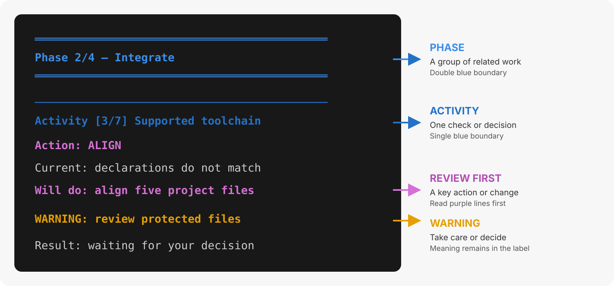

{{ heading_counter_reset(page) }}

# Build a template site {: #bootstrap-machine-bootstrap }

\index{commands!`prodockit bootstrap`} prepares a machine and creates or
resumes a project based on `prodockit-template`. Use
[Upgrade existing site](../adopt.md) when an established Zensical document
needs Prodockit without the template, or [Build site
manually](../manual-install.md) when you want to perform and verify every setup
task yourself.

This is not a general Zensical installer; it is the route for building from `prodockit-template`.

This guide organises what you do into documentation **stages and steps**.
Bootstrap reports its own work as **phases and activities**, allowing each
activity to be checked, repaired, and checked again. The [Bootstrap command
reference](../commands/bootstrap.md#cmd-bootstrap-phases) lists all 20
activities.

## Start with prodockit-template {: #bootstrap-template }

The \index{`prodockit-template`} project ([Surrey GitLab repository](https://gitlab.surrey.ac.uk/mb0105/prodockit-template){target="_blank" rel="noopener"}[GitHub repository](https://github.com/buckwem/prodockit-template)) is a ready-made
Zensical project for coursework, assignments, and professional reports. Its
central promise is **one source, two outputs**: write the report as Markdown
under `docs/`, then build both a browsable website and a single PDF from the
same pages and navigation.

Use the template when you want the publishing structure supplied for you. It
does not prescribe the subject or wording of the report, and it does not turn
your project into a live copy of the template.


For coursework, Bootstrap downloads the template from
[Surrey GitLab](https://gitlab.surrey.ac.uk/mb0105/prodockit-template){target="_blank" rel="noopener"}.

The template is maintained on GitHub. Bootstrap uses that source when setting
up projects on GitHub.com or GitLab.com.


<span id="bootstrap-template-contents"></span>

The template has a larger project structure because it already connects
authoring, website and PDF rendering, testing, and deployment. [See the
template-site directory tree in section
3.2](../installation.md#installation-template-structure), alongside the clean
Zensical and adopted-site structures.

Replace the sample pages and headings with your document. Keep the publishing
and toolchain files until you have a specific reason to customise them;
Template Sync can then maintain shared infrastructure without replacing your
content.

## Install with bootstrap {: #bootstrap-quick-start }

The seven stages below prepare the setup environment, assess the proposed work,
apply it, and verify the completed project. If you open a new terminal,
reactivate and verify the appropriate environment as described in section 3.1.
Each command is safe to repeat: Bootstrap checks before it changes anything,
and a completed activity is left alone.

If Bootstrap reports that it is running outside a virtual environment, it
stops before later activities. Run the recovery commands it displays, then
start Bootstrap from that environment in the same setup directory. Answering
"yes" or activating an environment in another terminal cannot change the
Python process already running. The new run checks the prerequisite again;
the stopped run does not record it as completed.

### Stage 1 — Prepare the setup environment

Create the shared setup environment, install Prodockit into it, and verify that
the shell selects the command from that environment.

/// steps

//// step | Prepare Python and the setup environment

Complete section 3.1 in the parent directory that holds your repositories:

[Open section 3.1 to prepare your environment](../installation.md#installation-preparation){ .md-button .md-button--primary target="_blank" rel="noopener" }

Return here with that setup environment active. Bootstrap later creates a
separate build environment inside the cloned project.
On Surrey RemoteLabs, choose the RemoteLabs tabs in section
3.1; Python is already installed and no privileged setup is needed.

////

//// step | Install Prodockit into the active environment

With the setup `.venv` activated, upgrade pip and install Prodockit using the
commands for your operating system. The `pip` or `pip3` command must belong to
that active environment:

=== ":material-apple: macOS"

    ```bash
    pip3 install --upgrade pip
    pip3 install --upgrade prodockit
    ```

=== ":fontawesome-brands-windows: Windows"

    ```powershell
    pip install --upgrade pip
    pip install --upgrade prodockit
    ```

=== ":material-linux: Linux (Ubuntu)"

    ```bash
    pip install --upgrade pip
    pip install --upgrade prodockit
    ```


=== ":stag-stag_icon_32: Surrey RemoteLabs"

    ```bash
    pip install --upgrade pip
    pip install --upgrade prodockit
    ```

    These packages go into the active setup `.venv`; no `sudo` is needed.


!!! note "If pip or pip3 does not work"

    If `pip` does not work, try `pip3`; if `pip3` does not work, try `pip`.
    Keep the intended virtual environment active and check that the alternative
    command belongs to it before installing packages.

////

//// step | Confirm the Prodockit version and command path

Confirm both the installed version and the command selected by the shell:

=== ":material-apple: macOS"

    ```bash
    prodockit --version
    command -v prodockit
    ```

=== ":fontawesome-brands-windows: Windows"

    ```powershell
    prodockit --version
    Get-Command prodockit
    ```

=== ":material-linux: Linux (Ubuntu)"

    ```bash
    prodockit --version
    command -v prodockit
    ```


=== ":stag-stag_icon_32: Surrey RemoteLabs"

    ```bash
    prodockit --version
    command -v prodockit
    ```


The command path must be inside the setup `.venv`. An older Prodockit command
from another Python can otherwise shadow the package just installed while
`pip` still reports success. Do not run the complete `pdk diag` here: it is a
project-scoped command, so a setup directory which holds project repositories
is refused before diagnostics start. Stage 7 runs it from the completed project
and its separate environment.

////

///

### Stage 2 — Assess and preview

Record the project choices, inspect the commands Bootstrap proposes, and
resolve anything that needs attention before allowing changes.

/// steps

//// step | Record the host and project choices

<span id="bootstrap-configuration"></span>
<span id="bootstrap-hosts"></span>
<span id="bootstrap-source"></span>

```bash
pdk boot
```

The first run asks for the Git host, your identity, and the project location,
then saves the answers in `.pdkboot.toml` in the setup directory. It stops
after configuration so the answers and next instruction remain visible; run it
again to assess the configured work.


Choose [Surrey GitLab](https://gitlab.surrey.ac.uk){target="_blank" rel="noopener"}
as the host and use **Surrey Login** to sign in. If your course has given you a
prepared repository, supply its SSH URL when Bootstrap asks for the source;
Bootstrap clones it without replacing its history.

Bootstrap derives several coursework values from your user ID, module,
assessment stage, and academic year. Check the proposed namespace and
repository name before applying the plan. For assessed work, `commtest`,
`ab1234`, and the academic year starting in 2026 produce
`CSEE/COMMTEST/2026-27/commtest-ab1234`; SRA and LSA append `-SRA` or
`-LSA` to the year subgroup. From January through August, Bootstrap's
default year is the previous calendar year; confirm it against your module.

Choose GitHub.com or GitLab.com. Bootstrap uses the public GitHub template for
either host. If you have already been given a repository, supply its SSH URL
when Bootstrap asks for the source; the existing repository is cloned without
replacing its history. Bootstrap asks for the namespace and repository name.


`pdk boot` is the short form of `prodockit bootstrap`. Use `--config PATH`
when the saved configuration is deliberately elsewhere. The [command
reference](../commands/bootstrap.md#cmd-bootstrap-configuration) explains the
saved fields and scripted use.
////

//// step | Review the proposed commands

<span id="bootstrap-dry-run"></span>
```bash
pdk boot --dry-run
```

The dry run shows every proposed command and every action it would ask you
to complete, without running or changing anything. Review the complete plan
before allowing Bootstrap to work on the machine.

////

//// step | Resolve warnings before applying

Read each warning, decision, and proposed change before continuing. Do not
apply the plan until you understand any manual action or potentially disruptive
software change it identifies.

\ref{fig-bootstrap-dry-run-output} is a short visual guide to the dry-run
output. Use [section 28.1, Scan phases and
activities](../commands/output.md#command-output-structure) for the complete
explanation of its phases, activities, actions, warnings, and decisions:

{ .documentation-diagram }
/// figure-caption
    attrs: {id: fig-bootstrap-dry-run-output}

Reading Bootstrap's dry-run output
///
////

///

### Stage 3 — Apply and confirm

Apply the reviewed plan, complete the actions that require a browser, and ask
Bootstrap to confirm the finished installation.

/// steps

//// step | Apply the reviewed plan

<span id="bootstrap-apply"></span>
```bash
pdk boot --apply
```

It asks before each activity and shows the commands first.

You can stop an applied run between activities. Run the same command later
to reassess the installation and continue with the remaining work.
////

//// step | Complete the browser actions

Two Bootstrap activities need a browser: uploading your SSH key and creating
the project on the host. Bootstrap asks you to type `yes` when each action is
complete.

!!! warning "Complete the manual step before confirming"

    Complete the browser action described on screen before answering its
    prompt. Type `yes` only after checking that the action succeeded; the
    confirmation allows Bootstrap to continue but cannot perform the action
    for you.

////

//// step | Confirm every Bootstrap activity

```bash
pdk boot
```

Every activity should report `ok`, and the last one names the address
where the site is published. If an activity still needs work, its line says
what and why; running `--apply` again works only on outstanding activities.

////

///

### Stage 4 — Enter the project

Move from the shared setup environment into the project environment and account
for a required Windows restart. These steps apply to every project, including a
website-only project that does not use PDF output.

/// steps

//// step | Restart the terminal on Windows if instructed

<span id="bootstrap-windows-restart"></span>

!!! warning "Windows only — skip this step on macOS and Linux"

    Windows installers change settings inherited when the terminal application
    starts. A new tab or reactivating the virtual environment can retain the
    old settings, so complete this step before checking the project.

=== ":fontawesome-brands-windows: Windows"

    Fully close Windows Terminal or VS Code, then reopen PowerShell. Bootstrap
    displays this amber message when a restart is required:

    <pre style="color: #E69F00; background: #181818; padding: 1em; white-space: pre-wrap;">============================================================
    RESTART YOUR TERMINAL — WINDOWS SETTINGS HAVE CHANGED
    ============================================================
    Fully close Windows Terminal or VS Code, then reopen it.
    Open PowerShell in your project directory:
    C:\path\to\your-project
    Set-ExecutionPolicy -Scope CurrentUser -ExecutionPolicy RemoteSigned
    .\.venv\Scripts\Activate.ps1
    pdk diag
    ============================================================</pre>

    The project path is replaced with your actual path. Continue with the next
    step in the newly opened PowerShell.

////

//// step | Enter and activate the project

<span id="bootstrap-project-checks"></span>

Leave the setup environment, enter the project directory named by Bootstrap,
and activate the project environment created by Bootstrap. Changing directory
while the prompt already says `(.venv)` does not switch environments.

=== ":material-apple: macOS"

    ```bash
    deactivate
    cd /path/to/your-project
    source .venv/bin/activate
    ```

=== ":fontawesome-brands-windows: Windows"

    In the fresh PowerShell opened in the previous step, run the following
    commands; there is no active environment to deactivate:

    ```powershell
    cd C:\path\to\your-project
    Set-ExecutionPolicy -Scope CurrentUser -ExecutionPolicy RemoteSigned
    .\.venv\Scripts\Activate.ps1
    ```

=== ":material-linux: Linux (Ubuntu)"

    ```bash
    deactivate
    cd /path/to/your-project
    source .venv/bin/activate
    ```


=== ":stag-stag_icon_32: Surrey RemoteLabs"

    ```bash
    deactivate
    cd /path/to/your-project
    source .venv/bin/activate
    ```

    Replace the path with the project directory reported by Bootstrap.


////

//// step | Confirm the project environment

```bash
python -c "import sys; print(sys.prefix)"
```

The printed Python prefix must end in your project's `.venv`, not the parent
repositories directory's `.venv`. This check applies to new and pre-existing
repositories on every host.

////

///

### Stage 5 — Install PDF host software **Privileged**{: .install-privileged} **Optional**{: .bg-green}

Complete this stage only when this machine will generate PDFs and its host
software is missing. Installing Pango or Node.js needs administrator or `sudo`
access. Skip this stage for website-only work and on Windows ARM64,
or on Surrey RemoteLabs without privileged access. The GitLab build
can generate both PDFs.

/// steps

//// step | Install Pango and Node.js

Pango is needed for local PDFs on macOS and Ubuntu; Node.js is needed only
when the PDF contains MathJax notation. Mermaid needs no Node.js. If the
software is already present, verify it and skip installation. A website-only
project needs neither prerequisite.

=== ":material-apple: macOS"

    ```bash
    brew install pango node
    export DYLD_FALLBACK_LIBRARY_PATH="$(brew --prefix)/lib"
    brew list --versions pango node
    node --version
    ```

=== ":fontawesome-brands-windows: Windows"

    This step is for Windows x64 only. Do not run it on Windows ARM64; use the
    GitLab build for PDF generation instead. The supported Windows x64 path
    uses a verified project-local WeasyPrint runtime and needs no Pango or
    MSYS2 installation. Install Node.js only for PDF mathematics:

    ```powershell
    winget install OpenJS.NodeJS.LTS
    ```

    Close and reopen PowerShell after installation, return to the project,
    reactivate its virtual environment, and verify with `node --version`.

=== ":material-linux: Linux (Ubuntu)"

    ```bash
    sudo apt update
    sudo apt install -y libpango-1.0-0 libpangoft2-1.0-0 libharfbuzz-subset0 nodejs
    dpkg-query -W libpango-1.0-0 libpangoft2-1.0-0 libharfbuzz-subset0 nodejs
    node --version
    ```


=== ":stag-stag_icon_32: Surrey RemoteLabs"

    Pango and Node.js are not installed on the RemoteLabs image, and a student
    account cannot install them. You can still build and preview the website.
    A local PDF containing Mermaid or MathJax examples cannot be generated
    there; the Surrey GitLab CI workflow has the software needed to render
    those examples in its PDF build. Do not try to run `sudo apt` on RemoteLabs.


For a PDF without mathematics, omit `node` or `nodejs` from the installation
command and verification. No npm packages, browser or MSYS2 are required.

////

///

### Stage 6 — Build the PDF downloads **Optional**{: .bg-green}

Complete this stage only when you need local PDF output and have any required
host software. Skip it for website-only work and on Windows ARM64; use a
supported CI runner for PDF generation instead. Build the source bundle last;
Stage 7's `zensical serve` refreshes the site with both downloads.


!!! note "Surrey RemoteLabs: use GitLab for PDFs"

    RemoteLabs does not provide Pango or Node.js, and student accounts cannot
    install them. Build and preview the website locally, but skip these local
    PDF steps. The Surrey GitLab CI workflow generates both PDF downloads on
    its supported runner; check them on the published site.


/// steps

//// step | Build the website for PDF rendering

Build a clean website and treat every warning as an error:

```bash
zensical build --clean --strict
```

Stop and correct any failure before continuing. `pdk pdf` consumes this
completed Zensical build; it does not replace the website build.

////

//// step | Build the rendered document PDF

Generate the rendered document from the completed website. On the first run,
`pdk pdf` automatically installs the project's committed PDF-only Python
requirements and prepares verified project-local Pandoc and font caches. It
also prepares Mermaid or MathJax only if the built content uses them (or their
PDF configuration requests preloading). Later runs reuse healthy caches.
This automatic preparation does not install the host Pango or Node.js software
covered in Stage 5.

```bash
pdk pdf
```

The rendered PDF is written to `docs/site_documentation.pdf`.

////

//// step | Build the source bundle

Generate the separate PDF containing the project's source files:

```bash
pdk source-bundle
```

Check `docs/source_bundle.pdf`. When Stage 7 starts `zensical serve`, it builds
the current site and makes both PDF download buttons available for review.

////

///

### Stage 7 — Verify the project

Check the active project environment and its configuration, then inspect the
website and any optional PDF downloads that were built.

/// steps

//// step | Run project diagnostics

```bash
pdk diag
```

Bootstrap leaves every PDF runtime to `pdk pdf`, which prepares verified
project-local caches on first use. Mermaid and maths are optional components
and are not selected by default in the template's
`.prodockit-components.toml`; content that uses
them can still trigger preparation. Bootstrap does not block completion on
optional PDF system prerequisites; the first applicable PDF build checks them.

The `Project` line must name the clone rather than its parent setup directory.
Add `--verbose` for resolved evidence or `--json` when attaching the report to
a support request. If Diagnostics reports a failure, stop and resolve it before
continuing; do not apply an update from the wrong environment.

////

//// step | Serve and verify the project

Start the local website:

```bash
zensical serve
```

Open the address printed by Zensical in a browser and check the website. For
the standard template, also select both download buttons and confirm that the
rendered document PDF and source-bundle PDF open successfully. Inspect the
rendered PDF's layout, diagrams, mathematics and references. A website-only
project has no PDF downloads to check. On Windows ARM64, verify the website
locally and check both PDFs from the successful GitLab build instead.

Press `Ctrl+C` in the terminal when the browser checks are complete.

////

//// step | Preview template updates

```bash
pdk template-sync
```

Template Sync here is a preview, not an installation or an apply. Review its
report and leave any available update for the maintenance workflow.
////

///

## Understand the completed project {: #bootstrap-completed-project }

The seven documentation stages above describe what you do. Bootstrap groups its
20 activities into seven phases covering preflight, core tools, Git and the
host, the project, the build toolchain, the editor, and publication. Use the
[phase and activity inventory](../commands/bootstrap.md#cmd-bootstrap-phases)
when you need to identify an activity reported by the command.

### Know what becomes yours {: #bootstrap-template-ownership }

After creation, the repository is your project. The template manifest
classifies files so a later `pdk template-sync` can update publishing
infrastructure without taking ownership of your work.

\ref{fig-template-file-ownership} separates the project into three practical
groups:

{ .documentation-diagram }
/// figure-caption
    attrs: {id: fig-template-file-ownership}

Template file ownership
///

- **Template-owned and shared files** carry the build, publishing, styles, and
  common configuration. Review their proposed changes through Template Sync.
- **Project-owned files** include your Markdown, images, bibliography, and
  author choices. They remain yours and are not replaced by a template update.
- **Generated and local files** include build output, caches, and `.venv`.
  Recreate them when needed rather than committing them.

### Keep the project current {: #bootstrap-template-updates }

A generated project does not change automatically when the source template
changes. Check periodically and before final publication:

```bash
pdk template-sync
```

The first run is a preview. If an update is available, follow the [Template
Sync guide](template-sync.md) to apply it on a branch, review protected files,
and merge it through the normal review process. Template and Prodockit package
releases are separate and can change independently.

After Template Sync has finished and the reviewed update is present in the
working copy, activate the project `.venv` and ask Adopt whether the supported
software or project declarations need aligning:

```bash
pdk adopt --dry-run
```

If Adopt selects any activities, review them and apply the required alignment:

```bash
pdk adopt --apply
```

Adopt installs, upgrades, or downgrades the project software to the combination
supported by the active Prodockit release. A second dry run is harmless when
Template Sync has already performed this alignment; it reports that no work is
needed.

Finish with Diagnostics before rebuilding or publishing:

```bash
pdk diag
```

Continue only when the required checks pass. Resolve any failure and review
relevant warnings first, then build and inspect both outputs.

## Where to go next {: #bootstrap-where-to-go-next }

Choose the route that matches the result:

- If setup has not completed or any check fails, use
  [Troubleshooting](../troubleshooting-installs.md).
- If setup has completed and `pdk diag` passes, continue with
  [Publish a document](../publishing.md).
