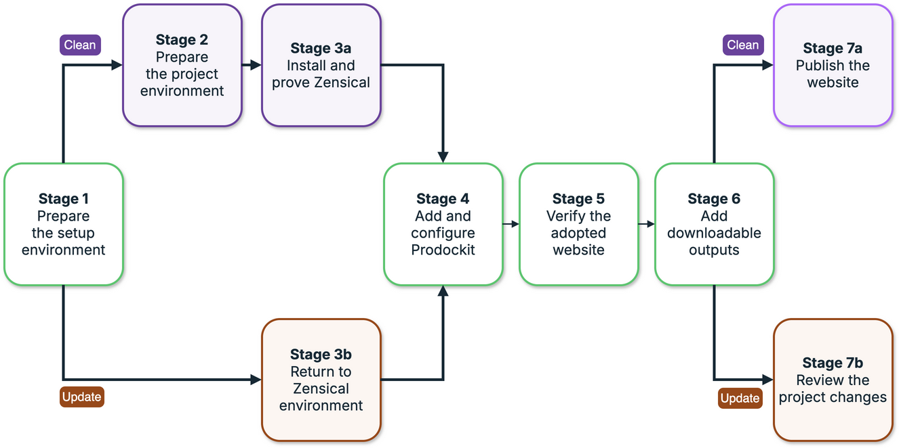

{{ heading_counter_reset(page) }}

# Adopt prodockit

Use these instructions to adopt Prodockit into a new or existing Zensical site.
The **Clean** path creates and tests a new Zensical site first. The **Update**
path adds Prodockit to an existing site, or updates a site that already uses it,
while keeping your content and reviewing changes to its configuration.

Both paths use `pdk adopt` to align the software and add your selected features.
Unlike the template-site route, adoption does not replace your project with
`prodockit-template`. Section 4.1 guides you through the stages for your path.

## Build and verify the site

Start with Stage 1, then follow the route shown in \ref{fig-build-or-update-site}:
for a clean installation, complete Stage 2 and Stage 3a; for an existing site,
skip those stages and continue with Stage 3b. Both paths join at Stage 4 to
configure Prodockit, verify the website and add any downloadable outputs you need.

{ .documentation-diagram }
/// figure-caption
    attrs: {id: fig-build-or-update-site}

Build or update a site
///

Use the badges beside stage and step titles to follow your route:

- **Clean**{: .install-clean}: only for a new site in an empty directory.
- **Update**{: .install-update}: only for an existing Zensical site, with or without Prodockit.
- **Optional**{: .bg-green}: skip when already completed or not needed.
- **Privileged**{: .install-privileged}: installing host software needs administrator or `sudo` access.
- [Go to](#stage-1-prepare-the-project-environment){ .install-go }: click to jump to another section.

Steps without a path badge apply to both routes. The words identify the path
as well as the colours. Keep your existing site's content and configuration;
do not copy new-site examples over them.

After Stage 6, the routes separate again. Stage 7a helps a new project save its
files and publish through Surrey GitLab PagesGitHub or GitLab Pages.
Stage 7b helps an existing
project review Adopt's changes and follow its own release process. You can
stop after local testing if you are not ready to commit or publish.

### Stage 1 — Prepare the setup environment **Privileged**{: .install-privileged} {: #stage-1-prepare-the-project-environment }

Python 3.14 must be installed before either a clean installation or an update.
An existing Zensical site may use an older Python version; installing or
updating Prodockit does not upgrade Python itself.

If Python 3.14 is not already installed, complete section 3.1 in the parent
directory that holds your repositories. It also prepares the shared setup
environment:

[Open section 3.1 to prepare your environment](installation.md#installation-preparation){ .md-button .md-button--primary target="_blank" rel="noopener" }

Once you have Python 3.14 installed, choose the route that matches whether you are creating a new site or updating an existing one:

- For a **Clean**{: .install-clean} install, continue: [Go to Stage 2](#stage-2-prepare-the-project-environment){ .install-go }.
- For an **Update**{: .install-update} install, skip ahead: [Go to Stage 3b](#stage-2b-return-to-zensical-environment){ .install-go }.

### Stage 2 — Prepare the project environment **Clean**{: .install-clean} {: #stage-2-prepare-the-project-environment }

Create the new site directory and its own Python environment. For an existing
Zensical site, skip to Stage 3b and use its existing directory and environment.

/// steps

<span id="prepare-the-empty-project-directory"></span>

//// step | Prepare the empty project directory

Leave the setup environment, then create and enter your new site's folder.
Change `~/repos` and `prodockit-project` if you chose different names. Skip
`deactivate` if no environment is active, and `mkdir` if the intended folder
already exists and is empty.

Run each line in turn. **If `cd` fails, stop and correct the path before continuing.**

=== ":material-apple: macOS"

    ```bash
    deactivate
    cd ~/repos
    mkdir -p prodockit-project
    cd prodockit-project
    ```

=== ":fontawesome-brands-windows: Windows"

    ```powershell
    deactivate
    cd ~/repos
    mkdir prodockit-project
    cd prodockit-project
    ```

=== ":material-linux: Linux (Ubuntu)"

    ```bash
    deactivate
    cd ~/repos
    mkdir -p prodockit-project
    cd prodockit-project
    ```


=== ":stag-stag_icon_32: Surrey RemoteLabs"

    ```bash
    deactivate
    cd ~/repos
    mkdir -p <module ID>-report
    cd <module ID>-report
    ```

    Replace `<module ID>` with your actual module identifier before running
    the commands. Do not type the angle brackets literally.


////

//// step | Create and activate the project environment

Create a Python 3.14 environment in `.venv`, then activate it so subsequent
commands use this site's packages rather than another project's.

=== ":material-apple: macOS"

    ```bash
    "$(brew --prefix python@3.14)/bin/python3.14" -m venv .venv
    source .venv/bin/activate
    ```

=== ":fontawesome-brands-windows: Windows"

    The policy command allows activation scripts for your Windows account.

    ```powershell
    py -3.14 -m venv .venv
    Set-ExecutionPolicy -Scope CurrentUser -ExecutionPolicy RemoteSigned
    .\.venv\Scripts\Activate.ps1
    ```

=== ":material-linux: Linux (Ubuntu)"

    ```bash
    python3.14 -m venv .venv
    source .venv/bin/activate
    ```


=== ":stag-stag_icon_32: Surrey RemoteLabs"

    ```bash
    python -m venv .venv
    source .venv/bin/activate
    ```


////

//// step | Verify the project environment

Check your current directory, Python version and active environment before
installing Zensical:

=== ":material-apple: macOS"

    ```bash
    pwd
    python --version
    python -c 'import sys; print(sys.prefix)'
    ```

=== ":fontawesome-brands-windows: Windows"

    ```powershell
    pwd
    python --version
    python -c "import sys; print(sys.prefix)"
    ```

=== ":material-linux: Linux (Ubuntu)"

    ```bash
    pwd
    python --version
    python -c 'import sys; print(sys.prefix)'
    ```


=== ":stag-stag_icon_32: Surrey RemoteLabs"

    ```bash
    pwd
    python --version
    python -c 'import sys; print(sys.prefix)'
    ```


The results should show your project folder, Python 3.14 and that folder's
`.venv`—not `~/repos/.venv`. If they do not, correct the directory and activate
the project's environment before continuing.

////

///

### Stage 3a — Install and prove Zensical **Clean**{: .install-clean} {: #stage-2-install-and-prove-zensical }

If you already have a Zensical site, skip this stage and continue with Stage 3b,
even if its current build fails: Adopt may repair its software dependencies.

Install Zensical, create its starter site, and prove that the unmodified site
builds and previews successfully before Prodockit is introduced.

/// steps

//// step | Install Zensical

Install the latest Zensical into your active project environment using the
command for your platform. See the [official installation guide](https://zensical.org/docs/get-started/) for details.

=== ":material-apple: macOS"

    ```bash
    pip3 install --upgrade zensical
    ```

=== ":fontawesome-brands-windows: Windows"

    ```powershell
    pip install --upgrade zensical
    ```

=== ":material-linux: Linux (Ubuntu)"

    ```bash
    pip install --upgrade zensical
    ```

////

//// step | Create the Zensical site

Create the starter site in your empty project directory. The dot means
“here”—do not run this in an existing site.

```bash
zensical new .
```

See the [project structure](installation.md#installation-project-structure)
or Zensical's [Create your site guide](https://zensical.org/docs/create-your-site/) for details.

////

//// step | Build the plain Zensical site

Build the website from scratch and check for errors or warnings. Continue
only when the build succeeds.

```bash
zensical build --clean --strict
```

////

//// step | Preview the plain Zensical site

Start a local preview with \index{`zensical serve`}:

```bash
zensical serve
```

Open the address printed in the terminal and check that the site appears.
Press `Ctrl+C` to stop the preview.

////

///

Now that Zensical is set up, continue with installing Prodockit:
[Go to Stage 4](#stage-4-add-and-configure-prodockit){ .install-go }

### Stage 3b — Return to Zensical environment **Update**{: .install-update} {: #stage-2b-return-to-zensical-environment }

Use this route when you already have a Zensical site, even if its environment
needs rebuilding or its current build fails.
If you completed Stage 3a, skip this stage and continue with Stage 4.

!!! warning "Protect your existing site before continuing"

    Create a new Git branch or make a separate clone of your existing Zensical
    site, and carry out the following steps there. Save open files and protect
    uncommitted work first: a new branch is not a backup, and a clone does not
    include uncommitted changes from your current folder.

    The `pdk adopt` command changes several existing files, including the
    site's configuration, software version settings and managed stylesheets
    and scripts. Working separately lets you review and test these changes
    before merging them into your usual branch. If your site does not use Git,
    make a backup copy of the project folder before continuing.

    See [Section 3.2.3](installation.md#installation-template-structure) for the
    template site's files and [Section 4.1.9](#stage-7-review-the-project-changes)
    for details of which files Adopt changes and how to review them.

/// steps

//// step | Enter the project root directory

Leave the active environment, then enter the existing site's root directory—the folder containing its Zensical
configuration. Use your own site's path if it differs from the example.
Skip `deactivate` if no environment is active. Do not create another project
folder or run `zensical new .`.

=== ":material-apple: macOS"

    ```bash
    deactivate
    cd ~/repos/prodockit-project
    ```

=== ":fontawesome-brands-windows: Windows"

    ```powershell
    deactivate
    cd ~/repos/prodockit-project
    ```

=== ":material-linux: Linux (Ubuntu)"

    ```bash
    deactivate
    cd ~/repos/prodockit-project
    ```

**If `cd` fails, stop and correct the path before continuing.**

////

//// step | Create a virtual environment **Optional**{: .bg-green}

Skip this step if the site already has a working Python 3.14 environment.
These instructions use `.venv` as the environment folder name. If yours has
another name, use that name in the activation commands in step 3; do not
create a second environment just to match the guide.

If no environment exists, create one inside the project directory using
Python 3.14 from the preparation stage. This keeps the site's packages
separate from other projects. For a damaged or older environment, follow
[environment recovery](troubleshooting-installs.md#wrong-python) instead.

=== ":material-apple: macOS"

    ```bash
    "$(brew --prefix python@3.14)/bin/python3.14" -m venv .venv
    ```

=== ":fontawesome-brands-windows: Windows"

    ```powershell
    py -3.14 -m venv .venv
    ```

=== ":material-linux: Linux (Ubuntu)"

    ```bash
    python3.14 -m venv .venv
    ```

////

//// step | Activate the virtual environment

Activate the site's environment so the following installation commands use
its Python and packages. Replace `.venv` if your environment has another name.

=== ":material-apple: macOS"

    ```bash
    source .venv/bin/activate
    ```

=== ":fontawesome-brands-windows: Windows"

    The execution-policy command allows PowerShell to run the environment's
    activation script; otherwise Windows may block it. It affects your
    account, not other users.

    ```powershell
    Set-ExecutionPolicy -Scope CurrentUser -ExecutionPolicy RemoteSigned
    .\.venv\Scripts\Activate.ps1
    ```

=== ":material-linux: Linux (Ubuntu)"

    ```bash
    source .venv/bin/activate
    ```

////

///

Now that your existing site's environment is active, continue with installing
Prodockit. Adopt will align its software in the next stage:
[Go to Stage 4](#stage-4-add-and-configure-prodockit){ .install-go }

### Stage 4 — Add and configure Prodockit

Install Prodockit, choose the features you need, then check the completed setup.

!!! info "Why are we not installing and configuring by hand?"

    Adopt aligns the Python packages, managed assets and project configuration,
    while preserving author-owned content and settings. It does not install the
    PDF generator or its host prerequisites. The first `pdk pdf` build prepares
    only the verified project-local runtimes the completed document actually
    uses. Pandoc is shared by citations and PDF processing, so the instructions
    below prepare it separately without installing the rest of the PDF toolchain.

/// steps

//// step | Install Prodockit

Install or update Prodockit in the active project environment. This adds the
`pdk` command; the next steps use it to configure your site.

=== ":material-apple: macOS"

    ```bash
    pip3 install --upgrade prodockit
    ```

=== ":fontawesome-brands-windows: Windows"

    ```powershell
    pip install --upgrade prodockit
    ```

=== ":material-linux: Linux (Ubuntu)"

    ```bash
    pip install --upgrade prodockit
    ```

!!! warning "Adopt may upgrade or downgrade software"

    In the following steps, `pdk adopt` may upgrade or downgrade software in
    your project environment to the versions supported by your installed
    Prodockit release. Newer versions have previously introduced changes that
    affected website appearance or broke parts of the build, so the newest
    version is not always the supported choice. Review Adopt's plan before
    approving changes; it shows which versions will be installed.

////

//// step | Choose optional renderers

Choose whether to include Mermaid diagrams and mathematical notation:

```bash
pdk adopt --configure
```

Both default to **No** for a new site. Existing installations or saved choices
may already enable them; check before accepting.

Adopt records the selection without installing a renderer. The first `pdk pdf`
prepares the selected project-local cache. Mermaid needs only Python; PDF
mathematics also needs Node.js on `PATH`, installed separately, but not npm.
The optional installation steps in Stage 6 prepare those requirements when
this machine will generate PDFs locally.

////

//// step | Adopt the Zensical site

Adopt checks your site, installs or updates the software it needs, and adds
Prodockit's settings and shared files while preserving your content. First
preview its plan, then apply the changes you approve. The coloured messages
help you see what is ready, what will change and what needs your attention,
as shown in \ref{fig-first-site-adopt-output}.

{ .documentation-diagram }
/// figure-caption
    attrs: {id: fig-first-site-adopt-output}

Reading the coloured Adopt messages
///

Preview the proposed changes without installing anything:

```bash
pdk adopt --dry-run
```

Apply the plan, approving or skipping each group of changes:

```bash
pdk adopt --apply
```

Answer the final questions about your site and repository. You can defer
unknown details and optional repository setup until you are ready to publish.
Stage 7a explains how to return to these questions. Adopt asks before
installing Git tools, connecting or creating a repository; it never commits,
pushes or publishes your files.

Accept the final diagnostic check and follow any correction instructions.
The [project structure guide](installation.md#installation-project-structure)
explains the files added by Adopt.

If installation is interrupted, keep your files, reactivate the environment
and rerun `pdk adopt --apply`. Follow any cleanup or restart instructions first;
see [Recover a failed installation](troubleshooting-installs.md#installtooling-download-fails).

If a TOML or YAML syntax error is reported, correct the indicated file and
line, then rerun the same command. Completed activities are retained and
rechecked; do not delete your project or start again.

////

//// step | Refresh the project environment

Reactivate the environment **before running diagnostics or builds** to load
any paths Adopt added. Use the activation path it prints if yours has another name.

=== ":material-apple: macOS"

    ```bash
    source .venv/bin/activate
    ```

=== ":fontawesome-brands-windows: Windows"

    Adopt displays this highlighted banner, using your project's actual path:

    <pre class="terminal-banner"><code><span class="terminal-warning">==============================================================================
    RESTART YOUR TERMINAL BEFORE CHECKING THE PROJECT
    Fully close Windows Terminal or VS Code, then reopen it in this project.</span>
      Project: C:\Users\your-name\repos\prodockit-project
      &amp; 'C:\Users\your-name\repos\prodockit-project\.venv\Scripts\Activate.ps1'
    <span class="terminal-warning">==============================================================================</span></code></pre>

    Close and reopen the terminal, then return to your project directory before
    running the commands below. The policy command allows activation scripts
    for your account.

    ```powershell
    cd ~/repos/prodockit-project
    Set-ExecutionPolicy -Scope CurrentUser -ExecutionPolicy RemoteSigned
    .\.venv\Scripts\Activate.ps1
    ```

=== ":material-linux: Linux (Ubuntu)"

    ```bash
    source .venv/bin/activate
    ```

////

//// step | Prepare project-local Pandoc **Optional**{: .bg-green}

Complete this step when the adopted document uses Prodockit citations or a
bibliography, or when you intend to generate PDFs locally. Otherwise skip it;
the starter adopted site has no citation file and its website does not need
Pandoc.

Install the verified Pandoc release in this project's ignored cache:

```bash
pdk pdf --prepare pandoc
```

Prodockit downloads, verifies and selects Pandoc; do not install it with
Homebrew, Winget or apt, and do not rely on a system `pandoc` command from
`PATH`.

This preparation is supported on Windows ARM64 even though local PDF generation
is not. On that platform, use Pandoc for the website build and let the GitLab
pipeline generate the PDFs.

////

//// step | Diagnose the adopted site

Check the environment, installed tools and project setup without changing files.
This is also a useful tool to run whenever you have problems: it checks for
common errors and suggests how to correct them.

```bash
pdk diag
```

Resolve every `FAIL` before continuing. Warnings about deferred repository
setup can wait until Stage 7a. For help, see [Correct diagnostic findings](troubleshooting-installs.md#diagnostic-corrections).

////

///

### Stage 5 — Verify the adopted website

Check a new site's example or your existing pages to confirm that Prodockit
is working with your content.

/// steps

//// step | Add and verify Prodockit content

For a new site, put this example in `docs/index.md`. For an existing site,
keep your content and your site will adopt the styles used on this website.
The example below is for the Clean path; do not replace an existing homepage.

!!! warning "Custom styles can override Prodockit"

    Adopt preserves your custom styles. Your `extra.css` loads after Prodockit's
    `pdk.css`, so its rules may override the Prodockit styles and change how
    features appear. You may need to adjust or remove conflicting custom rules.
    See [stylesheet precedence](stylesheets.md#load-the-cascade-in-order) for
    the loading order and how the styles work together.

```md
# My first document

The detail is in \ref{results}.

## Method

Describe what you did here.

## Results {: #results }

Describe what you found here.
```

In the new-site example, Prodockit should number the headings and turn
`\ref{results}` into a link to the Results section. For an existing site, check
the features you already use instead.

////

//// step | Build and preview the adopted website

Build the site, then start the preview only if the build succeeds:

```bash
zensical build --clean --strict
zensical serve
```

Open the displayed address and check the numbered headings and reference link.
For an existing site, also check its pages, styling and navigation. Press
`Ctrl+C` to stop the preview before continuing.

////

///

### Stage 6 — Add downloadable outputs **Optional**{: .bg-green}

Create downloadable PDFs of your document and its source. For an existing
site, keep working download links and use the output filenames printed by the commands.
The whole stage is optional. If you do not need downloads, skip to the route
choices at the end of this stage.

!!! note "Local downloads and published downloads are different"

    These steps test downloads locally. The stock website workflow does not
    regenerate PDFs; configure publishing to keep online downloads up to date.

/// steps

//// step | Install PDF host software

Complete this step only when this machine will generate PDFs locally. Skip it
for website-only work and on Windows ARM64, where the GitLab pipeline generates
the PDFs.

A PDF containing mathematics needs both Pango and Node.js on macOS or Ubuntu;
the supported Windows x64 PDF runtime needs only Node.js:

=== ":material-apple: macOS"

    ```bash
    brew install pango node
    export DYLD_FALLBACK_LIBRARY_PATH="$(brew --prefix)/lib"
    ```

=== ":fontawesome-brands-windows: Windows x64"

    ```powershell
    winget install OpenJS.NodeJS.LTS
    ```

    Close and reopen PowerShell, return to the project, and reactivate its
    virtual environment.

=== ":material-linux: Linux (Ubuntu)"

    ```bash
    sudo apt update
    sudo apt install -y libpango-1.0-0 libpangoft2-1.0-0 libharfbuzz-subset0 nodejs
    ```

For a PDF without mathematics, omit `node` or `nodejs`. Verify Node when it is
needed:

```bash
node --version
```

No npm packages, browser or MSYS2 installation is required.

////

//// step | Prepare PDF components

With the host software installed, download, verify and cache every configured
PDF component:

```bash
pdk pdf --prepare all
```

Skip this step on Windows ARM64. If you prefer lazy preparation, an ordinary
`pdk pdf` prepares only the components used by the document on its first local
PDF build.

////

//// step | Generate the rendered PDF

Build the website, then generate its PDF. Run `pdk pdf` only if the build succeeds.

```bash
zensical build --clean --strict
pdk pdf
```

Open the output, normally `docs/site_documentation.pdf`, and check its layout and links.

See [PDF documentation](pdf.md) for more detailed guidance.

////

//// step | Generate the source bundle

Create a separate PDF containing the Markdown and configuration for review or
submission. Skip this step if you do not need to share the source.

```bash
pdk source-bundle
```

The output is normally `docs/source_bundle.pdf`.

See [Bundling source into a PDF](pdf.md#bundling-source-into-a-pdf) for more detailed guidance.

////

//// step | Add both downloads to the site

Add buttons for the files you generated to `docs/index.md`. Omit the Source
button if you skipped the source bundle, and use your actual output filenames.
Keep existing download links if they already work:

```md
<div style="float: right; display: flex; gap: 15px; margin-left: 15px;" class="web-only" markdown="1">
[:material-archive: Source](source_bundle.pdf){ .md-button target="_blank" }
[:material-file-pdf-box: PDF](site_documentation.pdf){ .md-button target="_blank" }
</div>
```

Rebuild to copy the PDFs into the website, then preview it if the build succeeds:

```bash
zensical build --clean --strict
zensical serve
```

Test the buttons you added in the browser. After changing the content, regenerate the
PDFs and rebuild the website to keep the downloads current. Press `Ctrl+C` to stop the preview.

////

///

Choose the next stage for your site:

- For a **Clean**{: .install-clean} install: [Go to Stage 7a](#stage-6-save-and-publish-optional){ .install-go }.
- For an **Update**{: .install-update} install: [Go to Stage 7b](#stage-7-review-the-project-changes){ .install-go }.

### Stage 7a — Publish the website **Clean**{: .install-clean} {: #stage-6-save-and-publish-optional }


This stage publishes your working local site on Surrey GitLab Pages.

This stage publishes your working local site on GitHub Pages or GitLab Pages.


Stay in the project directory with its environment active. If the site is
already published, keep its existing workflow and use its normal review process.

If you deferred repository setup, run `pdk adopt --apply` again and accept its
optional site and repository questions before continuing. You need a repository
and an `origin` connection before the commands below can upload your files.

The steps below enable Pages, check the files you will share, save and upload
your changes, and confirm that the website is published. We provide terminal
commands, but you can review the differences between files in your preferred
development environment, such as [Visual Studio Code](https://code.visualstudio.com/download).
Its Source Control view lets you inspect changes side by side before committing.
Using an editor for this review is optional; the commands below work without one.

!!! warning "Check what you are sharing"

    A public repository exposes its committed files, and a public Pages site
    exposes the generated website. Do not upload passwords, tokens or private
    material. Do not make a repository public just to work around a Pages error.

/// steps

//// step | Enable repo for Pages

Use your host's tab. Skip settings that are already correct.


=== ":fontawesome-brands-gitlab: Surrey GitLab"

    1. Sign in to [Surrey GitLab](https://gitlab.surrey.ac.uk) with
       **Surrey Login** and open the project that will publish your site.
    2. In the project sidebar, open **Settings > General** and expand
       **Visibility, project features, permissions**. Check that **Pages** is
       on. If you turn it on, select **Save changes**. If you cannot change the
       setting, ask the project owner; do not make the repository public.
    3. Return to the project repository and look in its top-level file list
       for `.gitlab-ci.yml`. Open it if it exists; GitLab reads this file to
       decide which pipeline jobs to run.
    4. In `.gitlab-ci.yml`, look for a job named `pages` or one with a
       `pages:` setting. Check that it publishes the built `public/` directory.
       Keep the existing job, branch rules, and project-specific settings.
    5. If Adopt created `.gitlab-pdk.yml` beside the other project files,
       follow [Merge the build instructions](#merge-adopt-build-instructions)
       to bring its proposed build commands into `.gitlab-ci.yml`. Do not
       replace the whole CI file or add a second Pages job.
    6. If `.gitlab-ci.yml` is missing or has no Pages job, follow
       [the GitLab publishing workflow setup](devcons/continuous-integration.md)
       before continuing, then check the file again. Adopt does not create
       an active GitLab pipeline.


=== ":fontawesome-brands-github: GitHub"

    1. Open your repository on GitHub.
    2. Open **Settings > Pages**. If **Settings** is unavailable, ask a
       repository administrator to configure Pages.
    3. Under **Build and deployment**, set **Source** to **GitHub Actions**.
       Do not choose **Deploy from a branch**. GitHub may suggest a new
       workflow; skip that suggestion when your repository has one already.
    4. Return to the repository's **Code** tab and open
       `.github/workflows/docs.yml`, or the existing workflow that builds
       your website. Keep its triggers and deployment settings.
    5. If Adopt created `pdk.yml` in the repository root, follow
       [Merge the build instructions](#merge-adopt-build-instructions) to
       bring its proposed build commands into the existing workflow. Do not
       add a second publishing workflow.
    6. If there is no website workflow, follow
       [GitHub Pages setup](https://docs.github.com/en/pages/getting-started-with-github-pages/configuring-a-publishing-source-for-your-github-pages-site)
       before continuing. The later steps in this stage check the build,
       commit the files, and start the deployment.

=== ":fontawesome-brands-gitlab: GitLab"

    1. Sign in to GitLab and open the project that will publish your site.
    2. In the project sidebar, open **Settings > General**, expand
       **Visibility, project features, permissions**, and check that **Pages**
       is on. If you turn it on, select **Save changes**. Ask the project owner
       if you cannot change this setting; do not make the repository public.
    3. Return to the project repository and open `.gitlab-ci.yml` from its
       top-level file list, if the file exists.
    4. Look for a job named `pages` or one with a `pages:` setting. Check that
       it publishes the built `public/` directory. Keep the existing job,
       branch rules, and project-specific settings.
    5. If Adopt created `.gitlab-pdk.yml`, follow
       [Merge the build instructions](#merge-adopt-build-instructions) to bring
       its proposed build commands into `.gitlab-ci.yml`. Do not replace the
       whole file or add a second Pages job.
    6. If `.gitlab-ci.yml` is missing or has no Pages job, follow
       [the GitLab publishing workflow setup](devcons/continuous-integration.md)
       before continuing, then check the file again. Adopt does not create
       an active GitLab pipeline.


////

//// step | Check the site and files

Check the setup and build the site.
Run each command separately and stop if a check fails:

```bash
pdk diag
zensical build --clean --strict
```

List every changed and new file so you can check what will be included in the
commit and avoid uploading generated or private files:

```bash
git status --short --untracked-files=all
```

Include source, configuration and the publishing workflow—not `.venv`,
generated website output, caches, backups or private files.

////

//// step | Save and upload the changes

Select the site's source, configuration and publishing workflow files reviewed
in step 2, then review and commit the changes, running one command at a time.
Press `q` to leave the diff viewer; stop if anything should not be shared.
If your repository requires a pull or merge request, use that process instead.

```bash
git add .
git diff --cached
git commit -m "Publish documentation site"
```

Upload the commit to start the publishing workflow. Use your publishing branch
if it is not `main`:

```bash
git push -u origin main
```

If there is nothing new to commit or push, check the latest deployment instead.

////

//// step | Open the published website

Wait for a successful deployment, then open the published site:


=== ":fontawesome-brands-gitlab: Surrey GitLab"

    1. Open your project on [Surrey GitLab](https://gitlab.surrey.ac.uk), then
       select **Build > Pipelines** in the project sidebar.
    2. Open the pipeline for the commit you just pushed.
    3. Check that its Pages job completed successfully. If it failed, open the
       job log and resolve the reported error before continuing.
    4. Select **Deploy > Pages** in the project sidebar to find the published
       website address.
    5. Open that address in a new browser tab and check the site.


=== ":fontawesome-brands-github: GitHub"

    1. Open the repository's **Actions** tab.
    2. Open the documentation run for your latest commit and wait for success.
    3. Return to the repository's front page and click the configuration cog beside **About**.
    4. Tick **Use your GitHub Pages website** and save the change.
    5. Click the website link now shown in the **About** panel to open your site.

=== ":fontawesome-brands-gitlab: GitLab"

    1. Open your project on GitLab, then select **Build > Pipelines** in the
       project sidebar.
    2. Open the pipeline for the commit you just pushed.
    3. Check that its Pages job completed successfully. If it failed, open the
       job log and resolve the reported error before continuing.
    4. Select **Deploy > Pages** in the project sidebar to find the published
       website address.
    5. Open that address in a new browser tab and check the site.


Check the pages, navigation and any diagrams or maths. If publishing fails,
use [Troubleshooting](troubleshooting-installs.md) before retrying.

If the published address differs from your configuration, update it using the
actual address below, then repeat steps 2 and 3:

```bash
pdk sync-repo --site-url "https://your-actual-site-address/"
```

For automated PDF and source downloads, follow [Publish a document](publishing.md).

////

///

Congratulations — your Prodockit website is now published!
[Go to section 4.2](#first-site-completed-project){ .install-go } to learn which
files are yours to manage and how to keep your site up to date.

### Stage 7b — Review the project changes **Update**{: .install-update} {: #stage-7-review-the-project-changes }

If your site already uses Git, review the changed and new files before
committing through your normal workflow. If your existing site has no repository,
still review the files below, then use Stage 7a when you are ready to publish.

/// steps

//// step | Review the Adopt changes

Before committing, review the files added or updated by [`pdk adopt`](commands/adopt.md). Check that
your content and custom settings have been preserved. Only the activities you
approve are applied; not every project needs every change below.

Paths are relative to your project root. The `docs/` examples use the default
documentation directory; asset paths follow your site's configured locations.

Table \ref{tab-adopt-file-changes} lists files that may also be used by Zensical, your own customisations or other tools.
Review them for changes that could affect the rest of your project.

| File or group | Overall change | How existing files are handled |
|---|---|---|
| `zensical.toml` | Add or align authoring extensions and website stylesheet/script ordering. Save site and repository details you confirm. | Edit the existing TOML with TOML Kit, then validate with `tomllib` before saving. Preserve unrelated settings and comments; PDF-only settings are migrated by `pdk pdf` on first use. New, unrecognised template settings are added as commented suggestions, subject to [Adopt's exclusions and review ledger](commands/adopt.md#template-settings-and-the-review-ledger). |
| Existing YAML site configuration, such as `mkdocs.yml` | Apply the supported authoring and asset settings when the project uses YAML instead of TOML. | Update supported settings in the existing text and validate the result before saving. Unsupported structures stop the update rather than being guessed. The [template-settings ledger](commands/adopt.md#template-settings-and-the-review-ledger) applies to TOML, not YAML. |
| `requirements.txt`, `requirements/docs.txt` or `docs/requirements.txt` | Record the Python packages and supported versions needed to reproduce the site. | Choose the first existing file in this order, or create `requirements.txt`. Update recognised package declarations and append missing ones; retain unrelated dependencies. |
| `pdf-requirements.txt` | Record Python packages used only by PDF generation. | `pdk pdf` creates or migrates this file on first use, moves legacy WeasyPrint out of base requirements, then installs and validates the PDF packages. Adopt leaves it alone. |
| Other recognised version declarations, including `pyproject.toml` when present | Align supported package versions already declared in the project. | Use [`pdk pins`](commands/pins.md), the command that aligns recorded software versions, to change recognised version values, not replace the whole file. Build automation (CI) files are excluded from this pass and handled separately below. |
| `.python-version` | Record the supported Python version. | Replace the file's contents with the release's supported Python version. This does not replace the Python interpreter itself. |
| `.gitignore` | Exclude environments, generated files, renderer dependencies and Adopt backups. | Append missing ignore rules without removing existing rules. Ignore rules do not untrack files already committed to Git. |
| `docs/stylesheets/extra.css` | Provide a place for website customisations. | Create the starter file only when missing; preserve existing contents. `pdk pdf` creates a missing PDF-only `print.css` on first use. |
| `docs/javascripts/extra.js` | Provide a place for your custom JavaScript. | Create an empty file if missing. Preserve custom contents. If it exactly matches the recognised old stock script, allowing for line endings, clear it after installing that behaviour in `pdk.js`. |
| Configured [citation-style file (`.csl`)](extensions/bibliography.md) | Supply the supported citation style when needed. | Preserve an existing file. Install a missing recognised standard style from its trusted source or validated cache. A missing custom style requires attention rather than substitution. |
| `.github/workflows/docs.yml` | Add the Prodockit dependency installation and optional MathJax restoration to a stock website build. | Replace only when the entire file's [SHA-256 fingerprint matches the trusted Zensical baseline](commands/adopt.md#build-workflow-protection). Leave an already aligned file unchanged. Otherwise, preserve your workflow and place a proposed replacement at `./pdk.yml` in the project root, creating it only if absent. **Manually edit `.github/workflows/docs.yml` to merge the required changes**; the proposal is not activated automatically. Follow [Step 2 — Merge the build instructions](#merge-adopt-build-instructions). |
| `.gitlab-ci.yml` | Keep the existing GitLab build and publishing instructions. | Preserve your file unchanged: no trusted stock GitLab baseline is bundled. Place proposed replacement instructions at `./.gitlab-pdk.yml` in the project root, creating it only if absent. **Manually edit `.gitlab-ci.yml` to merge the required changes**; the proposal is not activated automatically. Follow [Step 2 — Merge the build instructions](#merge-adopt-build-instructions). |
/// table-caption | <
    attrs: {id: tab-adopt-file-changes}

Shared project files to review after adoption
///

Table \ref{tab-adopt-specific-file-changes} lists Prodockit's own settings, managed assets and renderer
setup, or its proposed build instructions. The renderer software itself is
third-party software; these are the project-local files managed for Prodockit.

| File or group | Overall change | How existing files are handled |
|---|---|---|
| `.prodockit-toolchain.toml` | Record the release's supported software specification. | Replace the generated manifest when it differs from the installed release. |
| `.prodockit-components.toml` | Save the selected optional components. | Write a generated manifest containing the selected component choices; do not use this file for unrelated custom settings. |
| `.prodockit-adopt.toml` | Record which template settings have already been processed. | Read the [review ledger](commands/adopt.md#template-settings-and-the-review-ledger), skip previously processed settings, then save the updated ledger after valid configuration has been written. Deleting it allows settings to be reviewed again on a later run. |
| `docs/stylesheets/pdk.css`, `docs/stylesheets/pdk-pdf.css`, `docs/javascripts/pdk.js` | Install the [managed styles and behaviour](commands/shared-files.md) supplied by Prodockit. | Replace these managed files with the installed release's copies when the activity runs. Put your customisations in the [user-managed files](stylesheets.md#keep-managed-and-author-styles-separate) in the first table, not here. |
| `.prodockit/cache/pdf/` | Cache verified PDF-only Pandoc, fonts, Mermaid and MathJax runtimes on demand. | `pdk pdf` manages this ignored project-local cache; use `pdk pdf --prepare COMPONENT` to prepare a component explicitly. Website maths remains configured separately according to Zensical's MathJax instructions. |
| `pdk.yml` | Propose GitHub build instructions for manual merging. | Create at the project root only when an existing GitHub workflow is not recognised and no proposal exists. Never overwrite an existing proposal; the root-level file is not an active GitHub workflow. |
| `.gitlab-pdk.yml` | Propose GitLab build instructions for manual merging. | Create only when `.gitlab-ci.yml` exists and no proposal is present. Never overwrite an existing proposal. Its hidden example job does not run by itself. |
/// table-caption | <
    attrs: {id: tab-adopt-specific-file-changes}

Prodockit-specific files to review after adoption
///

Adopt can also change installed packages in the active environment (usually
`.venv/`). Separately approved repository setup can initialise
`.git/` and update local Git identity and remote settings. These are local
installation changes, not source files to add to your commit.

Do not commit local environments, caches, backups or private files.

////

//// step | Merge the build instructions

<a id="merge-adopt-build-instructions"></a>

The `pdk adopt` command only replaces a GitHub workflow when its SHA-256 hash
matches a trusted Zensical baseline. Otherwise, it preserves the existing workflow
and creates a separate proposal if one is not already present. GitLab workflows
are always preserved, with proposed changes supplied separately.


=== ":fontawesome-brands-gitlab: Surrey GitLab"

    Merge the relevant instructions from `./.gitlab-pdk.yml` into
    `./.gitlab-ci.yml` in your Surrey GitLab project.


=== ":fontawesome-brands-github: GitHub"

    Merge the relevant instructions from `./pdk.yml` into `./.github/workflows/docs.yml`.

    The proposal stays in the repository root, outside `.github/workflows/`,
    so GitHub cannot run it automatically before you review and merge it.

=== ":fontawesome-brands-gitlab: GitLab"

    Merge the relevant instructions from `./.gitlab-pdk.yml` into `./.gitlab-ci.yml`.


This is a manual merge, not a file replacement. Bring across the required
dependency installation and build commands while keeping your existing
triggers, permissions, secrets and publishing settings. Avoid duplicate jobs
or commands. The proposals cover the website build; PDF publishing needs
additional setup.

The separate files do not run automatically. If neither exists, skip this step.

////

//// step | Follow your project's release process

On the branch prepared in Stage 3b, follow your usual process to review and commit all the project
changes made by `pdk adopt`, including any build instructions merged above,
then push the branch. Use your normal pull or merge request, testing and release
process before publishing the updated site. Keep local environments, caches
and private files out of the commit.

////

///

Congratulations — your Prodockit website is now published!
[Go to section 4.2](#first-site-completed-project){ .install-go } to learn which
files are yours to manage and how to keep your site up to date.

## Understand the completed project {: #first-site-completed-project }

This section explains which parts of the adopted site Prodockit maintains and
how to keep the completed project aligned after installation.

### Know what becomes yours {: #first-site-ownership }

Whether you started with a new or existing Zensical site, Adopt adds and aligns
the selected Prodockit components. The [adopted project
tree](installation.md#installation-adopted-structure) shows the principal
managed and user-managed files together.

Prodockit maintains its standard stylesheets, JavaScript, supported-toolchain
record, and saved component choices. Your Markdown, images, bibliography,
site identity, navigation, and the contents of `extra.css`, `print.css`, and
`extra.js` remain yours. Generated output and `.venv` stay local and can be
recreated.

Adoption does not create or remove a template relationship. For a new plain
site, `pdk template-sync` does not apply unless that relationship is established
later. For an existing template-derived site, retain its template metadata and
continue using [Template Sync](commands/template-sync.md) for template updates,
followed by Adopt and diagnostics.

### Keep the project current {: #first-site-maintenance }

In your project directory, with its environment active, update Prodockit:

```bash
pip install --upgrade prodockit
```

Check the project for problems before applying changes:

```bash
pdk diag
```

Then review and approve the software and configuration changes proposed by Adopt:

```bash
pdk adopt --apply
```

Follow any environment-refresh instructions it prints and resolve any remaining
problems. Rebuild and inspect your website and downloads, then review the changed
files before committing.

## Where to go next {: #getting-started-where-to-go-next }

Choose the route that matches the result:

- If setup has not completed or any check fails, use
  [Troubleshooting](troubleshooting-installs.md).
- If setup has completed and `pdk diag` passes, continue with
  [Publish a document](publishing.md).
