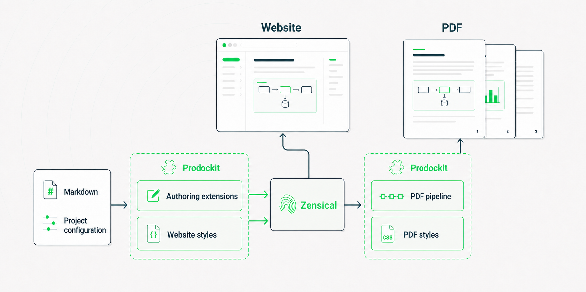

{{ heading_counter_reset(page) }}

# `prodockit` overview

This section is for anyone new to prodockit. It explains what the package
adds to Zensical, how to install it, and how to build a first local site before
you choose authoring or publishing features.

prodockit adds the document features that professional and academic
\index{Zensical} projects ([Zensical website](https://zensical.org/)) commonly need: numbered sections,
cross-references, citations, glossaries, richer tables, and a printable PDF.
Install one Python package, then enable only the parts your project uses.

\ref{fig-prodockit-output-relationship} shows how the shared authoring input
becomes a website and a matching printable document.

{ .documentation-diagram }
/// figure-caption
    attrs: {id: fig-prodockit-output-relationship}

Relationship between Prodockit's source, components and outputs
///

## What the features bring

Prodockit's features remove the points where basic Markdown stops being
enough for a structured academic or professional document. They preserve the
speed and readability of Markdown source while adding controls that would
otherwise require handwritten HTML, repeated manual edits, or a separate
print document.

### Structure that stays connected

Numbered headings give a long document a visible hierarchy.
Cross-references connect prose to headings, figures and tables by identity, so
their displayed number and title remain correct when material moves. Together,
`prodockit.headings` and `prodockit.refs` replace manually typed references
such as “see section 4.2,” which silently become wrong as a document develops.

Numbered steps provide a distinct structure for procedures, methods and
instructions. Directory trees present file layouts as relationships rather
than as hard-to-read lists of paths. Both make technical sequences easier to
scan without forcing the author to maintain numbering or connector lines.

### Evidence and publication references

Citations and bibliographies provide the evidence trail expected in academic
and professional publication, with a choice of implementation:

- `prodockit.citations` supports a small, hand-written reference list kept
  directly in Markdown. It suits a document whose author wants explicit
  control without maintaining a separate bibliography database.
- `prodockit.bibliography` uses BibTeX or BibLaTeX data and a CSL style through
  Pandoc. It suits larger or formally styled bibliographies, reusable source
  records, and publications that must follow a specified citation style.
- `prodockit.refs` handles internal references to the document's own sections,
  figures and tables. It complements either citation approach rather than
  replacing it.

The approaches can coexist, so an author can use the lighter hand-written
form where it is sufficient and the database-backed workflow where scale or a
publication style requires it.

### Tables with the layout the information needs

Basic Markdown tables are intentionally limited. `prodockit.tables` lets an
author choose widths, merge cells, span headings across columns, rotate dense
headings and use compact presentation. The information therefore determines
the table format instead of being squeezed into the small set of layouts that
plain Markdown happens to support. The same authored table remains aligned in
the website and PDF.

### Terminology readers can follow

`prodockit.glossary` manages acronyms and specialist terms from shared
definitions. Authors define a term once and use it consistently; readers get
the expanded form and a glossary without the author repeatedly explaining or
manually synchronising terminology throughout the document.

For the printable document, `prodockit.index` turns selected concepts and
cross-references into a back-of-book index. It gives readers another way to
find related discussion when the terminology spans several chapters.

### One source for reading and submission

The PDF command, website macros and shared styles extend the authoring
features into a complete publication workflow. The website remains useful for
navigation and review, while the PDF provides a controlled printable or
submittable document from the same source. Testing support checks both outputs
so links, headings and required content are verified rather than assumed.

Continue with [Choose your install](choosing-installation.md) to
decide whether Adoption, Bootstrap, or Manual installation matches the
document you have.

If you want to see it working before reading the reference pages, follow
[Build your first site](getting-started.md). It starts with a new Zensical
project and ends at a live local preview.

## Project status

prodockit is early but functional. All nine extensions, the PDF and source
bundle builders, website macros, testing support, and project-management
commands are implemented and tested. See
[Support and compatibility](about/support.md) for maturity, PyMdown Blocks and
other required versions, platform coverage, and known constraints. Read the
[release notes](about/changelog.md) before upgrading.

## Support prodockit

prodockit is free and open-source software. If it helps your work and you
would like to support its continued development, you can buy the maintainer a
coffee. Your contribution helps fund the software and online services used to
develop, test, and publish prodockit, as well as the time spent maintaining the
project and developing new features.

[Buy me a coffee](https://buymeacoffee.com/buckwem){ .md-button .md-button--primary target="_blank" rel="noopener" }
